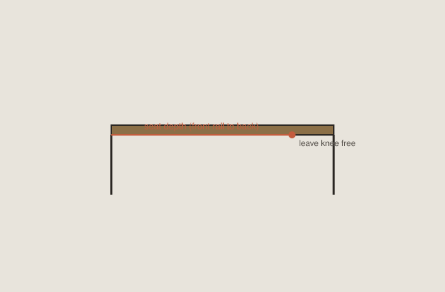

<!-- dchd-figure:v1 -->
<figure class="dchd-figure">
  
  <figcaption><strong>Fig. 1.</strong> Seat depth — leave the back of the knee free for a long conversation. <em>Rights:</em> CC0-1.0 (pack schematic); Bradley Brand editorial / pack; <a href="content/dining-chairs-history-design/assets/diagrams/seat-depth-and-the-knee.svg">source</a>. Original line diagram; no AI-generated faces or stock people.</figcaption>
</figure>

The front rail should not be a bar into the back of the knee. That is the whole depth argument. Stephen Pheasant calls the relevant bone buttock–popliteal length: how much thigh you have to put on a seat before the seat runs into the popliteal fold. Office chairs invent sliders because one worker owns the chair. Dinner invents nothing. Six people share six fixed depths.

A lot of good dining chairs are shallower than a lounge and shallower than a task chair at full slide. That is not a defect. It is how you get in under an apron and how a short femur still finds the floor. Long femurs pay. They sit on the front third and call the chair hard. They are not wrong. They are unmatched.

## What I measure

From the back contact — not the rear rail if you never touch it — to the front edge, along the sit. A raked back changes this. A cushion that slides you forward changes this. A compass seat is shallower at the corners than in the middle; turning on a compass uses a different depth than sitting square.

I do not publish a single inch as law. A habit for adult dining sides in the mid-to-high teens of inches of usable depth shows up on a lot of historical chairs that were meant to pull up. Deep seats show up on host chairs and on chairs that were parlor seats in exile. `[VERIFY]` against the object. If your hamstrings tingle, the seat is too deep or too high or both.

A waterfall front — a rounded edge — is kinder than a sharp rail. Upholstery can fake a waterfall and still hide a sharp frame. Run a hand under the cloth.

## Historical depths without romance

Queen Anne compasses often sit you in a smaller patch. Federal squares park more thigh. Windsor saddles shape the depth with a dish and a pommel. Mission seats can be deep and flat; the slat then becomes the thing that stops you sliding. Balloon-backs add stuffing that shortens effective depth as you sink — or lengthens it if you perch on a new foam.

I would rather sit a slightly shallow dining chair and own my thigh than sit a deep lounge at a table and fight the apron with my knees. Depth and the gap are a pair. A deep seat pushes you into the table. A shallow seat lets you perch and lean in. Dinner uses both motions.

## Children and extras

A deep adult seat is a child’s sliding board. They perch on the front edge, which is correct and which wrecks the front rail’s finish. A shallow seat is easier for them to use as a perch and worse for a long-femur guest. Households pick their fatigue.

Cushions that fill the back and push you forward are a depth experiment. They also raise height. Do one variable at a time if you are trying to learn anything.

## Shop practice

If we know the sitters, we can bias shallow or deep. If we do not, we stay in the historical dining band and spend the kindness on the front edge radius and the rake, not on a 20-inch seat that wants to be a sofa.

A customer who works at the dining table all day will ask for task depth. I will tell them they are asking for a different chair and a different duration. This pack is dinner. The desk pack next door already fought 29 inches.

Copies of Wishbones and Cescas sometimes get depth wrong because the copyist measured a photograph. Sit. The knee will tell you faster than the brand.

## Chalk on the shirt, tape on the sit

I put a piece of chalk on the back of a shirt and I sit. The mark is the contact. I tape from that mark to the front edge, along the sit, not along a rear rail I never touched. A raked back makes the tape climb. A cushion that slides me forward makes the tape a liar if I measured the empty chair. I measure after I have sat a minute.

BIFMA’s sliding pan is a cousin. It is not a leaf you can add to a rush seat. Six people share six fixed depths. If the chalk marks scatter over three inches on six sitters, we are making a dining chair, not a task chair. We pick a band that fails softly and we spend the kindness on the front edge.

## Compass, square, saddle, stuffing

Queen Anne compasses often sit you in a smaller patch. The curve in plan shortens the corners. You turn, you find less seat, you also find a way to sit at an angle to the plate — which dinner sometimes wants. Federal squares park more thigh. They are honest rectangles. A long femur likes them until the rail finds the fold.

Windsor saddles shape the depth with a dish and a pommel. The dish is a local depth. A router dent called a saddle is not a dish; it is a flat seat with a scar. Mission seats can be deep and flat; the slat then becomes the thing that stops you sliding. If the slat is late and the seat is long, you slide until the slat hits, and the rail is already at the knee.

Balloon-backs add stuffing that shortens effective depth as you sink — or lengthens it if you perch on a new foam. Haircloth over a firm foundation keeps a shallower sit than a later foam recover that lets you crawl back into a hole. Date the seat as a depth, not only as a fabric.

Shells — Eames, Jacobsen, tulip — bake a depth into a mold. Copies get this wrong because the copyist measured a photograph. I have sat a “Wishbone” whose cord seat was a deep tray and whose Y never found me. The knee told me before the underside did.

Cesca cane can look shallow and sit deeper once the cane hammocks. Rush does the same on a slower clock. Measure the sit you have, not the sit the catalog promised when the cane was a drum.

## Host depth, side depth, one cloth

I have sat a set whose host chairs were parlor-deep and whose sides were dining-shallow. Heights matched. Stain matched. One person sat on a third of a seat and called the chair hard. The person at the end sat into a lounge and reached for the salt. The set was two products. Mixing depths at one cloth is the same lie as mixing rakes.

A household “fix” I keep seeing: a back pillow on a deep Federal square. It shortens the usable depth and raises the sit. Then the thigh meets an apron that had been fine. Two thefts, one pillow. Do one variable at a time.

Boosters change depth as well as height. A child on a deep adult seat perches on the front edge and wrecks the finish, which is correct use of a wrong tool. The children essay takes the rest. Here: if you add a booster, remeasure the rail’s relation to the small knee.

## A plywood seat you can slide

Mock depth with a board you can slide on the rails. Sit, pull to the plate, cut an imaginary roast. If the rail prints on the hamstring, shorten the mock. If the thigh floats and the sitter perches, lengthen a little and check the gap. The plate is the test.

A house of shorter femurs gets a shallower sit and a kinder front edge. A house of long femurs gets more thigh and a radius that will not print a line at the fold. If we do not know the sitters, we stay in the historical dining band. We do not build a 20-inch sofa and call it dinner.

Copies of period chairs get depth wrong because the copyist measured a photograph or a museum chair that had been recushioned. Sit. The knee will tell you faster than the brand.

## What tingling is telling you

Tingling at the back of the knee after twenty minutes is the fold meeting the rail. People call it circulation and buy a pad. The pad slides them forward and the meeting moves with them. Tingling that starts later, with the feet dangling, may be height. Tingling that starts when they perch on the front third is a long femur on a short seat. Three clocks. One word in the store. I ask when it starts, and whether the feet are on the floor, before I reach for a rasp.

A customer who works at the dining table all day will ask for task depth. They are asking for a different chair and a different duration. A slider belongs on that other chair. Dinner keeps a fixed rail and a plate test.

If we recane or re-rush, I measure again after the seat has been sat. A drum becomes a hammock. The usable depth grows toward the fold. The catalog number does not. Date the seat as a depth, not only as a fabric.

## Sources

- Pheasant and Haslegrave, *Bodyspace* — buttock–popliteal length.
- Office sliders: BIFMA/Allsteel as cousins; not dining hardware.
- Object tapes on period chairs: prefer labels to memory.

See also: [Eighteen inches](27-eighteen-inches.md), [Rake is not a lounge](30-rake-is-not-a-lounge.md), [Children at the table](38-children-at-the-table.md).
