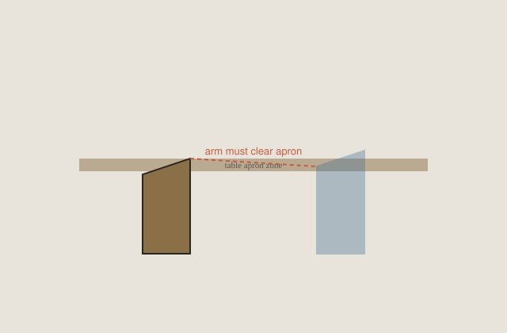

<!-- dchd-figure:v1 -->
<figure class="dchd-figure">
  
  <figcaption><strong>Fig. 1.</strong> Arms that kiss the apron belong in another room. <em>Rights:</em> CC0-1.0 (pack schematic); Bradley Brand editorial / pack; <a href="content/dining-chairs-history-design/assets/diagrams/arms-that-clear.svg">source</a>. Original line diagram; no AI-generated faces or stock people.</figcaption>
</figure>

An armchair at dinner has to do a trick: hold a body and still slide into a table that was drawn for side chairs. If the arm meets the apron, you sit six inches too far from the plate and you carve in the air. That is not dignity. That is a miss.

Host and hostess chairs — the next essay — are this problem with a title. This hour is the geometry. Arm height, arm width, apron depth, the path of the scoot.

## Measure the path, not the parked pose

People measure a parked armchair square to the table and say “it fits” because the arm is beside the apron. Then they scoot in to cut and the arm hits. Measure the path. Sit, pull in, pick up a knife.

Low arms (some Federal, some Wishbone rails, some modern shells) sneak under a shallow skirt and fail a thick top. High boxed arms (some Eastlake, some Mission, some club-ish hosts) fail almost everything except a pedestal with no skirt.

Width: a wide armchair at a leaf that was added later crowds the neighbor. Period host chairs were often for tables that did not grow a cheap leaf.

## Types of “arm”

A full armchair: support from the post to the front, a place to rest a forearm. A hand-rail: Wegner’s hoop ends, a Windsor continuous arm. A capstan of upholstery. They all occupy a different slice of the apron’s world.

Side chairs exist because arms are expensive in timber and in space. A table of six armchairs is a restaurant that hates servers. A table of six sides and two arms is the common hierarchy. A table of all sides is the Shaker and the café.

## Historical notes without a sermon

Chippendale knuckles are beautiful and wide. Phyfe hosts can be throne-adjacent. Hitchcock arms are fancy-chair arms. Cesca arms are tubes. Tulip arms are a bowl. INGOLF arms are a box-store version of the same trick. Each needs the same tape.

Parlor armchairs parked at dinner are the usual antique store mistake. The sit may be kind. The apron will not care.

## Shop practice

If we build arms, we build them to the table’s underside and to the scoot, or we refuse the arms. I would rather sell two well-cleared hosts and four sides than six arms that make a fence.

A customer who wants arms on every chair for “comfort” is often asking for a rest for elbows during a long talk. That rest can be a table edge if the height is right. It can be a side chair and a pause. It does not have to be six collisions.

Padding on arms changes height. Leather swell changes height. Measure the finished arm.

I like a host armchair that clears and a side chair that does not pretend. I do not like a matched set of eight arms in a room that needs a platter to walk.

## The path with a knife in the hand

People measure a parked armchair square to the table and say it fits because the arm is beside the apron. Then they scoot in to cut and the arm hits. Measure the path. Sit, pull in, pick up a knife. If the arm kisses the apron on the way in, you will carve in the air. That is not dignity. That is a miss.

I tape the finished arm height — pad and leather swell included — and I tape the underside of the apron. The gap essay owns the thigh’s air. This hour owns the arm’s air. They are different rectangles. A chair can clear a thigh and still fence the arm.

Low arms — some Federal, some Wishbone rails, some modern shells — sneak under a shallow skirt and fail a thick top. High boxed arms — some Eastlake, some Mission, some club-ish hosts — fail almost everything except a pedestal with no skirt. Width matters as much as height. A wide armchair at a leaf that was added later crowds the neighbor. Period host chairs were often for tables that did not grow a cheap leaf.

Padding on arms changes height. Leather swell changes height. A recover can turn a chair that cleared into a chair that kisses. Measure the finished arm, not the frame in the white.

## Types of “arm,” named as jobs

A full armchair: support from the post to the front, a place to rest a forearm. A hand-rail: Wegner’s hoop ends, a Windsor continuous arm. A capstan of upholstery. A tube: Cesca. A bowl: tulip. A box-store spindle: INGOLF. They all occupy a different slice of the apron’s world.

Chippendale knuckles are beautiful and wide. Phyfe hosts can be throne-adjacent. Hitchcock arms are fancy-chair arms. Each needs the same tape. I will not print a single arm-height law. Pair to the table.

Side chairs exist because arms are expensive in timber and in space. A table of six armchairs is a restaurant that hates servers. A table of six sides and two arms is the common hierarchy. A table of all sides is the Shaker and the café. The next essay takes the rank. This one takes the collision.

Parlor armchairs parked at dinner are the usual antique-store mistake. The sit may be kind. The apron will not care. A club chair with a short seat is still a club chair. Dinner is a scoot.

## Failure is six inches too far from the plate

If the arm meets the apron, you sit too far from the plate and you carve in the air. Shoulders climb. The roast is a reach. People blame the table, or the chairs, or “old furniture.” The path was never measured.

A left-handed carver at an end drawn for a right-handed show is a small household fact. A wheelchair at an end is often the best place — more room — unless the armchair cannot leave. The accessibility essay takes the rest. Children in host chairs because the arms trap them is a common mistake; they need a side and a booster, not a fence.

A platter walking behind a table of eight arms is a server’s complaint I will keep repeating. Arms occupy the aisle. Sides do not. If the room is tight, the hierarchy is a traffic problem.

I have sat a Wishbone whose hoop-ends cleared a thin Danish table and failed a 2-inch oak slab with a breadboard. Same arms. Different underside. The brand was not the variable.

## Shop: build to the underside, or refuse the arms

If we build arms, we build them to the table’s underside and to the scoot, or we refuse the arms. I would rather sell two well-cleared hosts and four sides than six arms that make a fence.

A customer who wants arms on every chair for “comfort” is often asking for a rest for elbows during a long talk. That rest can be a table edge if the height is right. It can be a side chair and a pause. It does not have to be six collisions.

Mock the arm with a stick at the finished height. Sit, pull in, cut. If the stick hits, lower the arm or drop the apron or drop the arms. Three choices. A carving on the knuckle is not a fourth.

Bradley Brand does not need an armed collection to make a table complete. Completeness is a catalog. Clearance is a tape. I like a host armchair that clears and a side chair that does not pretend. The platter still has to walk.

## Historical arms, same tape

I have pulled a Phyfe host to a later oak table and watched the arm stop three inches short of a civilized plate. The carving was correct. The apron was a drawer. I have pulled a Windsor continuous-arm to a thin harvest rail and watched it sneak under like it was born there. The hoop was the arm. The table had no skirt worth the name.

Eastlake boxed arms are a fence in a small room. Mission arms are a post and a cap; they fail high aprons and they photograph as seriousness. Cesca tubes look like they will sneak and then they hit a thick top because the tube is higher than the photograph promised. Tulip arms are a bowl; they need a pedestal and they still need a scoot. INGOLF arms are the box-store version of the same trick: a painted rest that will not invent clearance the table did not have.

A parlor armchair from an antique store is the usual exile. Deep seat, high arm, a rake that wants a book. Parked at dinner it is six inches too far from the plate and proud of it. The sit may be kind. Kindness that cannot reach the meat is not dinner.

When we inherit a set of eight arms and a table that was drawn for sides, I ask which two may stay as hosts and which six should lose the argument. Cutting arms off a period chair is a different object. I would rather buy sides than amputate. New work can refuse the arms on the drawing. That is cheaper than a fence.

Measure the path at every place setting if the apron changes — a drawer at one end, a leaf skirt, a pedestal flare. One cleared host does not clear the other end. The tape is not a personality. It is a walk around the table.

## Sources

- This pack’s gap essay for the underside number.
- Sibling room pack for host/hostess as social history — next essay takes the rest.
- Object tapes.

See also: [The gap under the apron](28-the-gap-under-the-apron.md), [Host and hostess](34-host-and-hostess.md), [Side chair versus armchair](45-side-chair-versus-armchair.md).
