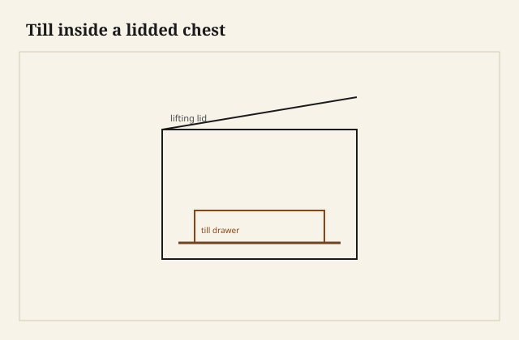

The first drawer I ever repaired that still thought it was a chest had a lid. Not a dust lid. A real hinged top, oak, with the ghost of a till on the right-hand end — a little box inside the box, the kind you keep a key in so you do not have to dump the blankets. Below that, two drawers that had been nailed together like packing crates and hung on runners so worn the sides had a crescent. The owner called it a chest of drawers. The object called it a chest that had grown a habit.

<figure class="dch-figure">
  
  <figcaption><strong>Figure 1.</strong> Till inside a lidded chest. Pack schematic (CC0).</figcaption>
</figure>

<figure class="dch-figure dch-shop-pending">
  
  <figcaption><strong>Photo 2 (pending).</strong> The lid is still the door. The drawer is a convenience at the bottom, not yet the whole idea. Keith BBF shop library — unpublished; photographer unnamed until file metadata is pulled Slot: D:\BBF\BBF Photos — mule chest or till inside a lidded case, drawer at the base (filename pending shop pull)</figcaption>
</figure>

I am not going to give you a century as if I had a dendro lab in the back room. The published shop history is consistent enough to stand on: for a long time Europeans stored what mattered in a coffer. You lifted a lid. You piled. You creased. When people had few shirts, that was a system. When they had more shirts, the pile became a search.

## A till is not a drawer yet

A till is a small receptacle built into a chest — often at the end, under the lid, sometimes lockable. It is a box that does not slide out of the case. You still open the lid to get at it. Fine Woodworking’s short history of the form (2005) treats the till as the obvious parent: once you have a box *inside* a chest, it is a short step to make a larger box that occupies the whole lower register and *draws* out.

The word is the job. Drawer. Drawing box. You pull it toward you. That is a different contract than a lid. A lid asks you to empty the stack to reach the bottom. A drawer asks the case to give you a hole and a runner and a front you can find in the dark.

Early versions are mixed animals. English work of the 1600s keeps the hinged top and puts one or two drawers in the base. Dealers and museum labels call those mule chests — mixed parentage, chest and chest-of-drawers in one hide. The name is later slang. The object is real. I have seen the same idea in pine in this country without anyone in Bradley County needing the English word. A lidded blanket box with a drawer under the till line is a mule whether you name it or not.

Do not date a piece by the word. Date it by whether the lid is still load-bearing in the design. If you need the lid to get at the main storage, you are still in chest logic.

## Drawers behind doors

Another early habit, easy to miss if you only look at later mahogany stacks: the drawers lived *behind doors*. The case still wanted to be a cupboard. The sliding boxes were an interior convenience, not the face the room saw. FWW notes that even after chests filled entirely with drawers, many kept a lid on top. The chest was a stubborn idea. It had been the furniture of record for a long time. You do not drop a lid because a joiner in London had a better Saturday.

When I see doors over drawers on a later piece, I do not automatically call it “early.” People still build bar cabinets that way. The early tell is the *combination*: thick joined oak, crude hang, a lid or a pair of doors that is doing the old job, and drawers that look like they were invented last winter. Hayward, writing for *The Woodworker*, puts the surprise where it belongs: it is astonishing, once you notice it, how late the sliding box becomes ordinary. He will not give you a fake year. Neither will I. Mid-17th-century England is the period the published record keeps pointing at for a case that has abandoned the chest pretense. [VERIFY] any tighter year before you print it on a tag.

## What the early box actually is

The first drawers that survive in oak are not half-blind jewelry. They are boxes. Sides grooved to ride a runner fixed to the carcase — Hayward’s mid-17th-century figure, the one that still startles a modern bench because we think runners *between* drawers are the obvious way. Construction at the corners is often a rebate, glue, and nails. The bottom is a board nailed up under the sides, taking the weight of the shirts on the nails. Occasionally someone cuts a dovetail, coarse, through, proud of the idea of itself.

I have built a demonstration box like that for the shop wall — not a fake antique, a teaching mule. Rebate, nails, a groove in the side. It slides. It also teaches why the later trades spent a century getting the bottom *off* the runner and the joint *out* of the nail. Nails in a bottom that wears become nails that score the rail. You feel them before you see them.

South Arkansas humidity is not 17th-century London, but wood is wood. A nailed bottom with grain running the long way of a wide drawer will split. The split is not a mystery. It is the same split I get when I glue a solid bottom all around in June and wait for August.

## The lid leaves, the language stays

English still says *chest of drawers*. The chest won the noun. The drawers won the job. French *commode* is a different cousin — a low case on legs, doors or drawers, an 18th-century Continental fashion that American auction catalogs still use when they want to sound expensive. Chippendale’s “commode tables” and Hepplewhite’s “commodes” are not mule chests. Do not mash the words because they all hold stockings.

<figure class="dch-figure dch-shop-pending">
  
  <figcaption><strong>Photo 3 (pending).</strong> When the top is a board you set a candlestick on, the chest has admitted it is a stack of drawers. Keith BBF shop library — unpublished; photographer unnamed until file metadata is pulled Slot: D:\BBF\BBF Photos — chest of drawers with no lid, bun or bracket foot, oak or walnut (filename pending shop pull)</figcaption>
</figure>

In this shop I still build lidded chests. People want a blanket box that is also a seat. If they also want a drawer, I treat the drawer as a guest in a chest, not as a stack pretending to be a coffer. The runner gets a kicker. The bottom gets a groove or a slip, not a handful of nails asked to be a floor. The lid gets a till if they ask for one, and I tell them the till is the oldest idea in the piece.

I will not sell a “17th-century mule” I made in Wilmar. I will sell a chest with a drawer and tell the truth about the year. The history is useful because it keeps you from over-explaining a lid. A lid on a drawer stack is not automatically ignorant. For a hundred years it was how you still knew what a chest was.

## Failures

I once fitted two drawers under a hinged lid and let the lid’s lower edge kiss the top drawer front. In July the lid swelled a hair and the top drawer wore a stripe in the paint. The old makers who kept a lid had to live with that geometry too. Leave a shadow. The lid is allowed to be a lid. The drawer is allowed to move.

I also inherited a “mule” whose drawers had been hung on modern side slides by a well-meaning cousin. The grooves in the old sides were empty, like eye sockets. The slides worked. The object had been translated into another language without anyone admitting the translation. I pulled the slides, patched the screw holes, and put wooden runners back. Not because I am holy. Because the sides were already grooved for a job, and empty grooves collect dirt and a story you cannot defend.

## What this is not

This is not a dating guide you can take to an estate sale with a ruler. Hand-cut anything can be cut next Tuesday. A lid can be added or removed. Bun feet on walnut chests are famous for being replacements — woodworm and wet floors eat them, and the published estimates of replacement rates are the kind of number I will not reprint as if I counted. [VERIFY] before anyone uses a foot as a century.

The judgment is small. A drawer is a box that has to leave the case and come home. For a long time the case still wanted to be a chest. When the lid finally left, the noun stayed. Build the box for the job it has now. If you keep a lid, keep a gap, and do not ask nails in a bottom to be a runner.
