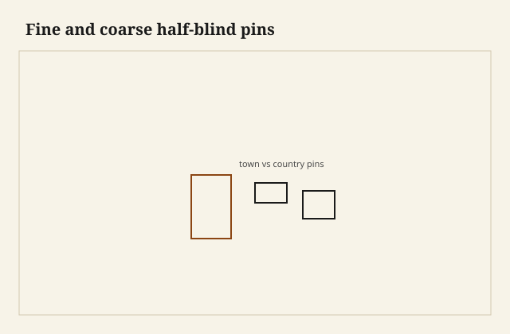

I held two drawer sides in one hand and the pins were not the same language. One row was a set of pale slivers, half-blinds in a mahogany front, the kind of pins you count rather than see. The other was three fat triangles in pine, proud, friendly, a country corner that had been cut with a saw that did not mind being a saw. Same shop light. Same joint name. Two different bills.

<figure class="dch-figure">
  
  <figcaption><strong>Figure 1.</strong> Fine and coarse half-blind pins. Pack schematic (CC0).</figcaption>
</figure>

<figure class="dch-figure dch-shop-pending">
  
  <figcaption><strong>Photo 2 (pending).</strong> The same joint, two clocks. One row cost an afternoon. The other cost an hour. Keith BBF shop library — unpublished; photographer unnamed until file metadata is pulled Slot: D:\BBF\BBF Photos — fine half-blind pins on a thin mahogany front beside chunky pine pins (filename pending shop pull)</figcaption>
</figure>

Pin size is time. Time is money. I will not invent a 1788 journeyman’s rate or a Wilmar hourly to prove it. The geometry is enough. A skinny pin is more sawing, more chopping, more fitting, more chances to blow a corner. A fat pin is fewer operations and a joint that still locks. London piecework could afford the skinny row when the case was sold as town furniture. A country shop with a pine blanket chest to finish before weather changed could not. Neither shop was making a virtue. Both were making a drawer.

I get tired of captions that call fine pins *refined* and fat pins *honest*. Honesty is a word people use when they want the cheap row to win a fight it is not in. The fat pin is honest about being fast. The skinny pin is honest about being paid. Put the halo down.

## What a pin is for

A pin is the wood of the front (or the back) that stands between tails. It is the socket’s wall. In a half-blind front the pin is also the meat that keeps the show face a skin. Skinny pins on a half-blind are a bravura act: you are leaving little material to lock a tail in a socket you cannot see from the face. Fat pins on a half-blind are easier to cut and harder to hide if the front shrinks. Choose on purpose.

Through pins at the back can be fatter without anyone writing a poem. The back is allowed to look like work. I cut backs faster. I let the pins stay chunky there even when the front is town. That mixed language is ordinary. A case that is town on the face and country at the back is not a fake. It is a payroll walking through a box.

Slope is a later argument in this pack. One-to-six is not a law. What I will say here: a fat pin with a steep slope still locks. A skinny pin with a timid slope is a finger waiting to snap. If you are going to cut slivers, give them a slope that means it.

## Town, country, and the porch sale

Fine London pins — and the American city shops that wanted that look — sit in thin linings and show wood that cost more than the time. You see a lot of them, small, regular enough, not machine-even. The half-pins at the ends are still pins, not leftover slivers that crumbled. The row looks like someone had a gauge and a reason to be careful.

Chunky country pins sit in thicker pine or poplar. Three tails on a shallow drawer. Two on a tiny one. The half-pins are generous. The saw leaves a mark. The baseline may be proud until a plane kisses it. I like these drawers. I have built these drawers for shop cabinets and for kitchen boxes that will live in grit. I do not call them London and I do not call them better.

A porch sale will try to date by pin count. More pins, older, richer, English. Fewer pins, later, cruder, American. That is a rumor. A late factory jig can cut many pins. An early country box can cut three. Count is not a century. Count is a Saturday.

Bradley County work I see — not as a corporate succession story, just as furniture that has lived here — leans country unless someone was copying a catalog. Fat pins, nailed rabbets, a groove in a thicker side. When a town row shows up in this parish it is usually a piece that traveled, or a later maker who had watched a book. I do not invent a local London. I notice the row.

## Spacing as shop practice

<figure class="dch-figure dch-shop-pending">
  
  <figcaption><strong>Photo 3 (pending).</strong> Half-pins at the ends keep the corner from being a tail that wants to break out. Keith BBF shop library — unpublished; photographer unnamed until file metadata is pulled Slot: D:\BBF\BBF Photos — drawer side, half-pins at the ends, spacing marked in pencil (filename pending shop pull)</figcaption>
</figure>

I mark half-pins first. The ends of the board want a pin, not a tail hanging on the corner grain. A tail at the very end is a short-grain accident waiting for a clamp. Half-pins do not have to be twins, but they have to be there. That is practice, not morality.

Between the half-pins I divide the rest into tails that will look like they belong on that height of side. A tall drawer can take more. A shallow drawer looks busy if you pack it. Busy is a town habit when the front is a jewel. Busy is clutter when the front is pine and a wood knob.

I do not space with a calculator. I space with a pair of dividers and an eye for the pull. The pull sits on the front and the joint sits at the ends. If I crowd the pins under a lock mortise I will meet myself coming the other way. Leave meat where the hardware goes.

Equal spacing is a modern comfort. Old rows often tighten or loosen a little as they go. A little wander is a person. A lot of wander is a person who did not mark. I mark. I still allow the last socket to take the leftover rather than force a perfect repeat. The leftover should still look like a pin, not like a mistake you ran out of board for.

Pins too skinny to clamp are a failure class I know. You cannot put a cramp on a sliver. You can put tape and hope. Hope is not a clamp. If the front is half-blind and the pins are slivers, the clamp lives on the inside against a block that does not bruise the tails. Plan that before you saw.

Pins too fat on a narrow front look like two teeth. Two teeth will hold. They will also look like you were late. Sometimes I am late. I do not write *country aesthetic* on the traveler when I was late.

## Time on the bench

A town row on a set of eight drawers is a day you can feel in the forearm. A country row on the same eight is an afternoon. I price the row I intend to cut. If the estimate said country and the customer later wants slivers, the pad changes. London priced operations. I price pins. Not because I am London. Because extras disappear if they are not written.

I will not print a minute-count as law. [VERIFY] any shop-time number before it becomes a schedule. What I will say: the skinny pin is where the time goes, not the slope, not the species. Students want to believe the sawing is the romance. The chopping of eight tiny sockets is the romance’s bill.

Machine pins of a size with the tails — the last essay — are a third payroll. The machine does not care about town or country. It cares about a cutter. Do not read a jig row as a country maker who “valued honesty.” Read it as a setup.

## Failures

I cut sliver pins in pecan that had a check I had not seen. One pin split out when the tail seated. The show face stayed clean — half-blind religion — and the inside looked like a bite. I patched with a sliver of the same pecan and lived with a pin that was now two pins. Next time I read the end grain before I commit to town.

I also spaced a shallow drawer like a tall one because I was using a story stick from the drawer above. The row looked like a fence on a cottage. I recut the front. The story stick is allowed to be per height. One stick for a stack is how you get a stack that looks like it was copied by a clerk.

A neighbor asked me to recut a pine chest’s fat pins into “nicer” ones. I refused. The box was a country sentence. Nicer would have been a different box and a lie about who stood at that bench.

## What I cut now

Sitting-room show wood: town pins on the front, chunkier at the back, half-blinds where the face is a face. Shop drawers and painted pine: country pins, fewer, and I do not apologize to the photograph. Kitchen boxes behind false fronts: often no pins at all, a locking rabbet or a machine row, and I still do not apologize.

If I am copying an old drawer for a repair, I copy the pin size. That is respect for the payroll that was already spent. I do not “improve” a country row. I do not coarsen a town row to make it look older. Both of those moves are porch-sale theater.

## What this is not

This is not a map of England versus Arkansas as virtue. Town work happened in the country. Country work happened in cities. The words are shortcuts for pin size and time. This is not a dating clock you can take to an auction with a ruler. Skinny pins can be last winter. Fat pins can be 1760 or 1960. This is not the one-to-six sermon.

The judgment is small. Read the row as a bill. If you are paying for slivers, cut slivers and protect them. If you are paying for a box that has to get done, cut a pin you can clamp. Do not let anyone sell you the fat one as a soul or the skinny one as a better person. They are both pins. They both have to hold when someone pulls.
