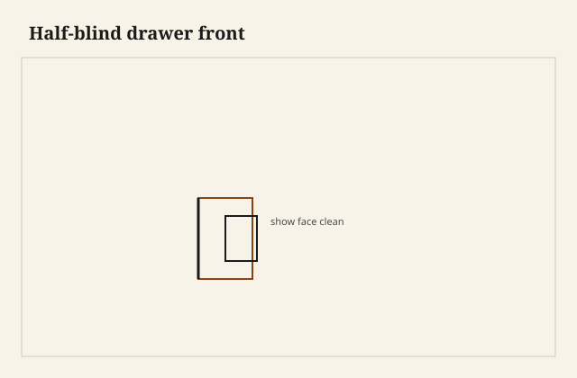

Chalk dust in a half-blind socket is a white comma you can smear with a thumb. I blow it off and the waste is still a little pale, the gauge line a hair I mean to leave, and the show face of the front is clean as a plate. No end grain. No tail. No story for raking light to read. That is the religion. The front is a skin. The joint lives in the thickness, like a pulse you do not owe the room.

<figure class="dch-figure">
  
  <figcaption><strong>Figure 1.</strong> Half-blind drawer front. Pack schematic (CC0).</figcaption>
</figure>

<figure class="dch-figure dch-shop-pending">
  
  <figcaption><strong>Photo 2 (pending).</strong> Chalk in a socket is a white comma. The face of the front does not know it is there. Keith BBF shop library — unpublished; photographer unnamed until file metadata is pulled Slot: D:\BBF\BBF Photos — half-blind sockets in a drawer front, chalk in the waste, show face clean (filename pending shop pull)</figcaption>
</figure>

Through tails at the back. Half-blind at the front. I have cut that pair so often I have to remember it is a settlement, not a law of physics. The 18th century is when the published shop history treats the lapped front as ordinary. Hayward’s earlier walnut-on-deal drawer — the telegraph you can feel through a leaf — is the parent that taught the lesson. One nod is enough. This essay is not that scar. This essay is the habit that replaced it: keep the face a face.

I will not give you a first summer. [VERIFY] any year someone wants to print as the birthday of the half-blind drawer. People could lap a joint before drawers were common. They did not always bother. When the front became the furniture — mahogany, a pull, a lock, a bedchamber window — the bother became the job.

## The skin is the point

A drawer front takes light. It takes a hand. It takes hardware. It is the rectangle a photograph wants. If you run through tails there, you have decided the joint is the picture. Arts & Crafts work sometimes decides that on purpose; that is a later essay and a different honesty. Ordinary case work, Federal work, most of what I build for a sitting room, wants the picture to be wood, not joinery.

Half-blind means the tail of the side goes into a socket that does not break the face. You see the joint from the side and from above. You do not see it from the hall. The front can be veneered without bones. The front can be solid and still read as one board. The pull’s screws live in meat that is not interrupted by end grain of a side.

That last is practical. A through tail at the front puts side-grain and end-grain in the same zone as a screw. Screws wander toward the soft. I have pulled a knob out of a through-tail front and brought a sliver of side with it. The half-blind keeps the face as a single species, a single grain, a place you can bore.

Locks want the same courtesy. A half-mortise lock in a front that is already a lace of tails is a fight. Leave the middle of the front as wood. Put the joint at the ends where a drawer front always had to be a joint.

## Why the back is allowed to shout

<figure class="dch-figure dch-shop-pending">
  
  <figcaption><strong>Photo 3 (pending).</strong> Two religions, one box. Hide where the room looks. Show where the case swallows the back. Keith BBF shop library — unpublished; photographer unnamed until file metadata is pulled Slot: D:\BBF\BBF Photos — drawer box, half-blind at the front, through tails at the back (filename pending shop pull)</figcaption>
</figure>

The back of a drawer lives in a hole. You see it when you drop a sock. You do not sit across the room from it. Through tails there are faster to saw, easier to inspect, easy to plane flush. They are also strong in the right direction if you keep the tails on the sides — the next essay’s religion. I do not lap the back unless the back is a show panel, and a show-panel back is a rare vanity.

Thinner backs are ordinary. Through tails in a thin back want fat enough pins that you do not split the board when you chop. Country pins at the back, town pins at the front, same box. The religion is about the face, not about making every corner a chapel.

A dadoed back is a quieter cousin. This pack will get to the housing that is allowed to be quiet. It is not a half-blind. It is a different decision: the back is a lid on the box, not a joint you are proud of. I dado small drawers and shop trays. I through-tail a sitting-room drawer because I want the box to come apart in a century with a chisel and a kettle, not a saw through a glued housing I cannot reach.

## What the religion is not

It is not a ban on through tails. Through at the back. Through on a show side when the style asks — a chest that wants the tail as jewelry. Through on a tool till no one will photograph. The religion is specific: the *drawer front that faces the room* stays a skin unless you have a reason to tattoo it.

It is not a claim that half-blind is older, better, or more “handmade.” A jig can cut half-blinds. A machine can. I can cut them badly by hand and still hide the badness from the hall, which is a moral hazard. The gauge line and the inside of the socket are where I judge the work. If the inside is chewed and the face is pretty, I have performed, not built.

It is not the kitchen false front. A slab screwed to a box is a skin too, and it hides everything, including the fact that the box has no front joint at all. Useful. Honest if you say it. Not half-blind. Do not caption a false front as period joinery because the room cannot see the screws.

## How I cut the hide

I gauge the socket depth from the face so I leave enough skin. Too thin a skin and a plane on the face will ghost the sockets later — a telegraph without veneer. Too fat a skin and the tail has nowhere to live. I want the tail to seat with a tap, not a prayer.

Chalk or a pencil in the waste keeps me from chopping the keep. I chop to the line, not past it. Overcuts on a half-blind hide inside, but they still weaken the pin. The last essay on pin size lives here: skinny pins in a half-blind are a town act. Give them meat enough to be pins.

I dry-fit until the baseline of the side kisses the inside of the front. Then glue. Then a plane on the side, not on the face, to bring the joint flush. Planing the face to hide a proud tail is how you thin the skin you just spent an hour protecting. If a tail stands, I pare the tail.

South Arkansas raking light is a critic. The long wall is glass. I turn the finished front in that light before I call it done. If I can see sockets as a weather map under polish, I was greedy with the plane or stingy with the skin.

## Failures

I cut through tails on a cherry front because the saw was already set for the back and I was “just making a shop drawer.” The shop drawer ended up in a desk someone liked. The tails were the first thing they mentioned. I had not meant a conversation. I recut the front. The religion is for any front that might leave the shop, not only the ones on the estimate.

I also bored a knob hole too close to a half-blind socket on a narrow front. The bit found the waste. The face stayed pretty for a week, then a little sink appeared when the screw drew down. Hardware layout belongs on the front before the sockets, or at least a mark that says *not here*.

A student wanted to “be honest” and run through tails on a walnut show front so the owner would know it was handmade. We looked at a Stickley photograph and then at a Federal photograph. Honesty is a style choice. It is not a virtue that overrides the room. The owner had asked for a quiet front. We hid the joint. The student signed the back of the drawer instead.

## What I will not do

I will not sand a half-blind face through the skin to chase a proud pin. I will not fill a blown socket from the face with putty and stain. I will not add a cockbead to hide a through tail I should not have cut — the bead is armor, not a confession booth, and the earlier essay already spent that word.

I will hide a repair on a period front if the repair is a Dutchman in the species, and I will write it down. The religion is about the room, not about erasing a life.

## What this is not

This is not the veneer essay again. The leaf was one reason to hide. The photograph, the pull, the lock, and the habit of a face are the others. This is not a dating clock. Half-blinds can be cut next Tuesday. Through fronts can be original on an old box that had not yet converted. Look at the rest of the construction. This is not bow-front work; a curve is another pack’s problem.

The judgment is small. If the room looks at the front, keep the front a skin. Put the loud joint where the case swallows it. The hide is not shame. It is a decision about what the rectangle is for. When I want the joint to be the picture, I will say so on the traveler, and I will cut it where a person is meant to see it.
