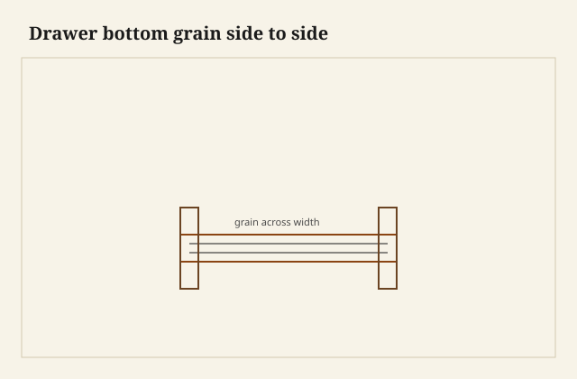

The bottom board popped — a dry tick — when I slid it out of the back. Pine, a little dirty, grain running left to right like a floor in a hallway, the bevelled edges dusty from a groove that had held them without glue. I had the drawer on its face on the bench, back toward me, and the floor came out as a tray. That is the late habit I trust. The grain points at the sides. The growth points at the back. The back is a door you are allowed to open.

<figure class="dch-figure">
  
  <figcaption><strong>Figure 1.</strong> Drawer bottom grain side to side. Pack schematic (CC0).</figcaption>
</figure>

<figure class="dch-figure dch-shop-pending">
  
  <figcaption><strong>Photo 2 (pending).</strong> The floor leaves by the back. The grain is a set of arrows pointing at the sides. Keith BBF shop library — unpublished; photographer unnamed until file metadata is pulled Slot: D:\BBF\BBF Photos — drawer bottom slid out the back, grain running left to right (filename pending shop pull)</figcaption>
</figure>

Hayward, in the *Woodworker* years, names the change. Early bottoms are often boards running back to front, nailed or housed, a short span across a wide drawer that still splits because the board is wide the wrong way. Late 18th century: groove the sides, turn the grain side to side, leave the floor free at the back so the board can move. I will not give you a first August. [VERIFY] any year someone wants as a birthday. I will stand on Hayward’s naming and on the boxes I have taken apart.

Hoadley is the physics. Wood moves across the grain more than along it. A bottom whose grain runs side to side is stable in width — it does not try to get wider and pry the sides. It tries to get deeper, front to back. If the front groove or slip holds the front edge and the back is free, the extra depth walks out the back. If you glue the floor all around, or nail it on four sides, the extra depth becomes a belly or a split. I will not invent a percent. [VERIFY] any movement number before it becomes a shop schedule. The direction is enough.

## Why the old way felt right

A board running back to front spans the shorter distance on a typical drawer. The sides are the long walls. A floor that reaches from front to back is a short plank. Short planks feel stiff. Nails at the sides feel like joists. Early boxes — and a lot of later country boxes — think like a floor in a hallway: run the boards the short way and tack them down.

The split still comes. The short plank is often *wide*. Width is the moving dimension. The board tries to get wider, left to right, and the sides or the nails refuse. A crack opens down the middle, or a nail tears, or the runner gets scored by a proud head. I have picked those heads out of oak rails with a knife. The floor was doing what a floor does when you fasten both banks of a river.

<figure class="dch-figure dch-shop-pending">
  
  <figcaption><strong>Photo 3 (pending).</strong> A short span still splits when the board is asked to grow and the nails refuse. Keith BBF shop library — unpublished; photographer unnamed until file metadata is pulled Slot: D:\BBF\BBF Photos — split bottom, old grain running front to back, nails or a trapped edge (filename pending shop pull)</figcaption>
</figure>

I have built the old way on purpose for a demonstration box. Rebate, nails, grain front to back. It slides. It also teaches. The first dry season wrote a hairline I did not have to fake. I keep that box. I do not sell it as an antique. I sell the lesson: short span is not the same as small movement.

## What the late habit actually is

Groove in the sides — or in slips, if you are on that fork — and a groove or a rebate at the front. Grain left to right. Back left open, or a thin back set above the floor so you can slide the board in after the box is together. Sometimes a slot-screw or a nail at the back through an oversized hole, to keep the floor from falling out if someone turns the drawer over. The fastener is a keeper, not a clamp.

A wide drawer may get a center muntin, a little joist front to back, so two boards can meet and still run side to side. Hayward mentions muntins when he gets to this floor. The idea is a joist. I use one when the drawer is wide enough that a single board would be a drum or a hunt. I do not glue the two floors to each other as if they were a panel I wanted to lock.

Bevel the underside of a thick bottom so a fat board enters a skinny groove. The bevel is another essay. Here I only need the board to arrive in the tunnel without asking the tunnel to be a canyon.

Plywood is a different contract. Crossed plies move less. You can glue a ply in a rebate and often get away with it. I still leave plywood free at the back in solid-sided boxes, because “often” is not a promise in a dog-trot house, and because I want to get the floor out again. I will not pretend ply is Hayward’s change. It is a 20th-century peace treaty.

## Free at the back is the whole trick

People remember “grain side to side” and forget the door. If you turn the grain and then glue the back edge, you have built a panel that can only belly. The movement has to go somewhere. Somewhere is out the back, or up in the middle. I choose the back.

Fitting the back above the floor means the back’s height stops short, or the back is grooved, or the back is applied after the floor is in. I like a thin back, through-tailed to the sides, sitting on the floor without glue, maybe one keeper in a slot. The floor can slide. The back can still be a wall.

Do not ask this paragraph to be the seasonal-clearance sermon. That sermon already has a feeler stick and a June in another pack. This is history of the floor: which way the arrows point, and whether the back is a clamp. Bind is what you get when any floor — old direction or new — is trapped. The dating clock is the direction and the freedom, not the weather.

## What I cut now

Solid bottoms in sitting-room drawers: side to side, bevelled into grooves, hide glue nowhere on the floor except maybe a spot at the front if I want the front edge to stay put while the back walks. Even that spot I skip if the front groove is tight enough to hold. Kitchen ply: groove four sides if the box is ply too; groove three and a free back if the box is solid. I say the contract on the traveler so I do not mix them in a stack.

I do not run grain the long way of a wide drawer because a board was already that shape. I rip and glue up a side-to-side panel, or I use two boards and a muntin. Convenience of stock is how the old split returns wearing new clothes.

South Arkansas will grow a pine floor toward the back in a wet month. I leave a shadow at the back edge — a gap you can see if you look. If the gap disappears in July, the floor is doing the job. If the belly appears instead, I glued something I should not have, or the sides pinched. I fix the pinch. I do not plane the belly into a thinner lie and call it a fit.

## Failures

I nailed a front-to-back pine floor into a wide shop drawer because I was out of wider stock and I was “just building a till.” The till split on the centerline and dropped a chisel into the runner. I recut the floor the right way. Tills are allowed to be furniture. Convenience is not a species.

I also glued a beautiful side-to-side oak bottom on all four edges because the fit was pretty and I did not want a rattle. The rattle would have been honest. The belly was a drum in August. I steamed what I could, I sawed the back free, I lived with a scar. Pretty is how floors get trapped.

A replacement floor in an old case came to me already cut front to back, nicely bevelled, ready to nail. Someone had copied the *shape* of a late bottom and the *grain* of an early one. I turned the arrows. The bevels needed recutting. The owner thought I was being fussy. The next dry season would have been fussier.

## What I will not do

I will not glue a solid floor into a four-sided rebate and sell the box as “traditional.” Traditional, after Hayward’s change, is the free back. I will not use a front-to-back grain on a wide drawer to “look old.” Looking old is a split you have scheduled. I will not print a moisture number as if I had a meter in this paragraph.

I will replace a split early floor with a late floor and write it down. The box can keep its nailed-rabbet corners and still gain a floor that will not open like a book. That is a repair, not a forgery, if you say it.

## What this is not

This is not a claim that every bottom before 1780 runs front to back. Habits overlap. Country shops keep old habits because they work until they do not. This is not the slip essay or the American-groove essay; those are where the tunnel lives. This is the arrow on the board that lives in the tunnel. This is not the craft-pack bind piece. No feeler stick. No June as a character. Weather is mentioned because Hoadley is mentioned. The argument is grain and freedom.

The judgment is small. Point the grain at the sides so the growth can walk out the back. Leave the back as a door. Nail or glue a floor on four sides and you have asked a board to be a panel in a frame that will not give. Hayward already named the better habit. I still have to cut it, every time, because the short span still looks clever when you are in a hurry.
