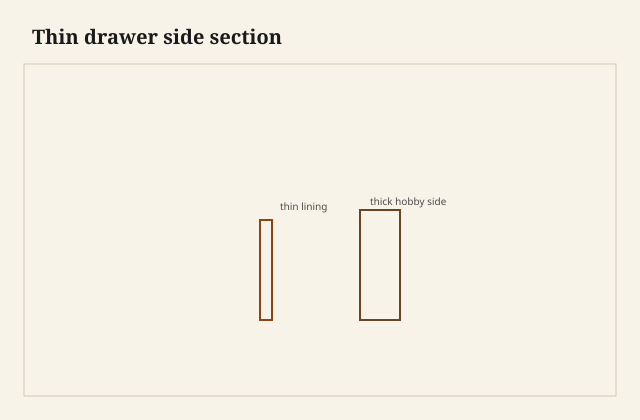

The side was 3/8 and it did not apologize. I pinched it between thumb and finger the way you check a ruler, and it still had tails at both ends and a groove that had never split. Pine lining, a walnut front, a drawer that had been pulling shirts since before anyone in this shop was born. I set a combination square on it because I did not trust my pinch. Three-eighths. A little under, if I am honest, in from the wear. The box was not fragile. The box was a box.

<figure class="dch-figure">
  
  <figcaption><strong>Figure 1.</strong> Thin drawer side section. Pack schematic (CC0).</figcaption>
</figure>

<figure class="dch-figure dch-shop-pending">
  
  <figcaption><strong>Photo 2 (pending).</strong> A 3/8 side still has room for a tail and a groove. The meat is the joint, not the caliper. Keith BBF shop library — unpublished; photographer unnamed until file metadata is pulled Slot: D:\BBF\BBF Photos — thin period or shop drawer side, 3/8 to 1/2, tails at the end (filename pending shop pull)</figcaption>
</figure>

Jeffrey P. Greene, in *American Furniture of the 18th Century*, puts ordinary American sides and backs in that 3/8-to-1/2-inch neighborhood. I treat the range as a published witness, not as a law I stamp on a traveler. [VERIFY] any house minimum before it becomes a spec. What the range does is kill a superstition I meet every year: that a drawer side wants to be as thick as a case side, or as thick as a 5/8 hobby board, or as thick as Baltic ply “so it will last.”

English work often went thinner still. The slip is why. A skinny side can survive if the groove and the wear live in an extra strip glued inside. That strip has its own essays in this pack. Here the point is the caliper. A thin English side with a slip is not a dare. It is a system. A thin American side with a groove in the meat is a different system that needs a little more board. Neither system asked for 5/8 as a moral.

## Thin is a joint problem

A dovetail turns a thin board into a corner that does not rely on the board’s thickness the way a nailed rabbet does. The tails are wedges. The pins are wedges. Glue is a film. The load of the pull goes into the front, into the pins, into the sides. If the pins have meat and the tails have meat, 3/8 is a lot of meat. If you cut sloppy pins in 5/8, you have a thick weak box.

I have watched a student trust thickness the way you trust a heavy skillet. The sides were 5/8 poplar. The tails were coarse and short. The groove was deep because the bit was already in the router. The remaining wall under the groove was a ribbon. Thick in the caliper, thin where it mattered. We recut the sides at 1/2 and made the groove behave. The drawer got lighter and stronger in the same afternoon. That is not a paradox. That is where the wood was.

Greene’s American groove-in-side wants enough board above and below the slot. That is the real floor on thinness: not a feeling, the remaining ribbons. If I cannot leave a decent wall under the groove, I thicken the side or I move the groove into a slip. I do not pretend 3/8 is magic when the drawer is tall and the groove is greedy.

## What the hobby overbuilds

<figure class="dch-figure dch-shop-pending">
  
  <figcaption><strong>Photo 3 (pending).</strong> Extra thickness eats the interior and does not automatically buy strength. It buys weight. Keith BBF shop library — unpublished; photographer unnamed until file metadata is pulled Slot: D:\BBF\BBF Photos — modern thick hobby side beside a thinner lining, same drawer height (filename pending shop pull)</figcaption>
</figure>

A lot of modern amateur boxes land at 1/2 to 5/8, sometimes more, in a species that did not need it. I have done it. The planer is set. The stack is already 5/8. The undermount spec sheet likes a certain wall. Kitchen slides are a later contract and they do ask for thickness; that is another Saturday. A wood-on-wood sitting-room drawer does not need to obey a slide sheet.

Overbuild has costs. Interior volume disappears. A jewelry drawer with 5/8 sides is a well with thick walls. Weight adds up in a tall stack; the case rails feel it, the person who lifts the drawer feels it. A thick side in a thin opening is a fitting problem you made. And a thick side invites a deep groove because the bit looks lonely. Deep grooves in thick sides are how you get a thick ribbon and a thin one.

I am not holy about this. Shop drawers that take planes and chisels get more meat. A tool till in the 65-foot shop can be 1/2 and I sleep. A Federal-style drawer under a light mahogany front wants to look like it belongs to the 18th century, which means it wants to *be* in Greene’s neighborhood, not in a lumber-aisle neighborhood. The look is not a veneer of thinness. The look is the shadow at the inside corner when you open the box. Thick linings make a clumsy shadow.

English thinner-with-slips will beat an American groove-in-side on interior width if both start from the same case opening. That is arithmetic. It is also why you do not copy an English caliper onto an American construction and then wonder where the groove went. Measure the system, not the side alone. [VERIFY] any millimeter I am tempted to print from a photograph. Photographs lie about thickness.

## Height is the other thin

People argue thickness and forget height. A tall thin side is a panel. It will move across its height. Quartersawn helps; that is a later essay. A short thin side is a lining. Jewelry drawers can go thin without drama. File drawers cannot go thin and tall without a conversation about movement and about the groove’s remaining wall. I have built a tall 3/8 poplar side that stayed calm and a short 5/8 maple side that still pinched in June because I had fitted it like a piston in January. Thickness does not forgive a fit.

South Arkansas will teach a tall lining faster than a book. I leave the height a shaving shy of proud in the opening and I do not invent a clearance number here. [VERIFY] any shop gap before it becomes a printed schedule. The old thin sides I have measured were not rattling in their cases. They were fitted. Thin and sloppy is sloppy. Thin and fitted is furniture.

## Failures

I thinned a pair of sides *after* I had cut the tails, because the front looked heavy. The saw had already committed to a baseline. Planing the outside after the joint is how you thin the pins and starve the glue. One pin went pale. I added a slip of veneer I am not proud of. Thickness is a decision you make when the boards are still boards.

I also copied a 3/8 English side onto a groove-in-side American box with no slip. The groove ate the board. The lower ribbon split the first time someone lifted the drawer by the side. Look at the old ones with the construction they actually have. A number without a system is a dare.

A stack of “heavy duty” kitchen boxes came through in 3/4 ply. They were strong. They were also so thick the undermounts had to sit in a notch I did not want to cut. Duty is a word sales use. The old thin side was on duty for two centuries with a tail and a runner.

I once mixed 1/2 and 3/8 sides in the same case because the poplar ran out. The 1/2 drawers ate the openings. The 3/8 drawers looked like they belonged to a lighter piece. The case became a mixed animal. One thickness per stack unless you have a reason you can point at — a tool drawer at the bottom, a jewelry drawer at the top, and a traveler that says so.

People buy 4/4 and then they are afraid to resaw. Fear is how you get 5/8 leftovers after a timid pass. Resaw. Or buy 1/2 and stop apologizing. The old sides were thin because the boards were used as linings, not because someone forgot to leave meat.

## What this is not

This is not a ban on 5/8. Use it when the slide asks, when the tools are brutal, when the remaining wall under a groove needs it. This is not a claim that every 18th-century American side is 3/8 on the nose. Greene’s range is a range. Wear takes some. Makers took some. I will not invent a mean.

This is not the slip essay, and it is not the Federal thin-wall sermon. Those have their own doors. This Saturday is the caliper in the hand and the superstition it kills.

The judgment is small. Thin is not weak if the corner is a dovetail and the groove still has a wall. Greene’s 3/8 to 1/2 is a place to stand, not a religion. English thinner wants a slip. Modern 5/8 is often leftover thickness from a planer that was already set. Pinch the old side. Then decide whether your stack is furniture or lumber you were afraid to thin.
