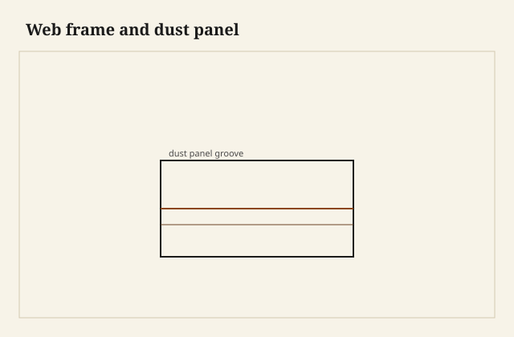

The dustboard was a pine panel the color of old paper. I had the chest on its back and a flashlight in the well, and when I tipped the upper drawer the grit that lived in its corners — wool, soot, a pin, a decade of Arkansas dust — stopped on that panel instead of raining onto the shirts. The panel had never been pretty. It had been a floor. It had also been a wall. The web around it was still square. The case had not become a parallelogram in a house that breathes.

<figure class="dch-figure">
  
  <figcaption><strong>Figure 1.</strong> Web frame and dust panel. Pack schematic (CC0).</figcaption>
</figure>

<figure class="dch-figure dch-shop-pending">
  
  <figcaption><strong>Photo 2 (pending).</strong> The panel is a floor for grit and a diaphragm for the case. Both jobs are real. Keith BBF shop library — unpublished; photographer unnamed until file metadata is pulled Slot: D:\BBF\BBF Photos — chest interior, web frame with dust panel in grooves (filename pending shop pull)</figcaption>
</figure>

That is the double job, and shops keep trying to make it one job so they can skip the other. Hygiene is the word people remember because they can see the grit. Structure is the word the case remembers when you rack it by opening a loaded drawer on one side. A web frame — rails front and back, runners as stiles, sometimes a center muntin — turns a stack of holes into a box that can take a shove. A dustboard in that frame is a panel in a door. Panels stiffen. They also catch what falls.

I am not going to write the clearance essay. June bind, feeler sticks, the seasonal gap at the top of a drawer — that Saturday already exists in the craft pack. This Saturday is the architecture between drawers, and the way a solid end is allowed to move while the architecture stays put.

## Why English high style paid for a full panel

Hayward’s later casework, and the English high-style habit behind it, likes a full dustboard. Not a sliver. A panel, grooved into the rails and into the runners, sometimes thin pine, sometimes a real board that you can still drum with a knuckle. The rail is grooved at the back to take the panel. The same groove, Hayward notes, is a convenient mortise for the runner’s stub-tenon. One plough setting does two pieces of thinking. That is elegance you can bill.

A full panel is hygiene you can defend in a city house. Coal. Open windows. Woolens. The drawer above is a little mill. Without a floor, the mill dusts the inventory below. American country work often skipped the panel and left the runners as a pair of sticks. The case still stood. The shirts took the grit. I have opened walnut chests from this side of the water that were all runner and no floor, and I have opened plainer English pieces that were fully boarded. Do not make “English” a moral and “American” a slight. Make it a bill. Full panels cost wood and time. High style could pay. A lot of good furniture did not.

In this shop I panel a sitting-room stack. I do not always panel a shop cabinet that will live in a barn. The barn already has a dust theory. The sitting room wants the shirts clean and the case stiff. If the customer is paying for “English construction,” I tell them they are paying for panels and for runners that are joined, not for a century. The century is not for sale.

## Stub-tenon, housing, slot-screw

<figure class="dch-figure dch-shop-pending">
  
  <figcaption><strong>Photo 3 (pending).</strong> Glue the tenon. House the runner. Slot the screw. The end is allowed to shrink. Keith BBF shop library — unpublished; photographer unnamed until file metadata is pulled Slot: D:\BBF\BBF Photos — runner stub-tenoned into a grooved rail, slot-screw at the back of a solid end (filename pending shop pull)</figcaption>
</figure>

A runner in a solid-end carcase is cross-grain to the end. That is the whole problem. The end wants to grow and shrink in width — which is the depth of the case, front to back. The runner wants to stay a stick of a fixed length. If you glue the stick to the end, the end will split or the runner will bow. Hayward’s religion, the one Schwarz later put back on the bench from *The Woodworker*, is specific enough to use.

The runner sits in a groove worked across the end. The groove takes the downward load. That is the bearing. You do not ask a nail in shear to be a joist. At the front, a stub-tenon goes into the grooved rail — glue on the tenon, a skew nail if you need the tenon to stay home while the glue sets. At the back, a screw through a *slot*, not a round hole, so the end can draw along the runner when it shrinks. The screw keeps the runner from wandering. It is not the support. The housing is the support. No glue along the end.

I have glued along the end. I was in a hurry and the runner ticked when I rubbed it and I told myself a thin film would not count. August counted. The pecan end checked in a line that followed my glue like a confession. I cut the runner out, I patched what I could, I slot-screwed the replacement. The check is still there. It teaches.

When there is no dustboard, Hayward says to cut the rail groove locally so the stub-tenon still has a mortise. Do that. Do not invent a dowel because the dowel is faster on a Tuesday. A dowel in a rail is a future split if the rail is thin.

Center runners are a different attachment because there is no end to house them in. A back muntin can take a groove. A hanger can drop from the top rail and dovetail into the runner. Both edges of a center runner get grooved if two dustboards meet there. I have faked a center runner by screwing a stick to a thin back and watching it sag. The hanger exists because the sag exists.

## What the web is doing when you shove

Open a wide drawer with one hand on one pull. The case wants to go out of square. Web frames at each register are the rungs of a ladder. A panel in the web is a sheet that fights the parallelogram. This is why a cheap case with only runners and no rails at the back feels like a carton by year five. The front looks fine. The interior has become a set of diving boards.

I rack-test a case before the drawers are fitted. Hands on opposite corners, a little shove, a look at the reveal. If the web is going to fail, I want to know before I shoot six fronts. South Arkansas humidity will rack a weak case without any help from a shove — one end wet, one end on a floor vent — but that is still geometry plus water, not a mystery of “settling.” Settling is a word people use when they do not want to say the webs were shy.

Panelled case ends change the runner conversation. A panelled end does not move the same way a solid pecan slab moves. You can join more aggressively because you are joining to a frame, not to a shrinking board. Hayward separates the two. So do I. A solid-end blanket chest in this climate gets the slot-screw religion every time. A frame-and-panel wardrobe can take a tighter conversation. [VERIFY] any house rule that pretends they are the same construction.

## Thickness, species, the unromantic panel

I like pine or poplar for a dustboard. It is a floor nobody sees until a repair. It should be dry enough not to blow the grooves, and thin enough not to waste a show board. I will not print a thickness as law. [VERIFY] before anyone writes 1/4 or 3/8 on a public spec from this paragraph. What I will say: a panel that is too thick for its groove will bulge the runners and the drawer will ride a wave. A panel glued around all four edges is a drum that will split. Groove it, let it float, the way a door panel floats.

Oak runners under a pine panel are a good pairing. The oak takes the wear. The pine takes the grit. Maple runners if the drawer is a file and the customer is an enemy of silence — maple is quieter than oak on oak, in my ear. That is shop, not Hayward. I will not invent a decibel.

## Failures

I once left the dustboards out of a five-drawer stack to “keep it honest” and to save a day. The case racked enough in the truck that the top reveal went trapezoid. I put the panels in after the finish. It is possible. It is also a penance. The grooves were still there. I had been too proud to use them.

I also slot-screwed with a slot so short it was a hole with ambitions. The pecan end moved anyway. The screw head chewed a little crescent. Make the slot long enough for the year, not for the afternoon. I do not have a printed movement number for that end. I leave more slot than I used to.

A third: I grooved a rail for a panel and then forgot the runner tenons were supposed to share that groove. I mortised beside the groove like a man who had not read his own notes. Two settings, two chances to be off. The runners sat a hair high. Every drawer wore a stripe. One plough, then the tenons from that plough. Hayward already said it. I paid to hear it again.

## What this is not

This is not a June-clearance essay. I will not tell you how to sneak a drawer through August with a feeler. This is not side-hung history. A groove in a 17th-century side is a different hang, already written. This is the framed interior of a later stack — hygiene plus structure — and the small religion of letting a solid end move.

The judgment is small. If the case is solid-ended, house the runners, glue only the front tenon, slot-screw the back. If the room is a room people dress in, pay for the panel. The grit will stop. The shove will have something to shove against. A runner glued to a shrinking end is a split you can date to the week you got impatient.
