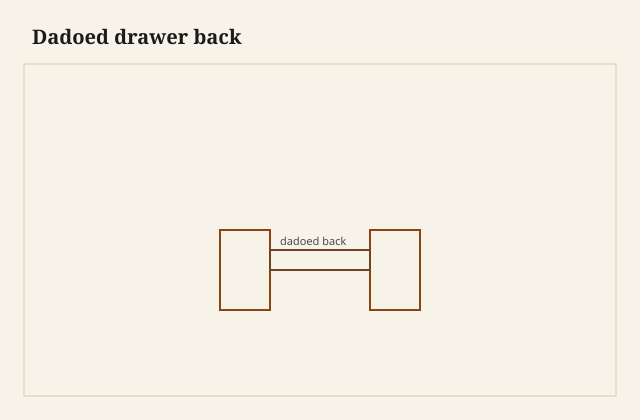

The back went home with a dry click. Not a clamp-up. Not a mallet. A pine board, square, sliding into two housings I had ploughed in the sides, and then a thumb-push until the shoulders kissed. No tails. No pins standing in raking light. The box was already a box. I set it on the bench and the rear wall did not rattle. That is the sound I trust when a dado is enough.

<figure class="dch-figure">
  
  <figcaption><strong>Figure 1.</strong> Dadoed drawer back. Pack schematic (CC0).</figcaption>
</figure>

<figure class="dch-figure dch-shop-pending">
  
  <figcaption><strong>Photo 2 (pending).</strong> The back is a board in two slots. The joint does not have to announce itself. Keith BBF shop library — unpublished; photographer unnamed until file metadata is pulled Slot: D:\BBF\BBF Photos — drawer back seated in housings in the sides, no tails at the rear (filename pending shop pull)</figcaption>
</figure>

The earlier essay in this pack gave the back permission to be pine, and thinner, and the place the floor finishes its travel. I will not retell the humility. This Saturday is the joint that essay pointed at and then left alone: a housing. A dado. A slot in each side that receives the back the way a bookcase receives a shelf, except the shelf is a wall and the load is a yank.

Through tails at the rear are the 18th-century settlement I still cut when the drawer is a sitting-room box and I have the hour. They lock the back to the sides even if the glue has gone to dust and the bottom has shrunk away. They are not a commandment. Plenty of honest drawers — country stacks, painted kitchens, shop tills, factory runs — close the box with a housing and go to work. The joint is allowed to be quiet. Quiet is not a costume if you do not later call the box Federal.

## What a housing is doing

A dovetail at the back is a mechanical lock in the pull direction. The pins and tails refuse to walk apart along the travel of the drawer. A dado is a sliding joint. The back can, in principle, leave the way it entered. Glue, pins, nails, and the bottom are what turn a slide into a wall. If you understand that, you will not be surprised when a dado fails. You will have decided, on the traveler, which of those locks you are buying.

I plough the housings from the rear edge of each side, stopped before the front so the slot does not telegraph into a half-blind I am proud of. Through dados are faster. They also show on the top edge of the side as two dark lines, and they leave the back free to keep sliding if nothing captures it. I use through slots on a painted kitchen box I will never photograph from above. I stop the slot when the drawer will be emptied onto a table and the top edges will be in the light.

Depth is meat. Too shy and you have a rumor of a joint — a scratch that holds a smear of glue and then lets go. Too greedy and the remaining wall outside the dado is a ribbon. I have split that ribbon by lifting a drawer by the side. [VERIFY] any depth I am tempted to print as a house number. What I will say is the feel: the back should sit in a step you can see as a shoulder, not as a pencil line, and the side should still be a side after the plough has eaten.

Width matches the back. A sloppy housing rattles. A piston housing in January in Wilmar will pinch in June when the back’s height — the cross-grain — swells in the slot. Leave a plane-shaving. Glue will take the rest if the glue is the right glue and the surfaces are wood, not dust.

## The bottom is often the pin

Here is the failure class that makes people swear off dados. The back is housed. The bottom is a board nailed up under the sides and under the back, as if nails were a floor and a lock. Someone yanks a stuck drawer. The nails tear. The back slides out of the housings and comes away in the hand, still wearing a row of bent brads, while the sides and front stay in the case like a three-sided tray. I have held that orphaned wall. It is a quiet joint telling the truth: it was never asked to lock, only to sit.

<figure class="dch-figure dch-shop-pending">
  
  <figcaption><strong>Photo 3 (pending).</strong> If the floor is the only pin, a yank turns the housing into a slide. Keith BBF shop library — unpublished; photographer unnamed until file metadata is pulled Slot: D:\BBF\BBF Photos — back walked out of shallow dados, nails in a nailed-only bottom still hanging (filename pending shop pull)</figcaption>
</figure>

A bottom that enters a groove in the back is a better pin, if you do not glue the ticket and if the groove has depth. The floor cannot leave without taking the back, and the back cannot leave without taking the floor, and the sides hold the floor. That is a box. A screw or a nail in a slot through the back into the bottom is the old country version of the same idea: the fastener is allowed to let the floor move, and it still keeps the wall from walking off.

I also pin through the sides into the edge of the back — one or two small nails or pegs, set where a later owner can find them. Hide glue in the housing plus two pins is a joint I will put socks in. Glue alone in a shallow dado is a joint I will put sandpaper in, and only because I am in the room when it lets go.

Factory housings fail the same way at scale. A shallow slot, starved glue, a stapled floor, a kitchen load. The back loosens. The box lozenges when you pull a corner. People then say dados are weak. The dado was not asked to be a tail. It was asked to be a slot, and then nobody paid for the pin.

## When I choose the quiet joint

I house a back when the drawer is painted, when the run is a kitchen, when the box will live in a shop cabinet and be dumped daily, when the customer is paying for a front and a fit and not for a photograph of pins in the dark. I house a back when the sides are plywood and I do not want to cut tails in a sandwich. I house a back when I am repairing a country case that already spoke that language, and I will not convert it to through tails so I can feel better in the aisle.

I cut through tails at the back when the front is half-blind and the piece is a sitting-room stack, when the sides are solid and I have the hour, when I want the box to stay a box if the floor is ever replaced by someone in a hurry. Tails are not a virtue. They are a lock that does not depend on the bottom. That is worth the hour on a drawer that will be emptied by grandchildren.

I do not house a back and then stain the slot-ends to look like pins. That is a lie with a brush. If you want the look of tails, cut tails. If you want the quiet joint, let it be quiet and write it on the estimate as a housing, the way London wrote a slip as an operation. The work is still work.

## Failures

I once ploughed through dados and trusted a nailed quarter-inch pine floor to keep the back at home. The drawer bound on a swollen runner. The owner pulled hard. The back came out in his hands and the shirts spilled into the case. I cut a new back, stopped the housings, grooved it for the floor, and put two pegs through the sides. The runner I should have eased first. The joint I should have pinned from the start.

I also cut housings too close to the top of a shallow drawer so the back would “look deeper.” The meat above the slot was a ribbon. The ribbon split when someone lifted the box by the sides. The groove — any groove — wants to live where the board has something to be. Look at the old housed backs. They are not shy. They sit in the middle third, or a little below, and they look like walls.

A student glued a back into sloppy dados with a bead of PVA and called the squeeze-out a fillet. The fillet was a gap-filler. In a year the back ticked. We recut the sides. Glue is not a shim, and a housing is not a place you argue into fitness.

## What this is not

This is not a ban on through tails. Through tails at the back are correct, fast once you are in practice, and kind to the next repair. This is not a claim that a dado is “just as good” in every direction. It is not. It is a different joint. It is good when you pay for the captures — stopped shoulders or pins, a floor that holds the wall, glue on wood that fits.

This is not a period trick you can use to make a kitchen box into an 18th-century lining. Hayward’s settlement at the rear is still tails if you are standing on that bench. Country and factory work already knew the housing. Joyce’s production manuals would recognize it without blushing. I will not put a housed poplar back behind a cockbeaded mahogany front and tell a customer the box is Federal. The front can be a picture. The back should tell the truth about the Saturday.

The judgment is small. If the back only has to be a wall, a housing is enough — when the floor or a pin keeps it from becoming a sled. If the back has to stay put after the glue and the nails have had a century to fail, cut tails. Do not ask a nailed-only bottom to be the lock. The click I heard on the bench was a joint that had been given its captures. The orphaned wall in a customer’s hand was a joint that had not.
