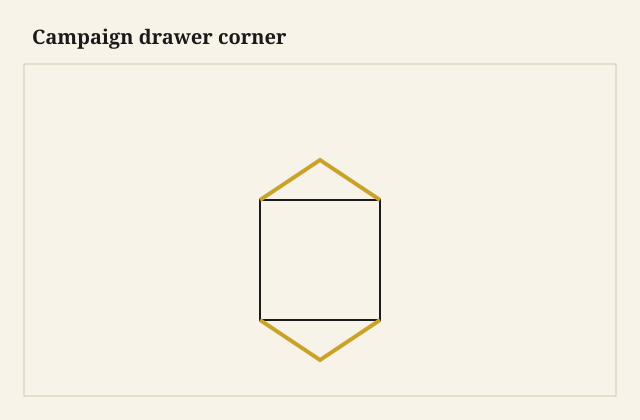

The pull sat dead in its well. Brass, flush, cold under my thumb, a recessed handle that would not catch a rope or the case beside it. I drew the drawer out of a teak chest that still wore corner straps — not a named officer’s piece, a later cousin that had kept the luggage habit — and the box came heavy and square, a lock keeping its tongue until I turned a key that was not original. The front was a board you could lean a trunk on. The lining was a lining. That is the job: a drawer that survives a ship.

<figure class="dch-figure">
  
  <figcaption><strong>Figure 1.</strong> Campaign drawer corner. Pack schematic (CC0).</figcaption>
</figure>

<figure class="dch-figure dch-shop-pending">
  
  <figcaption><strong>Photo 2 (pending).</strong> The pull sits in a well. Nothing stands up to catch a lashing or a neighboring case. Keith BBF shop library — unpublished; photographer unnamed until file metadata is pulled Slot: D:\BBF\BBF Photos — flush brass campaign pull seated in a teak or mahogany drawer front (filename pending shop pull)</figcaption>
</figure>

Campaign furniture, in the dealer literature this pack is allowed to stand on, is British traveling kit of the later 18th and the 19th centuries, especially the colonial and military trade. I will not invent a regiment or a cabin. I will not lift a dealer photograph. Two-part chests, flush pulls, brass corners and straps, side carrying handles, teak from Indian yards or mahogany from English shops, bun feet that sometimes come off — those are the repeating captions. [VERIFY] any tighter year before a tag. The advanced pack already spent a Saturday on the brass that lets a traveling bed come apart. I will not retell that hardware. This essay is the drawer that has to live in the case that travels.

## Flush is a load path

A bail that stands off a Federal front is a pretty catch for a lashing. A wooden knob is a pretty catch for the next chest in the hold. Campaign work puts the pull *in* the front. The well is a mortise. The brass is a plate and a bail or a flush lift that stays inside the thickness when it is down. The front is the abutment. When you pull, you are pulling on metal that is let into wood, not on a screw in a proud mushroom. I have pried a cheap “campaign” cup out of a pine front because the cup was a hat and the screws were in 5/8 of nothing. The old wells are deep enough to be a joint. Charge the mortise. Do not glue a plate on and call it travel.

Locks are not jewelry here. A traveling drawer is a strongbox in a stack that will be out of your sight. Lever locks are common in the dealer notes. A Bramah on a top small drawer shows up when the caption wants valuables; I will not make that a law. [VERIFY] the lock against the piece. What I will say: the escutcheon is flush too, or it is a small proud that still will not catch. A proud Victorian rose on a teak campaign front is often a replacement. Look at the shadow in the finish.

The pull’s screws or posts live in a front that may also take a lock. Half-blind keeps the field as meat if the shop was cutting tails. Some traveling boxes use simpler corners — rabbets, even fingers, cousins of the shop-drawer essay this pack will give to box joints. I will not flatten every campaign drawer into half-blinds. I will say the front must remain a plate that can be pulled by the brass and locked by the bolt and bumped by the next crate. Meat in the middle. Joint at the ends.

## The case is luggage; the box is still a box

<figure class="dch-figure dch-shop-pending">
  
  <figcaption><strong>Photo 3 (pending).</strong> The case is luggage. The drawer is a strongbox that still has to run when the chest is a chest again. Keith BBF shop library — unpublished; photographer unnamed until file metadata is pulled Slot: D:\BBF\BBF Photos — brass corner and strap on a knockdown chest, drawer lock escutcheon flush (filename pending shop pull)</figcaption>
</figure>

Knockdown is the chest’s religion. Two halves, sometimes more, iron or brass carries, straps that keep the corners from crushing. The drawer has to come out before the case comes apart, and it has to go back when the case is a chest again in a damp room that is not the room it was made in. That is a harder life than a parlor stack. Teak and mahogany are the woods the captions keep naming because they take wet and take knock. Camphor shows up when the story wants insects and China trade. I will not invent a cargo. I will say I have repaired a teak lining that had seen weather the finish could not explain, and the tails were still tails.

Ash and other secondaries appear as linings in English-shop mahogany examples. Colonial teak chests sometimes run teak through the box. Species follows the yard. Secondary wood is still not a slight. A traveling drawer can be oak or ash inside a mahogany face and be richer for it. I do not stain the lining to match the straps.

Bottoms take abuse. The chest will be set down hard. The drawer will be used as a handle if the pull is flush and the hand is in a hurry — you grab the well and you also grab the box. A nailed-only floor is a poor idea in a trunk. A floor in a groove, or a thick field with a ticket, or a ply sheet in a later repair, needs to stay a floor after a racking. I groove. I do not ask brads to be a keel.

Racking is the other weather. A ship rolls. A wagon hits a rut. The case can be strapped and still rack a hair, and a drawer that was a piston will become a wedge. I leave the box a little free in width and I do not ask the flush pull to be a pry bar. If the drawer is used as a handle — and it will be, because the well is where the hand goes — the sides have to stay joined. That is why I still like tails or a pinned housing at the back of a traveling box, even when the front is all brass.

Fit is the quiet problem. A drawer that was a piston in a dry English shop will bind in a wet hold, or rattle in a dry one, and then someone will force it and the flush pull will teach the front what a lever is. Leave a shadow. The straps will not hide a yanked front. The drawing-error essay already named the piston. Travel multiplies the audit. You do not know the next climate. Draw the gap as if you meant the ocean.

## What I will build, and what I will not fake

I will build a chest that comes apart, with flush pulls and corner brass, if a customer wants luggage that lives in a house. I will write *flush mortise* and *straps* on the traveler. I will not stamp a regiment. I will not call a pine box with catalog cups a campaign piece. The word is specific. Spend it on a box that could be lashed.

I will not pretend Wilmar is Calcutta or Portsmouth. Teak I can buy. Brass I can let in. The sea I cannot put in the shop. What I can put is a lining that stays a lining after the case has been taken down and set up, and a pull that does not catch a moving blanket. That is enough romance. The rest is a dealer’s century, and the dealer already wrote it.

Box-jointed shop drawers are a cousin, not a child. Fingers travel well. They are also how a bench makes a till. If I use fingers on a traveling box I say *fingers*. If I use tails I say *tails*. I do not say *period campaign dovetails* unless I am looking at a piece that has them and a catalog that agrees.

## Failures

I let a proud reproduction bail onto a teak front because the flush pulls were weeks out and the job was leaving. The bail caught a moving pad in the truck and tore a scallop of grain. I recut the front and waited for the wells. Flush means flush. Almost flush is a hook.

I also locked a drawer with a cheap surface lock that stood off the front like a hat. It caught the upper half of the knockdown when we stacked the case for a photograph. The lock lost. The rail bruised. Mortise the lock or admit the piece is a parlor chest with straps for show.

A student screwed brass corners through a thin lining into a drawer opening, so a strap landed where a side needed to run. The drawer shaved brass. We moved the strap. The case is luggage. The hole is still a hole. Draw both.

## What this is not

This is not a history of the British Army. This is not a bed. The brass that takes a traveling frame apart already had its essay; I nodded; I am done. This is not a claim that every flush pull is campaign — kitchen cups hide too, for other reasons. This is not a teak hymn. Poor teak exists. Poor mahogany exists. Brass can be thin.

The judgment is small. If the drawer has to travel, sink the pull, lock the box, strap the case, and keep the lining a lining that can run after the climate changes. If the drawer only has to look as if it traveled, say so and save the mortise. A flush well under the thumb is a sound I trust: metal, wood, no catch. The ship is a story. The catch is a fact. Build against the catch.
