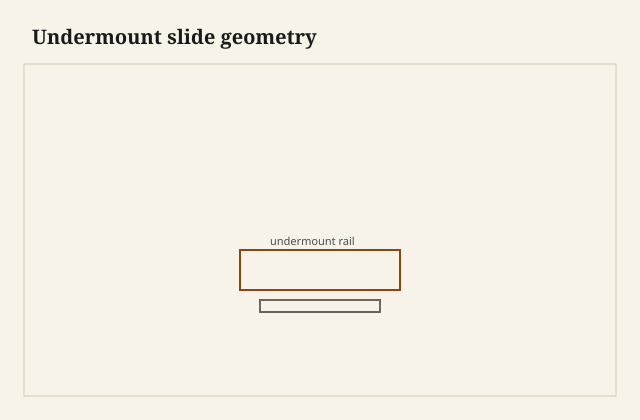

I turned the drawer over on the bench and the hardware was all on the underside — two steel rails, a pair of locking clips at the front, hooks at the back, and a damper that clicked when I pushed the carriage home with a thumb. The sides were maple, clean, no screw line, no roller. From the room this box would look like a wooden drawer. From the bench it was a wooden drawer wearing a chassis. I have learned to like that honesty more than the sales word *invisible*. The runner is not invisible. It is underneath. Those are different sentences.

<figure class="dch-figure">
  
  <figcaption><strong>Figure 1.</strong> Undermount slide geometry. Pack schematic (CC0).</figcaption>
</figure>

<figure class="dch-figure dch-shop-pending">
  
  <figcaption><strong>Photo 2 (pending).</strong> The hardware lives on the belly. The side stays a side. The customer is not invited here. Keith BBF shop library — unpublished; photographer unnamed until file metadata is pulled Slot: D:\BBF\BBF Photos — drawer inverted, undermount rails, locking devices at the front underside (filename pending shop pull)</figcaption>
</figure>

A side-mount slide is a confession on the lining. You see zinc or black or white every time the drawer comes out. An undermount is a decision to sell the lining. The customer paid for wood. The plant paid for a rail that would get out of the photograph. I build both. I do not tell the customer they have no hardware. I tell them the hardware is on the belly, and that the belly still has a job.

## The box still owes the sheet

Hiding the runner does not hide the contract. A concealed rail still wants a width, a side thickness, a notch, a hole for a hook. The box is still a part number. What the room sees is wood. What the bench still owes is a square box. Square. Spec thickness. A bottom that leaves room for the carriage, or a notch that lets the rail pass. Holes for locking devices, bored where the template says, not where a guess says. Rear hooks that actually catch. If any of that is sloppy, the drawer will still slide — once — and then it will list, or it will refuse to clip in, or it will come out in your hands with a rail still in the case.

I dry-fit the clips before I finish the box. The locking device is a little plastic-and-steel mouth that grabs the front of the runner. Left and right are not the same part. I have installed two lefts. The drawer went in on one side and hung in space on the other. That is not a mystery. That is a bin that was not labeled.

Thickness is not a feeling. If the side is fatter than the clip will hug, the rail sits in air. If the side is skinny, the clip pinches and the box goes hourglass when you drive the screws. [VERIFY] the maximum and the happy thickness for the SKU on the bench. I will not reprint a millimeter from memory. What I will say: I now write the thickness on the end of the side stock before I cut tails, because I am tired of discovering the number after the joint is closed.

Squareness is the debt people skip. A racked box on wooden runners can be lived with. You feel a rub and you plane it. A racked box on undermounts makes a reveal that changes as the drawer travels. The front goes up on the left and down on the right, then swaps, because the rails are trying to be parallel in a parallelogram. Soft-close will not fix that. Soft-close will close it *crooked*, quietly.

## Soft-close is a damper

BLUMOTION and its cousins are dampers. They take the last inch of travel and spend it. They are not joinery. They do not square a case. They do not thicken a side. They do not replace a kicker. They do not keep a wide drawer from racking if the box is wide and the rails are two thin lines under the edges. I like a damper in a kitchen. I like it less as a sentence on an invoice that says “premium drawers” when the premium is a piston and the box is stapled.

A damper can hide a slam. It cannot hide a gap. The gap is the case talking. Inset work is the loudest talker. Overlay fronts forgive a little because the front is a lid on the hole. Inset fronts sit in the hole. An undermount under an inset front is a tight religion: runner setback, depth-adjustable clips, a case that was square when the clips were bored. I have chased an inset reveal with the little screws on a locking device until I admitted the cabinet was in wind. The screws have a small life. The case has the rest of it.

<figure class="dch-figure dch-shop-pending">
  
  <figcaption><strong>Photo 3 (pending).</strong> The room sees lining and a front. The gaps tell on the cabinet the slide cannot correct. Keith BBF shop library — unpublished; photographer unnamed until file metadata is pulled Slot: D:\BBF\BBF Photos — open kitchen drawer, wood side visible, reveal at the case, no slide in the sightline (filename pending shop pull)</figcaption>
</figure>

## What they hide, what they reveal

They hide the runner. That is the product. A person standing in a Warren kitchen sees maple or beech or whatever lining the plant chose, and a front, and a shadow. They do not see the zinc. For a lot of houses that is the whole wish. I do not sneer at it. I have sneered at it. Then I opened a side-mount drawer in a dining room and watched a guest look at the rail instead of the silver. The undermount is a courtesy to the lining.

They reveal the case. Wooden runners and a slightly fat drawer can conspire to look all right in a case that is a little drunk. The wood rubs, the wax shines, the eye gets used to a reveal that is not a line. Concealed slides stand the box on two precise rails. If the opening is a trapezoid, the front reports it. If the face frame is twisted, the front reports it. If one runner is a sixteenth farther forward than the other, the front reports it. I have started using undermounts as a winding stick. If the reveals fight me, I stop blaming the clips and I look at the cabinet. The hardware is telling the truth I used to plane away.

They also reveal the bottom. A solid floor that droops will kiss a rail. A plywood floor stapled short of the sides will leave the clips with nothing honest to screw to. Glue-blocks under a Boston drawer are a different religion; I will not drag them in except to say an undermount wants a landing, not a sculpture. Keep the underside clean. Keep the notch big enough. Keep the back thick enough to take a hook without crumbling.

South Arkansas will still move the *box*. The rail does not swell. The maple side grows in height. A tall drawer in a tight inset opening can bind at the top in a wet month even though the slide is happy underneath. That is a clearance you owe the weather when you have hidden the only part that does not move. Leave meat at the top. The damper will not invent it.

## What I do on the belly

I square the box to itself before I bore. I use the maker’s template when I have it. I bore both locking devices from the same face so the holes agree. I notch the back as a notch, not as a bite from a dull spade bit. I clip the drawer on and off twice before finish, because a clip that is going to crack should crack on my bench. I set the runners in the case with a spacer, not with a guess, and I check that both back hooks see wood.

I still build wood-on-wood when the job is a wood-on-wood job. An undermount in a mule chest is a translation. A wooden runner under a row of kitchen trash drawers is a different translation. Name the product.

## Failures

I once sold “all wood, no metal” on a pair of nightstands and then put undermounts in them because the customer had liked a soft-close in the kitchen showroom. The sentence and the belly did not match. I called it what it was and I did not use the sentence again. The hardware is allowed. The lie is not.

I also racked a 36-inch pot drawer because I treated two undermounts like a pair of wooden runners and skipped a center guide the sheet did not mention. Wide drawers still rack. Geometry does not care that the steel is hidden. I split the opening or I added the guide the next time. The damper closed the racked drawer like a hymn over a wrong note.

A third: I finished the underside of a cedar-bottomed box with oil, pretty as a boat, and the locking devices sat on a film. Two screws walked. Bare wood under a clip. Oil on the show. I knew that after the first drawer came off in a customer’s hand. I will not invent the rest of that conversation.

## What this is not

This is not a brand sermon. TANDEM, MOVENTO, the equals on the shelf — they are a family of concealed rails. Read the sheet you bought. This is not an argument that side-mounts are dishonest. Side-mounts are honest steel. Some jobs want the confession. This is not a retelling of seasonal bind as a June surprise. Clearance is a drawing. The hidden rail just makes the drawing’s mistakes easier to see.

The judgment is small. If you hide the runner, you have bought a lining and a pair of truths. The lining can be pretty. The truths are a square box and a square hole. Soft-close spends the last inch. It does not spend the twist. Build the belly as if someone will turn the drawer over — because I will, and so will the next person who has to change a clip.
