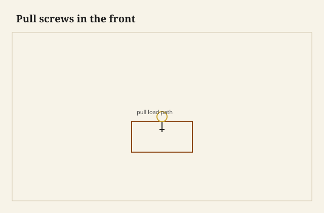

The bail came off in my hand with both rosettes still on it, screws and all — the front had given up a little crater of cherry around each hole, bright wood in a dark face, as if the posts had been trees and someone had pulled them up. The drawer stayed in the case. The handle did not. I set the bail on the bench and looked at the holes. One of them had found the void of a half-blind socket. The screw had been biting air and a skin of pin. That is not jewelry failing. That is a load path that ended in a cavity.

<figure class="dch-figure">
  
  <figcaption><strong>Figure 1.</strong> Pull screws in the front. Pack schematic (CC0).</figcaption>
</figure>

<figure class="dch-figure dch-shop-pending">
  
  <figcaption><strong>Photo 2 (pending).</strong> Two posts, a swinging bail, a front asked to be a beam. The screws stop in wood or they stop in a socket. Keith BBF shop library — unpublished; photographer unnamed until file metadata is pulled Slot: D:\BBF\BBF Photos — bail and rosettes on a drawer front, or the same front from inside showing screw tips in the pin wall (filename pending shop pull)</figcaption>
</figure>

A pull is how a person gets a box to leave a case. The force goes hand, pull, screws or tenon, front, joint, side, runner. If any of those sentences is weak, the weak one announces itself. I have seen beautiful brass on a front that was already a crack. I have seen a pine knob on a box that will outlive the house. The metal is not the grade. The path is the grade.

## The front is an abutment

Half-blind pins live in the front. The pull lives on the front. They share a board the way a lock shares it. A wide drawer with two bails is a beam with two hangers. A narrow drawer with one knob is a beam with one. The joint at each end is the abutment that keeps the beam from coming toward you in pieces. Tails on the sides, pins in the front: the pull is why that religion exists. You yank the picture. The picture has to bring the box.

So I lay out pulls after I know where the pins are, or I lay out pins after I know where the pulls are. What I do not do is drill for 8-32 posts in a finished front and hope. Hope finds sockets. Hope finds a lock body. Hope finds the groove of a sliding dovetail in a kitchen box and comes out the channel. I mark the inside. I hold the pull. I look at the pin wall. Then I drill.

Screw length is a stack, not a feeling. Front thickness, minus any lip rabbet, minus the depth you must not enter — lock, groove, socket. Too long and the tip tents the inside or kisses iron. Too short and you are in veneer. Machine screws into threaded posts want a hole that is a hole, not a wander. Wood screws into a knob want a pilot that does not split the knob and a bite in the front that is not end grain of a pin. [VERIFY] any length I am tempted to print. What I will say: I now keep a paper story stick of the front’s insides — pins, lock, groove — and I hold the screw against it. The story stick is uglier than a caliper and faster than a repair.

## Five common hands

Bail and rosette. Two posts, two backplates or two round rosettes, a swinging bail. Eighteenth-century brass, and every revival after. The load splits between two holes if you pull the bail in the middle. If you hook a finger at one end of a long bail, you load one post. Long bails on wide drawers are levers. I have bent them. I have watched a single rosette tear when someone used the bail as a lift for the whole chest. The bail is a handle for a drawer, not a handle for a case.

Drop. One plate, one hanging drop. The load is a point. Fine on a small drawer. A lonely drop on a 36-inch kitchen front is how you rack a box. Two drops, or a pair of knobs, or admit the front wants two hands.

Wood knob. Turned, Shaker-plain, Victorian fat. A tenon through the front with a wedge or a nut, or a screw from the inside. The load sits on one circle. A knob in the center of a wide front racks the drawer unless the runner is doing extra work. Two knobs on a wide front is arithmetic. I like a wood knob on a sitting-room drawer that does not want brass. I do not like a tiny knob on a file drawer full of paper.

Cup. The Arts & Crafts bin pull, a trough you hook. The load is a lift as much as a pull, kind to a heavy drawer if the screws reach meat. A stamped cup on thin brass with short screws is a costume. The fingers are fine. The path is a rumor.

Flush, the campaign cousin. A pull in a recess so a traveling chest can be stacked without a bail catching the next case. I am not writing that traveling box here. I am writing the load. The recess thins the front. A deep dish in a 3/4 board is a 3/8 wall at the worst moment. I leave meat. I do not cut a campaign dish into a lipped front that has already given up a rabbet.

<figure class="dch-figure dch-shop-pending">
  
  <figcaption><strong>Photo 3 (pending).</strong> Different hands, same job: get the box to leave the case without tearing the front off the sides. Keith BBF shop library — unpublished; photographer unnamed until file metadata is pulled Slot: D:\BBF\BBF Photos — wood knob, cup pull, and flush pull on the bench or on neighboring fronts (filename pending shop pull)</figcaption>
</figure>

A pull fails when the path ends. Wood around a hole crushes. A socket is a void. A lock body is a void with iron in it. A plywood front delaminates in a circle. More often the brass is fine and the cherry is a crater. I have replaced more wood than metal. Oil in a screw hole and the screw never bites; I leave the hole dry now. South Arkansas hands are not gentle. I open a finished drawer with the heel of my hand the way a tired person does. If the front flexes, the pull is in the wrong place or the joint is shy. If the bail hits the rail on the way in, the meeting is wrong — overlay, lip, inset — and the pull was designed for a different hole.

## What I put on the traveler

Pull first or pins first: I decide, I write it. Two pulls on anything over a couple of feet. Screw length as a measured stack. Clearance for the lock. Clearance for an undermount clip if the clip lives near the front underside — I have had a knob screw meet a locking device. That meeting is loud.

I do not sell a pull as a period blessing unless the rest of the box agrees. A stamped cup on a half-blind walnut drawer is allowed if we say it is a choice. A reproduction bail on a kitchen overlay is allowed if we say it is a kitchen. What I will not do is pretend the brass is doing the joinery. The brass is doing the hand. The front is doing the joinery. If the front is a false lid on a stapled box, the load path ends in staples. I tell that truth or I change the box.

Wax the runner. Tighten the posts after a season. Wood moves; brass does not. A rosette that was snug in June can spin in January. That is not a defect in the brass. That is a washer and a turn you owe the year.

## Failures

I drilled a pair of bail holes through a pin socket on a cherry front I liked too much to recut. I plugged the socket with a matching slip, a Dutchman I can still find with a thumbnail, and I moved the pull a half-inch. The symmetry police lost. The path won. I should have moved the pins on the layout. I move the pins now.

I hung a single cup in the center of a pot drawer because the drawing looked calm. The drawer racked, the slide protested, the cup stayed pretty. Two cups. Or a wider cup and a center guide. Calm drawings are not load paths.

A flush pull I recessed too deep left a front that flexed like a tin. The campaign idea is a shallow dish and a thick leftover, not a bowl. I laminated a patch on the inside and I still dislike that drawer. Meat is the dish’s neighbor.

## What this is not

This is not a hardware catalog. There are rings, rings-and-backs, glass knobs, wooden pulls shaped like leaves, every revival. They all obey the same path. This is not the campaign chest essay. Flush pulls get a nod because they thin a front and they travel. This is not a sermon against brass. Brass is fine. So is a knob I turned from pecan. The material is not the argument.

The judgment is small. A pull is a handle. The front is a beam and a pin wall and sometimes a lock wall. Lay the path out so the screw ends in wood. Give a wide box two hands. Do not ask a bail to lift a chest. Do not ask a cup to hide a staple. When the hardware comes off in your hand, believe it. It is telling you where the path ended. Put the path back into meat, and let the jewelry be what is left.
