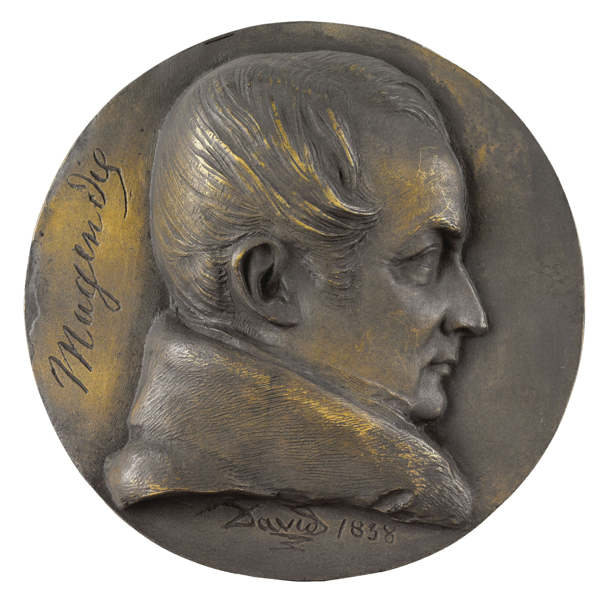

# François Magendie

*Educational history for SLPWOW. Not a treatment plan and not a substitute for evaluation by a licensed clinician.*

<!-- figure-id: francois-magendie.lead-portrait -->
<figure class="slpwow-figure slpwow-figure--portrait">
  
  <figcaption>
    <strong>François Magendie</strong> (1783–1855), French physiologist who treated deglutition as interruptible physiology in the *Précis* textbooks.
    BIU Santé / Wikimedia Commons. CC0 1.0.
  </figcaption>
</figure>

The *Précis élémentaire de physiologie* is a thick French textbook, not a clinic manual. Deglutition lives in it the way urine and breath live in it: as an act you can take apart. François Magendie, born in Bordeaux on 6 October 1783 and dead in Paris on 7 October 1855, is in this pack because later swallow science still uses his permission. He is not in it because he was a speech-language pathologist. The credential would have baffled him.

## Bordeaux, Paris, the table

He came to Paris as a young physician in the generation that wanted physiology to stop being a commentary on the ancients. The Hôtel-Dieu and the lecture room were his workplaces. The animal table was his reputation. Contemporaries already split over him: the man who could demonstrate a fact, and the man who made demonstration a blood sport. Later medical ethics will not baptize the table. A heritage series that hides it is selling a children’s Magendie.

The Bell–Magendie argument about spinal roots is the fame that crowds out the swallow. Keep it in a sentence. The swallow chapters matter here because they treat the meal as a chain of local motions, some of them outside conversation. That claim will travel, unnamed, into every later “once the pharyngeal swallow starts…” lecture. Magendie did not write that lecture. He wrote a physiology.

## The work that still sits on a shelf

Successive editions of the *Précis* from 1816–17 onward. Papers and demonstrations that made vomiting, swallowing, and absorption problems you could interrupt. Claude Bernard as the student who would make the method look like a system. The later GI historian who still trips over Magendie on the way to Cannon.

What later people discarded is the public casualness of the cutting. What they kept is the map: mouth, pharynx, esophagus as rooms with different rules. What they had to apologize for is the cost at which the map was bought.

## Residue

A Bordeaux birth date and a Paris death date, one day after a seventy-second birthday. A textbook that outlived the fights about vitalism. A later fluoro suite that still believes a swallow is a mechanism. The residue is the permission, and the debt.
