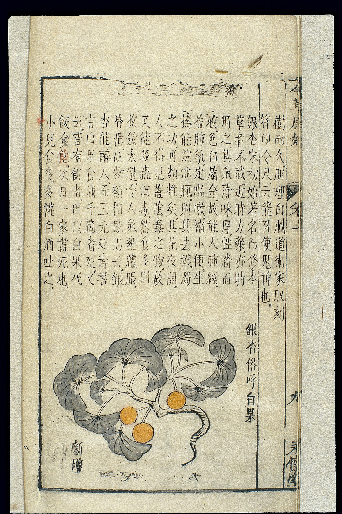

# Xinxiu bencao: the Tang state's book

In the fourth year of Xianqing, on a day the *Tang huiyao* is later said to record, a group of officials finished a book they had been ordered to make. The year, in the usual conversion, is 659. The title is *Xinxiu bencao* 新修本草, Newly Revised Materia Medica. People also call it *Tang bencao*, which is handy and a little lazy, as if the dynasty had only one. I will use *Xinxiu*.

The origin story, as later histories tell it: Su Jing 蘇敬 (also called Su Gong in polite later reference) asks, around 657, for a revision of Tao Hongjing. The court staffs a team. The number that has stuck is twenty-two. The names that get repeated include men who are physicians and men who are not — Li Chunfeng, Xu Jingzong, others — and a finishing eye associated with Li Shiji. A Japanese-transmitted account and a Dunhuang-related fragment have been used to argue that Zhangsun Wuji’s political weight sat on the project early. I was not in the room. The list, as a list, still tells you what kind of book this was meant to be: not a hermit’s commentary, a government product.

The shape, again as later described: on the order of fifty-some *juan* if you count text, illustrated classic, and captions together. A main text in twenty *juan* plus a table. Pictures. A *tujing*. Something like 850 substances in the handbook count I see most often. I treat 850 as a traditional figure, not as my inventory. The pictures matter even if we no longer have them in the original colors. This is one of the earliest official pharmaceutical books that *wanted* to be seen as well as read. Draft 40 will come back to that want.

<figure class="eahp-figure" id="eahp-fig-xinxiu-standin" itemscope itemtype="https://schema.org/ImageObject">
  
  <figcaption itemprop="caption">
    <strong>Figure 1.</strong> Seventeenth-century plant-drug illustration sheet (Wellcome L0039345) shown as a **type** of official-looking picture grid, not as a surviving Tang color plate from 659. The *Xinxiu* pictures are described in later sources; this file does not replace them.
    Credit: Wellcome Collection. CC BY 4.0.
  </figcaption>
  <meta itemprop="name" content="Seventeenth-century Chinese plant-drug illustration grid (Wellcome L0039345)" />
  <link itemprop="license" href="https://creativecommons.org/licenses/by/4.0/" />
</figure>

What the court said it was doing — I am paraphrasing later official language, not holding the edict — was to set a standard for drug use. In a manuscript empire that is a strong verb. I do not know how many working copies left the capital. I do not know how a prefectural doctor met the book, if he met it. The honest statement is: **the Tang state claimed the right to speak the identity of drugs in one arranged voice, and it paid a mixed team to write that voice down.**

Su Jing’s own profile, in the biographical crumbs, is not “great physician of the age.” He looks like a man who knew tribute goods and a famous stubborn disease of the feet (*jiaoqi*), the kind of knowledge you get from logistics and from a court medical problem that will not go away. That is almost too neat for my taste — the tribute official who writes the tribute-shaped book — and I flag the neatness. It may be later storytelling around a real post.

The *Xinxiu* is often called “the first state-sponsored pharmacopeia in China,” and sometimes, in a swell, “the world’s first national pharmacopeia.” The first half I will carry, with the class attached: first *in the series of imperial Chinese bencao projects as later historians have named that series*. The second half I will not carry. Other places wrote official drug lists. “World’s first” is a prize. This collection does not give prizes.

The book’s afterlife is a better story than its birth, and it is mostly a story of **not staying in China**. By the Song, the *Xinxiu* as a complete work is already being treated as something you reconstruct from other books. A copy tradition survives in Japan; a date of 721 for transmission is widely repeated. Dunhuang left fragments. The National Library of China has a piece that scholars have set next to those fragments. Draft 13 is that survival. The irony is ordinary and still worth saying: the first Chinese state *bencao* is a Japanese and a desert witness.

For Korea, the *Xinxiu* is not “the Korean book.” It is part of the ocean of Tang medical writing that Goryeo and Joseon compilers fished. When a later Korean project insists on *hyangyak*, it is insisting against the cost and prestige of that ocean, not against a single title.

I have not read the *Xinxiu* as a continuous reconstructed text from first *juan* to last. This draft is about the event of the book and the kind of object it was. A later pass should sit with a diplomatic edition and say what, exactly, the large-character layer still shares with Tao.

## Open questions

- Can the twenty-two-name list be sourced to a single early witness, or is it a composite of later lists?
- How should we talk about the illustrated *juan* without pretending we have the 659 paintings?

## Sources used

*Tang huiyao* dating as reported in standard accounts. Wikipedia/handbook synthesis checked against the UW/De Gruyter open chapter on the *Newly Revised Materia Medica* (team composition, Gaozong’s sponsorship). Toyo Bunko paper on NLC fragment 臨.2371 and Zhangsun Wuji. Mayanagi on later quotation. Unschuld’s official-series framing.

## Claims I am not making

- That I have handled a Tang-period complete copy.
- That “first in the world” is a demonstrated fact.
- That promulgation equals use in every prefecture.
