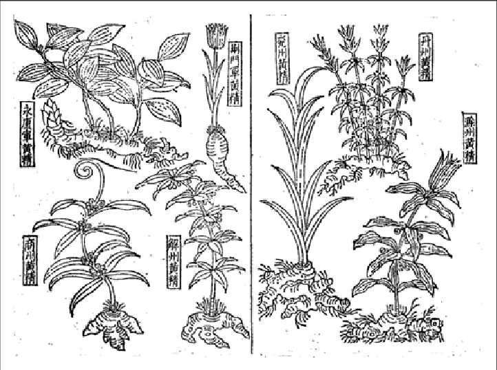

# Su Song and the illustrated classic

Su Song 蘇頌 (1020–1101) is easier to meet as the man of the astronomical clock than as a *bencao* editor. That is a modern fame-sort. In this collection he matters because the court asked the prefectures to send pictures, and he was one of the men who had to make a book out of what came back.

The project sits in the Jiayou reign. The usual years: an order to revise the official *bencao* (Zhang Yuxi and others on the textual side, the *Jiayou bencao*), and a parallel order to compile a *tujing* 圖經, an illustrated classic, presented in 1061. Su Song’s name is the one that stuck to the pictures.

<figure class="eahp-figure" id="eahp-fig-tujing-line" itemscope itemtype="https://schema.org/ImageObject">
  
  <figcaption itemprop="caption">
    <strong>Figure 1.</strong> Line plate from the illustrated materia medica tradition Commons links to the <em>Bencao tujing</em> / Song official illustration story. Later books attribute this kind of image to prefectural submissions; this file does not prove a specific 1061 drawing survived unchanged.
    Credit: Wikimedia Commons contributor. CC BY 4.0.
  </figcaption>
  <meta itemprop="name" content="Illustrated materia medica line plate (Bencao tujing tradition)" />
  <link itemprop="license" href="https://creativecommons.org/licenses/by/4.0/" />
</figure> Twenty *juan* plus a contents *juan* in the bibliographic notes. Later working counts — I am repeating handbook figures, not my census — talk about on the order of 780 substances and nine-hundred-plus pictures, with a hundred-odd “new” items. The original *Tujing* as a stand-alone Song book is, again, not what you casually open. We meet it in the *Zhenglei* line and in later reconstructions.

I care about the *method* more than the counts.

The method is imperial in a different way from 659. The Tang book had illustrations; the descriptions we have make them sound like a capital product. The Jiayou book asks the *empire* to look. A prefecture is told to have the local thing drawn and explained. What returns is not nature. It is a bureaucracy’s idea of a plant: a clerk, a painter who may never have been a pharmacist, a specimen that may be the market grade rather than the wild one, a name that may already be a substitute. Su Song’s job, as I understand it from later accounts of the preface, is to arrange that mess into a classic.

So the pictures argue (draft 40). They argue that the right identity is a visible identity. They argue that the prefecture is a witness. They argue — this is the dangerous part — that a line drawing can travel in place of a plant. Sometimes it can. Sometimes it teaches the next painter to copy the last painter, and the leaf migrates off the stem of the world.

There is a scholarly habit of calling the *Tujing* “the world’s earliest printed illustrated materia medica.” I will say: **it is the earliest printed illustrated official *bencao* in this series that we can still largely recover as a set of images through later books.** “World’s earliest” I leave to people who have checked every other woodblock tradition.

Su Song the polymath is a temptation. I will not make the clock explain the herbs. I will say only that the same court culture that wanted a machine to model the heavens wanted a book to model the provinces’ drugs. Both are projects of *correspondence between a center and a distributed world*. The clock is a model you can point at. The *Tujing* is a model you can miscopy.

When Li Shizhen later complains about pictures, and when Japanese honzō scholars later go into the field because the Chinese picture does not match the Japanese plant, they are living in Su Song’s problem. He did not invent the problem. He made it official, and he made it printable.

## Open questions

- How much of the surviving *Zhenglei* image-set is Jiayou-line and how much is later recut or substitution? Image stemma is a field of its own.
- What did a prefecture actually send — a fresh drawing from life, a copy of an older official picture, a market-stall sketch? I suspect all three. I cannot prove the mix.

## Sources used

Bibliographic notes on *Tujing bencao* (twenty *juan*, 1061 presentation). Handbook counts of images and items. Unschuld on Song official illustration. Later *Zhenglei* as the vehicle of survival (draft 17). Su Song’s dates as standard.

## Claims I am not making

- That the 1061 pictures are photographic witnesses of Song flora.
- That I have seen a complete independent Song *Tujing*.
