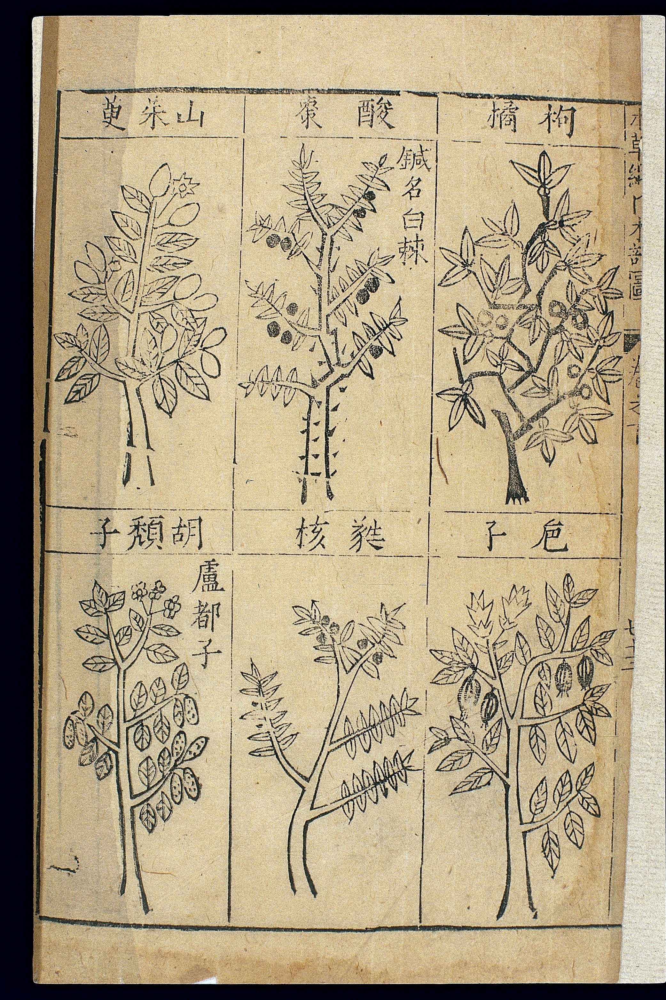

# Bencao gangmu as a machine for reading

The *Bencao gangmu* 本草綱目 is usually introduced as a pile of facts. I want to introduce it as a machine. *Gang* is the leading rope of a net. *Mu* are the eyes. The title says: we will give you a way to pull.

Wang Shizhen’s 1590 preface, which is doing advertisement and homage at once, already tells you how to use the page. Correct name as *gang*. Alternative names as *mu*. Then a sequence: collected explanations, disputes, corrections — so you know the look and the place. Then qi, taste, claimed governing uses, attached recipes — so you know the body’s story. “From the canonical to the anecdotal,” he says, in more elegant language. The boast is completeness. The mechanism is **a repeated order of reading**.

Li’s sixteen *bu* 部 throw out the old three-grade house as the primary architecture. The new rooms — waters, fires, earths, metals and stones, herbs in several ecological moods, woods, fabrics, insects, scaled things, birds, beasts, humans — are a cosmology of stuff that wants to look like a natural order. Later writers will call this scientific classification. It is a late-Ming literate order with ecological adjectives. Sometimes it groups things a modern botanist would also group. Sometimes it groups them because a word or a use or a moral feeling sits nearby. I will not upgrade it into Linnaeus. I will not downgrade it into chaos. It is a machine with sixteen mouths.

Inside a monograph the machine does something the *Zhenglei* chorus already wanted: it lets contradiction stand long enough to be seen. *Bianyi* and *zhengwu* are not always victories. Sometimes they are a man saying he does not believe a sentence, and why. Sometimes they are a man believing the wrong correction. The point is that **doubt has a slot on the page**. A collection that cares about claims should salute that slot even when the doubt is wrong.

Recipes at the end of entries pull the book toward the formulary. That is why people still call it a medical encyclopedia and not only a *bencao*. I am keeping it in a pharmacopeia history because the machine’s first job is identity and classification. The recipes are the action the identity is for. They are not, here, instructions for you.

Pictures are two *juan*, and they are a weaker part of the first print in the bibliographic tradition. The Jinling book is often described as poorly cut. Later recuts look better and wander further. Draft 21 is the edition story. Draft 40 is the picture problem. Here I will only say: the *Gangmu*’s real pictures, for many later readers, were the words — the morphology-in-prose. Edo naturalists will walk into fields holding those words and then get angry at them. That anger is a use of the machine.

<figure class="eahp-figure" id="eahp-fig-gangmu-woodcut" itemscope itemtype="https://schema.org/ImageObject">
  
  <figcaption itemprop="caption">
    <strong>Figure 1.</strong> Woodcut plate Wellcome L0039330 catalogs with Li Jianyuan’s pictures for the first-edition <em>Bencao gangmu</em> line. Several drugs share one page; the illustration argues grouping, not modern species proof. Text on the historical monograph makes therapeutic claims; this caption does not repeat them as advice.
    Credit: Wellcome Collection. CC BY 4.0.
  </figcaption>
  <meta itemprop="name" content="Bencao gangmu woodcut botanical page (Wellcome L0039330)" />
  <link itemprop="license" href="https://creativecommons.org/licenses/by/4.0/" />
</figure>

Citation is the machine’s rust. Names of books shorten. Names of people shorten. A quote hops. Unschuld’s dictionary exists because the rust is thick. If you use the *Gangmu* as a transparent witness to a Tang sentence, you have not used the machine; the machine has used you.

What the machine made possible abroad is occupancy (draft 04). Once the sixteen rooms and the inner sequence exist, a Japanese scholar can spend a life clarifying them. A Korean reader can lift a monograph without lifting the Ming. A modern translator can spend thirty years on the English. None of that is what Li asked for. It is what a successful reading-machine gets.

I have not read the *Gangmu* through. Nobody I trust has, in the sense of having checked every attribution. This draft is about the page as a device. A later pass can take one substance — a boring one, not ginseng — and walk the slots in Jinling and in a good modern edition, just to show the device working.

## Open questions

- How much of the inner monograph sequence is borrowed from the *Pinhui jingyao* or other Ming desk-books, and how much is workshop invention? Unschuld floats the *Pinhui* as a possible model.
- Are the sixteen *bu* as original as the monument literature says, or do they have a closer ancestor I have not met?

## Sources used

Wang Shizhen preface (1590) as the user’s manual. Unschuld/Zhang introductions on structure, citation mess, and possible *Pinhui* influence. Handbook accounts of sixteen *bu* and the *gang/mu* naming. UNESCO file used only as a contrast in tone.

## Claims I am not making

- That the machine is accurate.
- That I have verified Li’s corrections against the sources he names.
