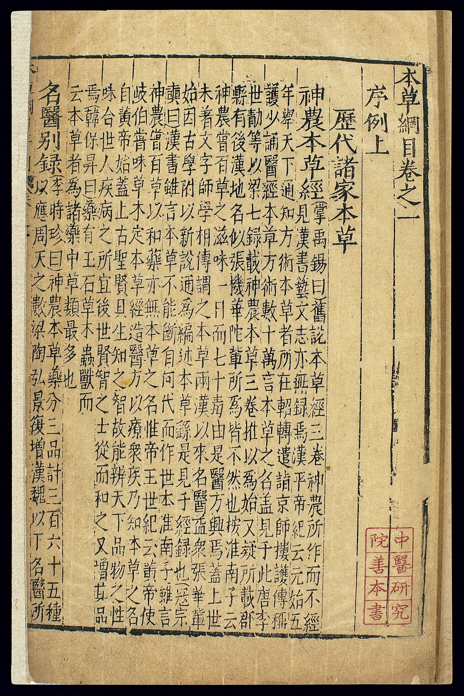

# Jinling, Jiangxi, and the 1596 story

English Wikipedia-prose and a hundred popular books will tell you the *Bencao gangmu* was “published in 1596.” That date has done a lot of work. It may still appear in this collection if I slip. The better story, the one Chinese bibliographic work and the Memory of the World file both point at, is a **first cut at Jinling in Wanli 21, 1593**, associated with the printer Hu Chenglong 胡承龍 (you will also see 胡成龍), and a **better-looking official recut in Jiangxi in Wanli 31, 1603**, associated with Xia Liangxin and Zhang Dingsi, after which most later editions run.

I was not at either press. What I trust enough to use:

- Li dies in 1593 in the biographical tradition. The first print is tangled with that year. Unschuld’s project language sometimes says “first published in 1593.” UNESCO’s nomination treats the Jinling Wanli 21 book as the ancestor of later prints.
- The Jinling book is described, in Chinese bibliographic essays, as a family-supervised cut that looks poor and travels badly. Sons’ names sit on the picture *juan*. Wang Shizhen’s preface is there. “Ancestor and scarce” is the tone.

<figure class="eahp-figure" id="eahp-fig-gangmu-jinjing-title" itemscope itemtype="https://schema.org/ImageObject">
  
  <figcaption itemprop="caption">
    <strong>Figure 1.</strong> Opening of a first-edition-line <em>Bencao gangmu</em> print photographed at the China Academy of Chinese Medical Sciences, as reproduced by Wellcome (L0039328). Bibliographic tradition associates this family with the Jinling Wanli cut; this photograph is an edition witness, not a proof of every colophon date popular books repeat.
    Credit: Wellcome Collection. CC BY 4.0.
  </figcaption>
  <meta itemprop="name" content="Bencao gangmu Jinling-line title opening (Wellcome L0039328)" />
  <link itemprop="license" href="https://creativecommons.org/licenses/by/4.0/" />
</figure>
- The Jiangxi book is described as a six-month official project in 1603, prettier, and already introducing errors — a famous example being a slip that moves a phrase from one skin condition into another, so the indications change by typesetting. I have not seen the pages side by side. I have seen the example repeated by people who have. I treat it as a warning about recuts, not as a fact I personally collated.
- After Jiangxi, the “one ancestor, three lineages” talk begins: later Ming and Qing shops copy the official-looking book, not the ugly first one. Japanese Kan’ei-era prints sit in that later world.

So where did 1596 come from? I do not have a single smoking colophon. It may be a conversion fudge, a catalog habit, a confusion with a later issue, or a round number that English writers liked. Until a second pass pins it, **do not use 1596 without a note**. If you need one year for a timeline, 1593 (Jinling) and 1603 (Jiangxi) do more honest work.

Why this file is not trivia:

Because **“the book” is an edition**. Japanese *honzōgaku* lives inside particular reprints with particular *kundoku* marks (draft 27). Korean readers meet particular imports. Modern monument culture photographs particular copies (the China Academy of Chinese Medical Sciences Jinling, the one in the UNESCO file). A claim about what “Li Shizhen said” that does not know which page-family it is on is a soft claim.

Because **better printing can be worse text**. The Jiangxi story, if even half right, is the whole problem of official recuts in one anecdote. Prettiness wins circulation. Circulation wins the stemma. The stemma then teaches errors as classics.

Because **family print is not the same as court print**. The *Pinhui* had the court and no public. The *Gangmu* had a family, a Nanjing shop, then a provincial official rescue. The rescue is what made the unofficial book more official than the official book. That is not a parable about genius. It is a parable about blocks.

I have not handled the Jinling copy in Beijing. I have not handled a Jiangxi. This draft is a stake in the ground so the rest of the collection stops saying 1596 as if it were a birthday.

## Open questions

- What is the earliest appearance of “1596” in European-language literature? Needham? A cataloger? A translator?
- How many of the “28+” Jiangxi variants listed in the 2013 *Guangming ribao* essay survive a second, colder collation?

## Sources used

UNESCO / MOWCAP files on the Wanli 21 Jinling Hu Chenglong print. Unschuld project language (“first published in 1593”). *Guangming ribao* bibliographic essay (2013) on Jinling scarcity, Jiangxi 1603 official recut, and the indication-slip example. Wang Shizhen preface date 1590 as a separate fact from print.

## Claims I am not making

- That 1596 is impossible. I am saying it is unsecured in this pass.
- That Jinling is textually “pure.” First cuts have their own mistakes. Ancestor is not purity.
