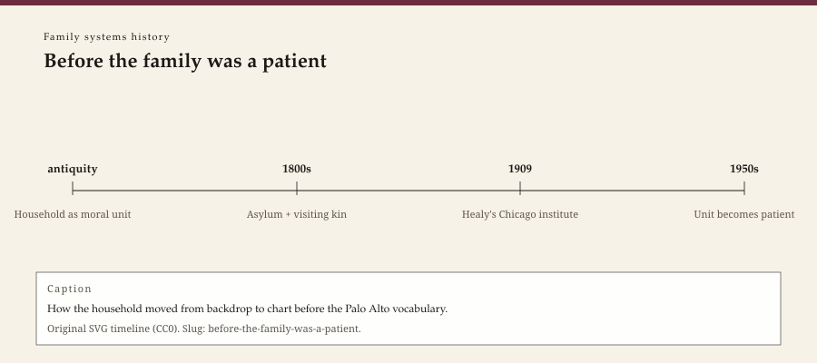

**Educational note.** This is history for a general reader. It is not a diagnosis, not a treatment plan, and not a substitute for care with a licensed clinician.

<!-- figure-id: before-the-family-was-a-patient.lead-timeline -->
<figure class="wow-figure wow-figure--era">
  
  <figcaption>
    <strong>Before the family was a patient</strong> — How the household moved from backdrop to chart before the Palo Alto vocabulary.
    Original editorial timeline (CC0). No AI-generated faces.
  </figcaption>
</figure>

In 1915 William Healy, a physician who had run Chicago's Juvenile Psychopathic Institute since 1909, published *The Individual Delinquent*. The title still pointed at one young person. The book did not. Healy's clinic had already learned that a child's theft, truancy, or silence arrived with a household attached: a wage, a boarding-house, a stepfather, a parish, a court. The family was not yet the patient. It was already the file.

## Government, pulpit, and the moral house

Long before a one-way mirror, Western institutions treated the household as a unit of order. Early modern "family government" manuals told a husband how to rule a table. Parish visitations asked who sat where. Poor-law officers decided whether a widow's children would be bound out. None of that was psychotherapy. It was administration with a theology.

Nineteenth-century moral treatment — Tuke at the York Retreat, the American asylums that copied and then betrayed that mildness — still imagined a *substitute* household: regular hours, kind keepers, a garden. The blood family was often the problem the asylum was built to escape. Dorothea Dix's memorials named jails and almshouses, not dinner-table coalitions. That story belongs to the general psychotherapy pack. The sentence that belongs here is smaller: when the twentieth century invented "family therapy," it inherited a habit of judging houses, and it did not always notice the inheritance.

Clergy kept doing the unpaid version. A pastor who sat with a couple in 1890 was not Jay Haley. He was closer to the later marriage-counseling office than historians of Palo Alto sometimes admit. The difference is licensure, a fee, and a theory that the pattern *is* the trouble. The similarity is the room: more than one person, and a third party who claims the right to interrupt.

## The clinic that could not keep the parents in the waiting room

Child guidance, in the American telling, begins with Healy in Chicago (1909) and with the Judge Baker Foundation in Boston (1917). The model was multidisciplinary before that word was a brand: physician, psychologist, social worker. The identified patient was a child. The social worker went to the home. That visit is the unglamorous ancestor of the family hour. It was also, often, a visit that measured a mother against a middle-class script she had not written.

Healy's 1915 book is a period object this series can actually show. It is a United States publication from 1915. The title page is public domain. The photographs of named children inside such volumes are not decorations. If a later editor uses the book, use the title page. Leave the children in the archive.

Adlerian child-guidance clinics in Vienna, and their American cousins, invited parents into lectures and then into rooms. Rudolf Dreikurs carried that habit into mid-century Chicago. John Bowlby's 1949 paper in *Human Relations*, "The Study and Reduction of Group Tensions in the Family," is easy to file under attachment and war nurseries. Read in this lane, it is an early claim that a family's tensions can be *studied as a group*. The full Bowlby biography is the other pack. The 1949 title is this pack's business.

Marriage counseling professionalized on a parallel track that family-therapy origin myths sometimes treat as a maiden aunt. Emily Mudd's Marriage Council of Philadelphia opened in 1932. The American Association of Marriage Counselors formed in 1942. Those dates matter because they puncture a handsome story: that "the field" began when a few men in the 1950s discovered the household. Women social workers and marriage counselors had been in the house for decades. They were not yet calling the house a system. They were already refusing to pretend the spouse in the waiting room was furniture.

## 1951 in Worcester, 1953 in Boston

John Elderkin Bell, a psychologist at Clark University in Worcester, Massachusetts, began seeing families together in 1951. He did not found an institute that trained a generation of famous names. He did not publish quickly. He read a paper to the Eastern Psychological Association in Boston on 24 April 1953. *Family Process* later reprinted it, in 1967, with a comment that it might be the first description of treating a whole family consistently together. The 1961 Public Health Monograph — *Family Group Therapy*, number 64, printed by the U.S. Government Printing Office — is a federal document. That title page is one of the few clean images this pack can recommend.

Bell's method, as he later wrote it, borrowed the phases of group therapy: a child-centered stretch, a parent-centered stretch, then a family-centered stretch. Later systems thinkers would say he still saw *members*, not a structure. That criticism is fair and slightly ungrateful. He sat the household down in 1951, while many of the people this series treats as founders were still seeing one patient and taking a history of the others.

Christian Midelfort's *The Family in Psychotherapy* (1957) is another book that histories mention and then step around. A psychiatric hospital in the Upper Midwest put relatives in the treatment, not only in the visiting hours. The mid-century was crowded with such experiments. The later brand names — MRI, Georgetown, Philadelphia, Milan — won the textbooks. The earlier rooms remain the reason the textbooks had anyone to cite.

## What this prehistory is for

A contemporary clinician who invites a parent, a partner, or a translator into an hour did not invent the gesture. Neither did Bateson. The gesture is older than the theory, and the theory is older than the license.

The risk is equally old. When a state, a church, or a clinic decides that the household is the object, someone in that household will be nominated as the cause. Nineteenth-century poor-law officers nominated the "unfit" parent. Mid-century psychiatrists, for a while, nominated the mother. A history that only celebrates "seeing the system" forgets how often seeing has been a prosecution.

This series will keep returning to that two-way street. The first fact is dated and modest: by 1915 the American child-guidance file already knew it was not about an individual. By 1932 a Philadelphia marriage council was billing the relationship. By 1942 marriage counselors had an association. By 1951 Bell had a family in the room in Worcester. The famous 1956 paper, the 1958 institute, the 1962 journal, and the 1974 Harvard book come later. They did not come out of nowhere.

A Southeast Arkansas clinic that still answers its own phone is closer to Healy's social worker on a porch than to a California marathon. The usable inheritance from this era is not a method. It is a suspicion: if the intake form has one name on it, ask who else is in the story — and ask who has been nominated, cheaply, as the problem.

Do not turn that suspicion into a kitchen-table session. If a household is in trouble, this essay is not the appointment.

## Portrait

No face. If a later editor wants an object: Healy 1915 title page (PD) or type. Do not use clinic photographs of children.

## Sources

Healy 1915; Mudd / Marriage Council of Philadelphia 1932; American Association of Marriage Counselors 1942; Bowlby 1949; Bell 1953/1961/1967; Midelfort 1957. On child guidance's class scripts, see later social-work histories; this essay will not pretend the home visit was neutral.

*WOW Therapies educational series. Family-systems heritage lane. Complementary to the general psychotherapy history pack and the SLPWOW speech-pathology pack; this folder is family therapy only.*
