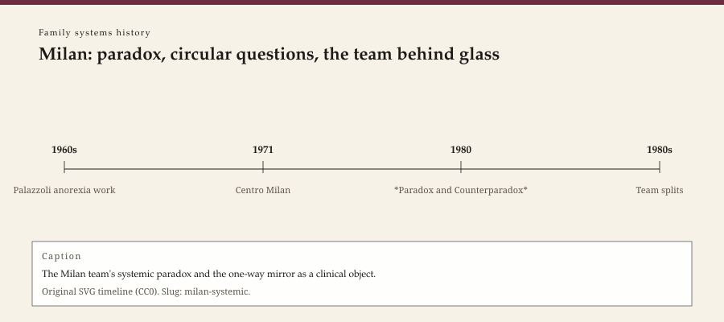

**Educational note.** This is history for a general reader. It is not a diagnosis, not a treatment plan, and not a substitute for care with a licensed clinician.

<!-- figure-id: milan-systemic.lead-timeline -->
<figure class="wow-figure wow-figure--era">
  
  <figcaption>
    <strong>Milan: paradox, circular questions, the team behind glass</strong> — The Milan team's systemic paradox and the one-way mirror as a clinical object.
    Original editorial timeline (CC0). No AI-generated faces.
  </figcaption>
</figure>

In the late 1960s in Milan, Mara Selvini Palazzoli — already known in Italy for work on anorexia — gathered a team that would give family therapy a European dialect. Luigi Boscolo, Gianfranco Cecchin, and Giuliana Prata were the other three names on the book American trainees carried: *Paradox and Counterparadox*, English edition 1978, Italian earlier in the decade. They saw families at intervals, often a month apart. They met as a team. They hypothesized. They asked questions that made a household describe its own rules. Sometimes they delivered a paradoxical prescription and then left the family to live with it until the next appointment. American institutes imported the mirror and the questions. They did not always import the politics or the interval.

## A Centro, not a California workshop

The Centro per lo Studio della Famiglia belongs to a city that had already given the century psychoanalysis, design, and a taste for groups that argue. Selvini Palazzoli was born in 1916 and died in 1999. She had been a physician and a psychoanalyst before she was a family therapist. The anorexia work came first; the family work grew from the sense that a dangerous symptom in a young woman was not only a young woman's symptom. That sentence can be a liberation. It can also be a return to the mid-century habit of prosecuting a house. Milan's better writing tried to stay on the first side by refusing a simple villain. Milan's worse imitators found a villain anyway and called it "the system."

The team behind the glass was not a gimmick. It was an epistemology: no one observer owns the family. Hypotheses were to be held lightly and discarded. "Neutrality," in the early papers, did not mean indifference. It meant not taking the official story as the only story. Cecchin's 1987 paper, "Hypothesizing, Circularity, and Neutrality Revisited," later shifted the third word toward *curiosity* and even *irreverence* — a recognition that neutrality had been heard as a freeze, and that a freeze can protect the person who already has the power.

Circular questions — questions that ask one person to comment on a relationship between two others — are easy to list and hard to do without turning a child into an informant. This essay will not list them. A list is a protocol. The historical point is that Milan tried to make the interview itself the intervention, not a prelude to a lecture.

## The split

The original four did not stay four. Selvini Palazzoli and Prata moved toward a more standardized "invariant prescription" — a specific directive given across families, aimed at disrupting what they saw as a repetitive parental pattern. Boscolo and Cecchin moved the other way: less prescription, more interview, more training of curiosity in other people's institutes. The split is a date in the early 1980s as much as a doctrinal fight. Students picked a side, or pretended not to.

Lynn Hoffman's later writing is one American record of how the Milan work landed and then changed in her own hands, from strategy toward a more collaborative postmodernism. Hoffman has her own essay. Karl Tomm in Calgary made "interventive interviewing" a name for questions that do something. Those names traveled. The Centro's particular Italian arguments did not always travel with them.

## Glass, tapes, and the specimen

Milan used a team and a screen. So did Palo Alto. So did Philadelphia. The one-way glass is a historical object. It trained a generation. It also turned a household into a specimen. A family that knows it is being watched by unnamed people is not in the same room as a family with one clinician. Consent forms got longer for a reason. A contemporary clinician who wants a consultant behind a mirror inherits that file, not only the clever question.

American trainees sometimes left the politics in Milan. Italy in the 1970s was not a neutral backdrop: psychiatric reform, class, the afterlife of fascism, a Catholic country arguing with itself about the family. A method that treats "the family" as a universal machine will miss the country the machine is in. Selvini Palazzoli's anorexia work cannot be cut free from what Italian medicine and Italian families were in those decades. This essay will not fake a social history it cannot source line by line. It will say: do not import a 1978 book as if it were written in Arkansas.

## What not to do with Milan

Do not deliver a paradox you do not understand to a family you will not see for a month. The interval was part of the method. Without the interval and the team, you have a stunt.

Do not use "neutrality" to sit still while someone is being hurt. Cecchin's later curiosity is not a reason to ignore a bruise.

Do not scrape Italian institute photographs. Selvini Palazzoli died in 1999. Boscolo died in 2015. Cecchin died in 2004. Type only.

A small-city clinician can steal one habit. Ask a question that makes the official story harder to tell in the same way. Then listen. Then stop. The rest is training, a living team or supervisor, and a consent form that names who is watching.

If a household is in trouble, this page is not the appointment.

## 1978 in English, a Centro already older

American trainees met Milan as a 1978 Norton-or-Aronson object. The Centro was already a going concern. Translation lag is how a European family-therapy dialect becomes "the 1980s" on a U.S. syllabus. Date the Italian work as earlier. Date the English book as 1978. Date Cecchin's revisit as 1987. Three dates, one split in between.

Giuliana Prata is too often the fourth name. She stayed with Selvini Palazzoli on the invariant-prescription fork. Fourth names do the work and lose the statue. This pack will keep her on the 1978 cover and in the split sentence.

Karl Tomm in Calgary made "interventive interviewing" a name North American students could underline without learning Italian. Underlining is not the Centro. Hoffman is the other receiving station and has her own essay. Receiving stations change the signal. Milan-in-Calgary is not Milan-in-Milan. Say so.

The month-long interval was a refusal of the American fifty-minute hour as the only honest clock. A small-city clinic that sees a family every week is not failing Milan. It is on a different clock. Importing the questions without the interval is how a 1978 book becomes a bag of tricks.

## Portrait

Type only. No one-way-mirror voyeur shots. No generated Milan team.

Boscolo died in 2015, Cecchin in 2004, Selvini Palazzoli in 1999. The Centro's English afterlife is a set of training tapes and questions. Tapes still need a consent the first audiences did not always get in today's words. Date the deaths. Leave the glass in the past unless you can explain it in ordinary language.

## Sources

Selvini Palazzoli, Boscolo, Cecchin, and Prata 1978; Cecchin 1987; later accounts of the invariant-prescription split; Hoffman as an American receiving station. On anorexia as a period medical object, later histories; this essay will not treat 1970s family papers as current eating-disorder care.

*WOW Therapies educational series. Family-systems heritage lane. Complementary to the general psychotherapy history pack and the SLPWOW speech-pathology pack; this folder is family therapy only.*
