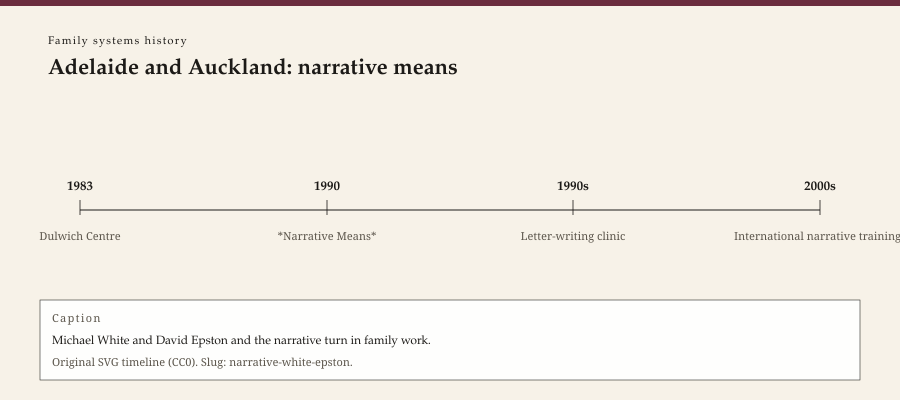

**Educational note.** This is history for a general reader. It is not a diagnosis, not a treatment plan, and not a substitute for care with a licensed clinician.

<!-- figure-id: narrative-white-epston.lead-timeline -->
<figure class="wow-figure wow-figure--era">
  
  <figcaption>
    <strong>Adelaide and Auckland: narrative means</strong> — Michael White and David Epston and the narrative turn in family work.
    Original editorial timeline (CC0). No AI-generated faces.
  </figcaption>
</figure>

In 1990 W. W. Norton published *Narrative Means to Therapeutic Ends*, by Michael White of Adelaide and David Epston of Auckland. The book treated problems as stories that had recruited a person, and it looked for the hours the story did not win. White had already been building the Dulwich Centre in Adelaide (from 1983) into a place that published, trained, and argued. Epston had been writing letters to families from the Family Therapy Centre in Auckland as if a letter could be a clinical act. Together they gave family therapy a Southern Hemisphere accent and a politics: against the expert who owns the meaning, against the thin story a file tells about a child.

## Not Milwaukee, not Milan

Narrative therapy is brief in mood and suspicious of excavation, like SFBT. It is interested in questions that do something, like Milan. It is not a clone of either. Externalizing — speaking of a problem as something a person is in relation *to*, rather than something a person *is* — is the move students remember. This essay will not teach you to externalize. A cute name for a problem on a blog is how a 1990 book becomes a classroom skit. White was more careful than his imitators. He had read Foucault; he cared about the practices through which people get made into cases. Epston's letters were not cute. They were documents a family could hold when the clinic's file would not hold them.

The politics belong with liberation and multicultural essays in the general psychotherapy pack, and with Boyd-Franklin and Hardy in this one. Narrative therapy's Australian and New Zealand origins matter. White worked in a country still arguing with its colonial archive. Epston worked in a country where Māori families had every reason to distrust a Pākehā clinic's story. This essay will not decorate itself with motifs it does not have a license to use. It will say: do not import 1990 as a set of clever questions and leave the politics at the airport.

## 1948–2008, and a living partner

Michael White was born in 1948 and died in 2008, in San Diego, after a workshop — a public fact reported at the time. The Dulwich Centre continued. So did the habit of citing him as if he could still sign off on every franchise. He cannot.

David Epston was alive at last verification in 2026. Living writers get extra care: public books, public lectures, no gossip, no health speculation. The Auckland letters are in the published record. This pack will not reprint a letter as a template. Templates are protocols.

## What the book did to the field

It gave clinicians permission to treat a diagnosis as a story among stories — not to deny a body's illness, but to refuse the idea that the file's plot is the person's plot. It made "unique outcomes" (the hours the problem lost) a thing you could ask about without sounding like a Milwaukee clone. It made audiences and witnesses — other people who could certify a new story — part of some later narrative practices. Those later practices have their own ethics problems (who is in the room, who is asked to applaud). History can name the problem. History cannot run the room.

American family therapy, by 1990, was already splitting into manuals and postmodernisms. Narrative arrived as a postmodernism you could still *do* on a Tuesday. That is why it was loved and why it was cheapened. A school-counseling worksheet that says "name your problem" is not Dulwich. A workshop that treats Aboriginal or Māori life as a spice for a white clinician's brand is not Dulwich either, and it is worse.

## What not to do with narrative

Do not externalize a person's oppression as if racism were a cartoon character they can outwit in four sessions. Hardy's work exists in this pack because that sentence needed him.

Do not write a "therapeutic letter" to someone who has not asked for one. Epston's letters lived inside a relationship and a consent.

Do not scrape Dulwich or workshop photographs. White died in 2008. Epston is living. Type only.

A small-city clinician can steal one habit. When a file has already decided who a child is, ask for an hour the file cannot explain. Then believe the answer long enough to write it down. Then stop. The rest is training.

If a household is in trouble, this page is not the appointment.

The usable inheritance is a suspicion of thin stories. Child guidance wrote thin stories in 1915. Schizophrenogenic theory wrote them in 1948. Strategic cleverness could write them in 1976. Narrative therapy is one of the field's attempts to give the thin story back and ask for a thicker one. Attempts fail in ordinary ways: they become brands, they become cute, they forget a bruise. White and Epston are not responsible for every failure. They are responsible for a book that still deserves a careful reading in 1990's own terms.

## 1983, a Centre, a 1990 Norton book

Dulwich Centre Publications made Adelaide a place you could read without flying. White's papers circulated as cheap stapled objects long before 1990. The Norton book is the American event. Date both. Students who only know 1990 have missed the Centre's own list.

Foucault in a family-therapy book is easy to parody. The parody exists because some later workshops used "power/knowledge" as incense. White's better pages are more concrete: a file makes a child into a case; a question can make the case less inevitable. Concrete is the test. If a narrative hour cannot name the file, it is a skit.

Epston's Auckland letters are the other concrete object. A family could hold paper. Paper is not a metaphor. Do not mail a performance. The figure essays say so again because the failure mode is popular.

## Portrait

Type only. No decorative Indigenous motifs. No generated White.

Dulwich Centre Publications stapled papers that American students later met as a Norton cloth. Staples first, cloth later. Date 1983 and 1990. Do not treat 2008 as a brand opportunity. White cannot sign. Epston can still refuse a template. This series refuses the template with him.

Adelaide 1983, Auckland letters, Norton 1990, San Diego 2008. Four dates. A fifth would be the first American syllabus week that assigned the book without assigning the politics. Do not be that week. Leave the motifs off. Leave the letter unmailed unless a living relationship asked for paper.

## Dulwich paper, 1989; maps, 2007

Before Norton bound the 1990 book, Dulwich Centre Publications issued White and Epston's *Literate Means to Therapeutic Ends* (1989) as a stapled Australian object. American students who only know the cloth edition have missed a year and a publisher. White's *Selected Papers* (Dulwich, 1989) collected Adelaide clinic writing that already treated a file as a practice of power, not as a neutral chart. Those papers are the local event. 1990 is the export.

*Maps of Narrative Practice* (Norton, 2007) is the late teaching book: externalizing conversations, re-authoring, remembering conversations, definitional ceremony, scaffolding questions. The maps are diagrams of talk, not a 1966 MRI flowchart and not a Milwaukee scale. White died the next year. The 2007 book is the last long statement he signed. Quote a map only with the warning that a map is not the territory — a sentence he used because workshops were already flattening him.

The *International Journal of Narrative Therapy and Community Work*, from Dulwich, is the serial afterlife. It continued after 2008. Epston's Auckland letters and the later *Playful Approaches to Serious Problems* (Freeman, Epston, and Lobovits, Norton, 1997) are the child-and-play wing. Do not collapse every narrative hour into the 1990 spine. Do not mail a letter. Do not recruit a witness from a group chat. Those refusals are the same ethic as the 1989 staples: writing *with* a family, not decorating a brand.

## Sources

White and Epston 1990; Dulwich Centre from 1983; public notices of White's death, 2008. On cousins, the Milwaukee and Milan essays. On race and story, Boyd-Franklin and Hardy in this pack.

*WOW Therapies educational series. Family-systems heritage lane. Complementary to the general psychotherapy history pack and the SLPWOW speech-pathology pack; this folder is family therapy only.*
