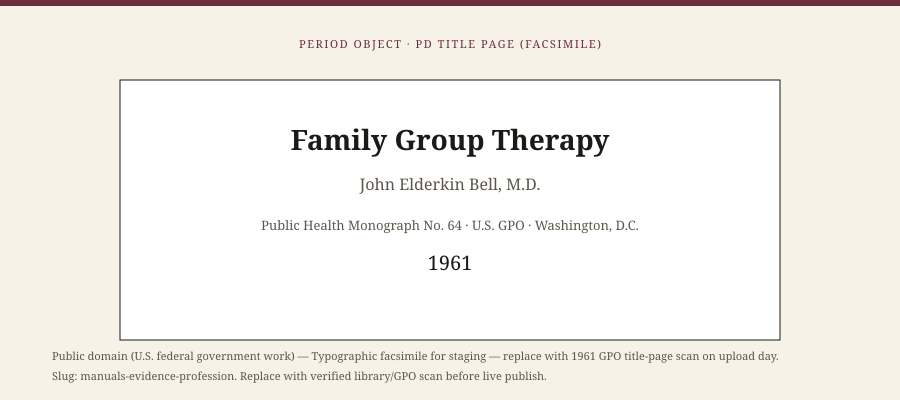

**Educational note.** This is history for a general reader. It is not a diagnosis, not a treatment plan, and not a substitute for care with a licensed clinician.

<!-- figure-id: manuals-evidence-profession.lead-period-object -->
<figure class="wow-figure wow-figure--era wow-figure--period-object">
  
  <figcaption>
    <strong>Family Group Therapy</strong> (1961) — From a GPO monograph to licensure, journals, and court-bought manuals.
    PD period object (facsimile for staging). Public domain (U.S. federal government work). See <code>assets/era/manuals-evidence-profession/RIGHTS.md</code>.
  </figcaption>
</figure>

In 1961 the U.S. Government Printing Office issued Public Health Monograph No. 64: John Elderkin Bell's *Family Group Therapy*. It is a federal document. The title page is public domain. A year later *Family Process* 1, no. 1 appeared, Haley editing, Jackson and Ackerman in the founding mix. Sixteen years after that, in December 1978, the American Association of Marriage and Family Counselors took the name American Association for Marriage and Family Therapy. The revolt had a journal, then a lobby, then a license. The family that walks into a small-city clinic in 2026 inherits all three — and a stack of manuals the 1956 paper did not imagine.

## 1942, 1970, 1978

The American Association of Marriage Counselors formed in 1942. In 1970 it became the American Association of Marriage and Family Counselors. In 1978 it became AAMFT. The name changes are a map. First the couple, then the couple-and-family, then "therapy" as a word that could sit next to psychology and social work at a statehouse. Licensure in all U.S. states came later, state by state, with Montana and West Virginia among the last in the usual telling. This essay will not reprint a lobbying timeline. It will say: a profession is a political object. It decides who may say they do the work, and who is a counselor, a social worker, a psychologist, or an outlaw.

*Family Process* outlived its first editor's farewell (Haley, 1969). Donald Bloch and later editors took the journal through life-cycle, culture, gender, and, eventually, video abstracts and a Chinese translation (2012). Jay Lebow was editor at last verification. Journals are not churches. They are the place a field agrees to argue in public. The 1978 Hare-Mustin paper and the 1956 double-bind paper share a shelf in the same run. That is the journal's real achievement.

## Manuals arrive; argument does not leave

DSM-III (1980) changed American psychiatry's language. Family therapy felt the change as a demand for diagnoses, billing codes, and, later, "evidence-based" lists. Scott Henggeler and colleagues' multisystemic therapy trials, from the 1980s into the 1990s, treated serious youth trouble as a problem of multiple systems — home, school, street — and wrote manuals that courts could buy. James Alexander's functional family therapy and Howard Liddle's multidimensional family therapy belong on the same late-century shelf. José Szapocznik's brief strategic family therapy in Miami took a structural-strategic hybrid to Latino families and also wrote it down. Sue Johnson's emotionally focused couple therapy built an attachment-based couples model with outcome papers and a public book, *Hold Me Tight* (2008).

These are historical events. They are not a menu. This series will not tell you MST "works" as a slogan, and it will not teach you an EFT hold. Named trials have limits, samples, and afterlives. A court that buys a manual is not the same object as a family that buys a book. Johnson's public book is a public book. It is not a substitute for a licensed clinician.

The manuals did something the 1960s institutes could not: they made a method portable to people who would never study in Philadelphia. They also did something the institutes feared: they made a method thin. A fidelity checklist can keep a novice from freelancing harm. It can also keep a clinician from seeing the woman Hare-Mustin was writing about, or the kinship Boyd-Franklin was writing about. Portability and thinness arrived together.

## What a profession forgets

It forgets Bell, because he trained few famous students. It forgets the social workers who were in the house before 1956. It forgets that Satir left MRI because she wanted a different room. It forgets that Milan split. It forgets that a license is not a theory.

It also forgets, unless someone insists, that WOW Therapies is a Southeast Arkansas speech-and-language practice as well as a brand that can host heritage education. These essays are not a claim that the clinic practices MST, EFT, or Bowen coaching. Service pages are a different file. History posts that pretend otherwise fail the claims guide.

## What not to do with the professional story

Do not put schema `MedicalTherapy` on these URLs. `Article` is enough.

Do not pair "family therapy history" with "book now" and a disease keyword.

Do not rank any school named here as the official best therapy for a diagnosis.

Do not treat a 1961 GPO monograph as a current how-to. Use it as a title page, or as proof that the Public Health Service already thought the family hour was worth ink.

A small-city clinician can steal one habit from this whole pack. Date your words. If you say "system," know whether you mean 1956, 1974, 1978, 1989, or a manual a court bought in 2004. Then look at the people who drove over. They are not a school. They are a household.

If a household is in trouble, this page is not the appointment.

The usable inheritance is modest and anti-heroic. Family therapy became a profession because people billed, wrote, licensed, and argued. The arguing is the part worth keeping. A field that only celebrates founders will miss the revolt. A field that only celebrates manuals will miss the founders' reasons. This pack is staged so a human editor can keep both on the table without dumping forty-four URLs onto a live sitemap in a week.

## 1962, volume 1, number 1

The first *Family Process* issue is a primary source this pack can name without a face. Haley, Jackson, Ackerman: three men, two coasts, a revolutionary mood in an introduction. Sixteen years later the association changed its name. Forty years later Lebow's editorship had video abstracts. The journal's body of argument is the profession's memory. Memory that only celebrates 1956 has not read its own run.

Emily Mudd's 1932 Marriage Council remains the under-told start of the couple as a billable object. Bell's 1961 monograph remains the under-told start of a federal interest in the family hour. This pack put both in era 01 and on this essay's allowed image list. Under-told is a choice you can stop making.

Henggeler's early MST papers, Alexander's FFT, Liddle's MDFT, Szapocznik's BSFT — four acronyms, four manuals, four ways a court or a grant could buy a method. This page still will not rank them. Ranking is a sales floor. Dating them is a history floor.

## Portrait

Allowed object: Bell 1961 GPO title page (U.S. government work, PD). Re-open the scan on upload day. Or type.

Bell 1961 remains the one featured object this pack can honestly recommend: a GPO title page, a federal monograph, no face. Re-open the scan on upload day. Then import in waves. Forty-four URLs in a week is how a staging folder becomes a live accident.

## Sources

Bell 1961; *Family Process* 1962–; Broderick and Schrader on AAMC/AAMFC/AAMFT; Henggeler and colleagues' early MST papers as dated events; Johnson's EFT books as dated publications; Szapocznik, Alexander, Liddle as names on a shelf, not as a protocol list.

*WOW Therapies educational series. Family-systems heritage lane. Complementary to the general psychotherapy history pack and the SLPWOW speech-pathology pack; this folder is family therapy only.*
