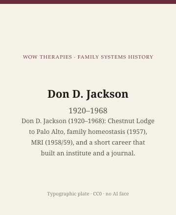

**Educational note.** This is history for a general reader. It is not a diagnosis, not a treatment plan, and not a substitute for care with a licensed clinician.

<!-- figure-id: don-jackson.lead-plate -->
<figure class="wow-figure wow-figure--portrait wow-figure--portrait-typographic">
  
  <figcaption>
    <strong>Don D. Jackson</strong> (1920–1968) — Don D. Jackson (1920–1968): Chestnut Lodge to Palo Alto, family homeostasis (1957), MRI (1958/59), and a short career that built an institute and a journal.
    <em>Typographic plate — no likeness embedded.</em>
    Original editorial plate (CC0). See <code>plates/don-jackson/RIGHTS.md</code>.
  </figcaption>
</figure>

Don deAvila Jackson was born on 2 January 1920 and died on 29 January 1968. In those forty-eight years he trained at Chestnut Lodge in the interpersonal climate of Harry Stack Sullivan, returned to Palo Alto, sat on Bateson's communication project, published "The Question of Family Homeostasis" (1957), founded the Mental Research Institute in 1958 (some later pages say 1959), edited *The Etiology of Schizophrenia* (1960), helped launch *Family Process* (1962), and put his name on *Pragmatics of Human Communication* (1967) with Watzlawick and Beavin. The institute outlived him. So did a certain sentence: a symptom can be part of how a family stays the same.

## Chestnut Lodge, then a medical foundation

Jackson's Lodge years matter because they place him in the same mid-century air as Fromm-Reichmann without making him her student in the popular sense. Interpersonal psychiatry already looked at context. He looked at it as a psychiatrist who would go home to a California clinic and try to fund a research shop. The Palo Alto Medical Foundation — later folded into larger systems — gave him a title: head of psychiatry. MRI was the nonprofit he built beside that title, "a public service institution dedicated to research in the field of mental health," in the period sentence.

He personally pushed a 1960s fundraising campaign for the Middlefield Road building. Buildings are not theories. They are why theories have addresses. MRI kept that address until the building was sold in 2019. Jackson had been dead for fifty-one years.

## Homeostasis, and the sentence that can injure

The 1957 paper asked whether a family, like a body, might restore a status quo when a symptom moves. If a "cured" patient is followed by a spouse's collapse, maybe the collapse is data. The idea is powerful. It is also available for cruelty. A clinician who watches a woman for the "function" of her depression has already decided she is a part. Feminist family therapy had to spend the late 1970s naming that decision. Jackson is not the only source of it. He is a clear one.

This essay will not teach you to find a function. Functions without a supervisor become prosecutions.

He edited a 1960 volume on the etiology of schizophrenia that belongs on the same dangerous shelf as the 1956 paper: serious, dated, not a current medical account of psychosis. Read it as a document of what a smart 1960 psychiatrist thought he could know. Do not read it as a reason to blame a household for an illness.

## The journal and the book

With Ackerman and Haley he made *Family Process*. With Watzlawick and Beavin he made *Pragmatics*. The book is the one students still finish. Jackson's death the next year means we do not have his late style. We have a short, crowded career and a lot of other people's memories. This pack will not collect unsourced memories of his death. The date is 29 January 1968. The work is the work.

Satir's early training-director years at MRI are part of his institute's story, not a footnote. He hired a social worker who would not sound like him. That is a fact in his favor. Haley left and fought. That is a fact about both men.

## Inheritance

A small-city clinician can steal one habit. When a change in one person is followed by a new trouble in another, do not be shocked. Then do not decide who is "using" whom until you have more than a clever idea. Then stop.

Do not scrape MRI archive photos. Type: Don D. Jackson, 1920–1968.

If a household is in trouble, this page is not the appointment.

The usable inheritance is an institute and a sentence. The institute taught people this pack names: Watzlawick, Weakland, Fisch, for a time Satir and Haley. The sentence — homeostasis — still needs a warning label. Family therapy's better decades are the ones that kept the warning on the bottle.

Palo Alto in the late 1950s was a small town with a large idea. Jackson was the psychiatrist willing to incorporate the idea. Bateson would not have. Ackerman was three thousand miles away. The field needed a California corporation. It got one. The corporation's later fame, after 1968, is the Brief Therapy Center's. Jackson's fame is the founding and the 1957 paper. That is enough for a short life. It is not enough to make him a mascot.

## 1960, Basic Books, a volume that should stay in the library

*The Etiology of Schizophrenia* (1960), which Jackson edited, belongs on the same dated shelf as the 1956 paper. Serious, of its decade, not a current medical account. A small-city clinician does not need the chapters. A historian does. This pack names the book so no one can say we hid the dangerous shelf.

Chestnut Lodge to the Palo Alto Medical Foundation is a move from a private psychoanalytic hospital to a California clinic with a research itch. The Lodge's long stays and the Foundation's outpatient world are not the same clock. Jackson's homeostasis idea is what he carried between clocks: a symptom as part of a staying-the-same. Carrying is not the same as proving. Proving is what later biology and later family research both had to redo.

He was forty-eight. Short careers become legends if you let them. This pack will keep the dates and the institute and refuse the legend. MRI's later fame is other people's. His fame is 1957, 1958/59, 1962, 1967, and a January death.

## Portrait

Type only.

## Sources

Jackson 1957, 1960; MRI institutional histories (1958/1959); Watzlawick, Beavin, and Jackson 1967; *Family Process* 1962. On Chestnut Lodge as climate, the schizophrenogenic-theories essay — without collapsing Jackson into Fromm-Reichmann.

*WOW Therapies educational series. Family-systems heritage lane. Complementary to the general psychotherapy history pack and the SLPWOW speech-pathology pack; this folder is family therapy only.*
