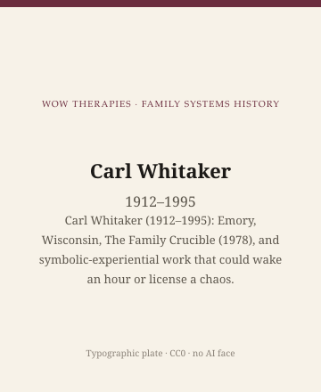

**Educational note.** This is history for a general reader. It is not a diagnosis, not a treatment plan, and not a substitute for care with a licensed clinician.

<!-- figure-id: carl-whitaker.lead-plate -->
<figure class="wow-figure wow-figure--portrait wow-figure--portrait-typographic">
  
  <figcaption>
    <strong>Carl Whitaker</strong> (1912–1995) — Carl Whitaker (1912–1995): Emory, Wisconsin, The Family Crucible (1978), and symbolic-experiential work that could wake an hour or license a chaos.
    <em>Typographic plate — no likeness embedded.</em>
    Original editorial plate (CC0). See <code>plates/carl-whitaker/RIGHTS.md</code>.
  </figcaption>
</figure>

Carl Whitaker was born in 1912 in Raymondville, New York, and died on 21 April 1995. He worked at Emory, then at the University of Wisconsin, and became, with Virginia Satir, the name students say when they mean experiential family therapy that did not come from MRI's cooler paradox. With Augustus Napier he published *The Family Crucible* in 1978. The book used a composite family. This series will not rewrite that composite as if it happened in Arkansas. Published case material is a text. It is not your neighbor.

## A temperature, not a manual

Whitaker could empty a chair or fill it. He trusted experience more than a hypothesis about the 1890s. He could be unpredictable in a way that woke a stuck hour. He could be unpredictable in a way that gave a trainee a license to be chaotic. History's job is to keep those outcomes from being confused. This pack will not collect workshop legends as if they were methods. Public books, public academic posts.

Symbolic-experiential is the later label. The words mean, roughly: the hour is a living event, not a delivery system for a task. Symbols — a chair, a silence, a joke that is not only a joke — are allowed to do work. Allowed is not the same as assigned. An assigned symbol is a gimmick. Whitaker's better hours, on the page, feel like a person in the room who is not frightened of the family's temperature. His worse imitators feel like a person who wants to be interesting.

Satir sat near this temperature and came from social work. Whitaker sat near it and came from mid-century American psychiatry. The difference matters. A psychiatrist who improvises in a family hour has a different permission, in that era, than a social worker who does the same. Permission is a historical object. It is not a compliment.

## Emory, Wisconsin, a book

The Emory years and the Wisconsin years are institutional facts students can check against university catalogues and obituaries. This essay will not invent a colorful hospital story to fill a paragraph. The 1978 book is the object a general reader can hold. Napier's name on the cover is not a courtesy. Coauthors write books.

The *Crucible* family is a teaching story about a household under heat. Heat is the metaphor the title wants. Heat is also what a violent home already has too much of. Experiential work that cannot tell a stuck family from an unsafe one is a danger Satir's essay already named. Whitaker does not get a pass because the prose is livelier.

Feminist readers asked who was allowed to be wild in the hour. A male psychiatrist's irreverence can look like freedom. A woman's anger in the same decade could look like a symptom. Hare-Mustin is on this shelf too.

## Inheritance

A small-city clinician can steal one habit. Do not be so frightened of a family's feeling that you turn the hour into a lecture. Then do not be so in love with your own feeling that you turn the hour into a show. Then stop.

Do not scrape university or workshop photographs. Type: Carl Whitaker, 1912–1995.

If a household is in trouble, this page is not the appointment.

The usable inheritance is a warning as much as a permission. Family therapy's heroic decades liked vivid men. Vivid is not the same as sound. Whitaker's soundness, when it is on the page, is a refusal to treat a household as a puzzle you solve from behind glass. His unsoundness, in the afterlife, is a trainee who thinks wildness is the method. Keep the refusal. Leave the wildness in a supervised room, or leave it in 1978.

Raymondville to Emory to Wisconsin is a northern itinerary that never became a California brand. That is part of why textbooks give him a chapter and not a franchise. Franchises need manuals. He did not write one this pack will treat as a manual. He wrote, with Napier, a book. Books are allowed to be strange. Blogs that teach strangeness as a technique are not.

The general psychotherapy pack does not give him a figure essay. This pack does, because the family-systems deep lane without Whitaker would pretend the field was only diagrams and paradox. It was also an hour that sometimes needed a living person more than a plan. Sometimes is the word. Always is how a school becomes a problem.

## 1912, Raymondville; 21 April 1995

Raymondville, New York, is not a California origin myth. Emory and Wisconsin are university facts. *The Family Crucible* is 1978, Harper & Row, Napier's name first on some printings and always on the work. Coauthors write books. This pack will not treat Napier as a scribe.

Mid-century American psychiatry gave a man permission to be vivid in a family hour that a woman in the same decade might have been told was a symptom. Hare-Mustin is on the shelf. Whitaker's vividness, when it is sound, is a refusal of the glass. When it is unsound, it is a trainee who thinks wildness is the method. 1978 can hold both if you date it and do not franchise it.

He never became a California brand. Textbooks give him a chapter. Chapters without manuals are easy to skip in a licensed-exam world. Skipping is how a field pretends it was only diagrams. This pack kept the chair so the pretense has to work harder.

## Portrait

Type only. No generated "wild therapist." No stock empty chair as if it were his.

## Sources

Napier and Whitaker 1978; later collected papers as public record; university posts as dates. On the risk of theater, the Satir era essay and the claims file.

*WOW Therapies educational series. Family-systems heritage lane. Complementary to the general psychotherapy history pack and the SLPWOW speech-pathology pack; this folder is family therapy only.*
