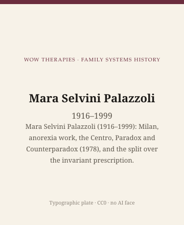

**Educational note.** This is history for a general reader. It is not a diagnosis, not a treatment plan, and not a substitute for care with a licensed clinician.

<!-- figure-id: mara-selvini-palazzoli.lead-plate -->
<figure class="wow-figure wow-figure--portrait wow-figure--portrait-typographic">
  
  <figcaption>
    <strong>Mara Selvini Palazzoli</strong> (1916–1999) — Mara Selvini Palazzoli (1916–1999): Milan, anorexia work, the Centro, Paradox and Counterparadox (1978), and the split over the invariant prescription.
    <em>Typographic plate — no likeness embedded.</em>
    Original editorial plate (CC0). See <code>plates/mara-selvini-palazzoli/RIGHTS.md</code>.
  </figcaption>
</figure>

Mara Selvini Palazzoli was born in 1916 in Milan and died there in 1999. She was a physician and a psychoanalyst before she was a family therapist. The anorexia work came first. The family work grew from the sense that a dangerous symptom in a young woman was not only a young woman's symptom. In the late 1960s she gathered Luigi Boscolo, Gianfranco Cecchin, and Giuliana Prata at the Centro per lo Studio della Famiglia. The book American trainees carried was *Paradox and Counterparadox*, English edition 1978.

## Anorexia, then a team

This pack will not treat 1970s family papers as current eating-disorder care. It will say the historical thing: a Milan clinician already known for anorexia built a team that saw families at intervals, hypothesized, asked questions that made a household describe its own rules, and sometimes delivered a paradoxical prescription. The interval — often a month — was part of the method. American institutes imported the questions and the glass. They did not always import the interval or the city.

Italy in the 1970s was not a neutral backdrop. Psychiatric reform, class, the afterlife of fascism, a Catholic country arguing with itself about the family — an essay this length cannot source that social history line by line. It can refuse to pretend the 1978 book was written in Arkansas.

The team behind the glass was an epistemology: no one observer owns the family. "Neutrality" in the early papers did not mean indifference. Cecchin later shifted the word toward curiosity. Selvini Palazzoli's own later path went the other way.

## The invariant prescription, and a split

With Prata she moved toward a more standardized directive — the "invariant prescription" — aimed at disrupting what they saw as a repetitive parental pattern. Boscolo and Cecchin moved toward interview and training. The split is a date in the early 1980s as much as a doctrinal fight. Students picked a side.

A standardized directive is a historical object with an obvious risk: it treats families as similar enough to receive the same instruction. Milan had begun by refusing a simple villain. A prescription that travels unchanged can smuggle a villain back in and call it a pattern. Later teachers had to say so. This page will not teach the prescription. A prescription without a team, an interval, and a consent process is a stunt.

## Inheritance

A small-city clinician can steal one habit. Hold a hypothesis lightly. Ask a question that makes the official story harder to tell in the same way. Then listen. Then stop. Do not deliver a paradox you do not understand to a family you will not see for a month.

Do not use "neutrality" to sit still while someone is being hurt. Do not scrape Italian institute photographs. Type: Mara Selvini Palazzoli, 1916–1999.

If a household is in trouble, this page is not the appointment.

The usable inheritance is a European dialect the American field had to hear. Family therapy was never only Palo Alto, Philadelphia, and Milwaukee. Milan made a team, an interval, and a book. The book still deserves a careful reading in 1978's terms. The franchise of circular questions on a slide deck does not.

She was a woman directing a famous team in a field whose official memory prefers men in California. That sentence is not a mascot. It is a reason this pack gives her a figure essay and not only a share of an era. Boscolo (1932–2015) and Cecchin (1932–2004) have their own afterlives as trainers. Prata's name is too often the fourth on a list. This page keeps all four on the 1978 cover and then follows Selvini Palazzoli through the split, because the split is her particular later life.

Anorexia as a period medical object will keep being rewritten by later medicine. Family therapy's job, in her pages, was to refuse the idea that a young woman's dangerous symptom was only hers. The refusal can liberate. It can prosecute a house. Her better writing tried to stay on the first side. Imitators did not always.

## 1916–1999, a Milan life

She was born and died in the same city. The Centro is a Milan object. The English book is an American event. The anorexia work is an Italian medical event this pack will not turn into current care. Three clocks. Students who only own 1978 have one.

A woman directing a famous team in a field that prefers California men is a fact, not a mascot. The split in the early 1980s is her later fact: she chose a more standardized directive, Boscolo and Cecchin chose the interview. Choosing is how a founder refuses to become a statue of her first book.

American fifty-minute hours and Milan month-long intervals are not moral grades. They are clocks. Importing questions without the clock is the failure mode. This figure essay repeats the era essay's warning because the failure mode is popular and her name is on the slides.

## Portrait

Type only. No one-way-mirror voyeur shots.

## Anorexia first, a team second, English third

The order matters. She was already a physician with a published interest in anorexia before the Centro was a brand Americans could buy. Later eating-disorder medicine will keep rewriting 1970s family papers. Let it. This pack's job is to refuse two mistakes: treating 1978 as current care, and treating a young woman's dangerous symptom as only hers *or* only the house's. Both onlys are prosecutions.

Prata stayed on her fork. Boscolo and Cecchin took the other. Hoffman received the signal and changed it. Four sentences a slide deck will collapse into "Milan questions." Uncollapse them. Date the English book. Date the split. Date the deaths. Leave the invariant prescription in the archive.

## Sources

Selvini Palazzoli et al. 1978; later accounts of the invariant-prescription split; Cecchin 1987 as the other fork. On ethics of the glass, the after-the-mirror essay.

*WOW Therapies educational series. Family-systems heritage lane. Complementary to the general psychotherapy history pack and the SLPWOW speech-pathology pack; this folder is family therapy only.*
