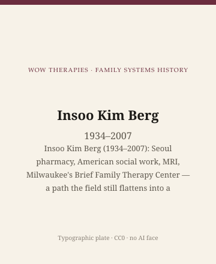

**Educational note.** This is history for a general reader. It is not a diagnosis, not a treatment plan, and not a substitute for care with a licensed clinician.

<!-- figure-id: insoo-kim-berg.lead-plate -->
<figure class="wow-figure wow-figure--portrait wow-figure--portrait-typographic">
  
  <figcaption>
    <strong>Insoo Kim Berg</strong> (1934–2007) — Insoo Kim Berg (1934–2007): Seoul pharmacy, American social work, MRI, Milwaukee's Brief Family Therapy Center — a path the field still flattens into a coauthor line.
    <em>Typographic plate — no likeness embedded.</em>
    Original editorial plate (CC0). See <code>plates/insoo-kim-berg/RIGHTS.md</code>.
  </figcaption>
</figure>

Insoo Kim Berg was born in Korea in 1934 and died in 2007. She trained in pharmacy in Seoul, then in social work in the United States, then at the Mental Research Institute, then, with Steve de Shazer, founded the Brief Family Therapy Center in Milwaukee in 1978. The general psychotherapy pack already gives her a figure essay in a wider counseling frame. This pack is the family-systems deep lane. It will not reprint that essay. It will say, at more length, why Milwaukee without Berg is a misunderstanding.

## A path, not a footnote

Pharmacy is a useful first training. It teaches you that a small change in a dose is still a change, and that people come in with a problem they have already tried to solve. Social work teaches you that the file is written in the language of deficit because deficit is what agencies pay to see. MRI taught her a communication theory. Milwaukee was the place she used all four.

Students who cite only de Shazer have picked the philosopher. County buildings picked Berg. She had an ear for people agencies called "difficult" or "mandated." Compliments, in her usage, were not fluff. They were a way of marking a competence the file had ignored. This page will not teach you a compliment technique. Techniques on a blog become condescension.

The Center was a partnership. Partnerships get written as his books and her manner. Manner is a sexist filing system. Her later books and interviews are in the public record. A later editor should list the titles a live page will actually link; this draft will not invent a bibliography of convenience.

## Safety, and the cheap version

Solution-focused work can hear a bruise or talk over it. Berg's better teaching did not pretend a miracle question replaces a shelter. This pack will not pretend either. If you are in danger, call local emergency services.

The cheap version is a flyer and a three-session form. She is not responsible for every flyer. She is responsible for a practice that was available to become one. Honor the practice. Do not franchise the smile.

A Korean woman in a Midwestern institute in the late 1970s was not the unmarked default of American family therapy. That sentence is not a mascot. It is a reason her path — pharmacy, immigration, social work, MRI, Milwaukee — belongs in the family-systems calendar and not only in a diversity paragraph at the end of de Shazer's chapter.

## Inheritance

A small-city clinician can steal one habit. Ask for the hours the file cannot see. Then write them down. Then stop.

Do not scrape BFTC or workshop photographs. Type: Insoo Kim Berg, 1934–2007.

If a household is in trouble, this page is not the appointment.

The usable inheritance is an ethic of attention. Child guidance wrote thin stories in 1915. Berg kept asking for the other hours. The question is older than 1978. Milwaukee gave it a literature she co-made.

The general-pack Berg essay sits next to Herman and Frankl in a counseling-heritage series. This one sits next to de Shazer, Weakland, and White. Different neighbors, same woman. Complementary packs should not be identical paragraphs. The deep-lane version keeps MRI, the mandate, and the refusal to let SFBT be a man's epistemology with a woman's "clinical gift" as decoration.

1934–2007. Seoul to Milwaukee. The books are on the shelf. The Center is not a place you can visit. The ear is the thing students still try to learn and cannot learn from a slide.

## 1934, Korea; 2007, an American death

Pharmacy in Seoul is a first profession, not a colorful preface. Immigration and social work are a second and third. MRI is a fourth. Milwaukee is a fifth. Five trainings, one ear. Students who cite only de Shazer have chosen the philosopher. This chair exists so the choice is visible.

Mandated clients are people a court or a child-protection office sent. Berg's public teaching took the mandate as a fact, not as a reason to be cute. Cuteness is the failure mode of compliments. This page will not teach a compliment. It will say the file is written in deficit because deficit is what agencies pay to see, and she kept asking for the other hours.

The general-pack Berg essay sits in a counseling-heritage calendar. This one sits next to Weakland and White. Same woman, different neighbors, more MRI. Complementary packs should not be identical.

## Portrait

Type only.

## Five trainings, one refusal of the deficit file

Pharmacy, immigration, social work, MRI, Milwaukee. Count them. The count is why "coauthor" is a sexist filing system. County buildings remember her. Graduate seminars remember him. This chair is the county's memory written as heritage.

Mandates are facts. Cuteness is a failure. Compliments-as-technique become condescension on a blog, so this page will not teach them. Ask for the hours the file cannot see. Write them down. Stop. 1934–2007. Type only. The general-pack essay is a different neighbor list. This one keeps MRI and the mandate. Complementary, not identical.

Seoul pharmacy first. American social work second. MRI third. Milwaukee fourth if you count the Center as a training. 1934–2007. The general-pack essay is shorter and sits among counselors. This one sits among family-systems cousins. Read both if you need both. Do not franchise the smile.

## County books, 1992–2003

Berg's name is on books agencies actually bought. *Working with the Problem Drinker: A Solution-Focused Approach* (with Scott D. Miller, Norton, 1992) took Milwaukee into substance-use offices. *Family Based Services: A Solution-Focused Approach* (Norton, 1994) wrote for child-welfare clocks: a caseworker with a dozen families cannot run a five-year Bowen course. *Interviewing for Solutions* (with Peter De Jong; first edition Brooks/Cole, 1998, later editions) became the textbook many B.S.W. programs assigned. *Tales of Solutions* (with de Shazer, Norton, 2001) and *Children's Solution Work* (with Therese Steiner, Norton, 2003) are the late joint and child-welfare wing. A live "Sources" block should confirm each imprint against a catalogue. This draft will not invent a 2004 title to look finished.

A public-agency version is not identical to a boutique SFBT hour. Educational copy should say so. Language difference — a Korean-born clinician in a Wisconsin county building — is a clinical fact in her teaching, not a diversity sticker. After 10 January 2007, students kept workshop notes in circulation. Unpublished notes are lore. Cite the books first.

The general-pack Berg essay sits among counselors. This chair keeps the 1992–2003 county shelf next to de Shazer's philosophy books. Complementary, not identical.

## Sources

BFTC 1978; de Shazer 1985 as partner-text; Berg's later public books and interviews; the Milwaukee era essay. Exact titles for a live "Sources" block: confirm against a library catalogue before print.

*WOW Therapies educational series. Family-systems heritage lane. Complementary to the general psychotherapy history pack and the SLPWOW speech-pathology pack; this folder is family therapy only.*
