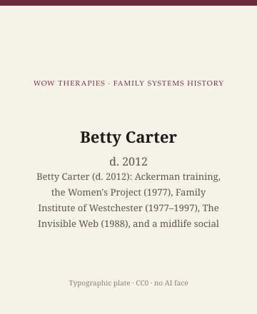

**Educational note.** This is history for a general reader. It is not a diagnosis, not a treatment plan, and not a substitute for care with a licensed clinician.

<!-- figure-id: betty-carter.lead-plate -->
<figure class="wow-figure wow-figure--portrait wow-figure--portrait-typographic">
  
  <figcaption>
    <strong>Betty Carter</strong> (d. 2012) — Betty Carter (d. 2012): Ackerman training, the Women's Project (1977), Family Institute of Westchester (1977–1997), The Invisible Web (1988), and a midlife social worker who changed a field's faculty math.
    <em>Typographic plate — no likeness embedded.</em>
    Original editorial plate (CC0). See <code>plates/betty-carter/RIGHTS.md</code>.
  </figcaption>
</figure>

Betty Carter died in 2012. She had taken a B.A. in 1950, spent fifteen years in a nonprofit educational organization, earned an M.S.W. at Hunter in 1971, trained at the Ackerman Institute from 1970 to 1972 with Olga Silverstein under Peggy Papp, and in 1977 both co-founded the Women's Project in Family Therapy and became director of the Family Institute of Westchester, a post she held until 1997. Smith College holds her papers. The finding aid is a primary source this pack prefers to workshop lore.

## Midlife, not a prodigy myth

Family therapy's official memory likes young men in 1956. Carter is a midlife social-work student who arrived when the field already had a journal and was about to rename its association. She is, in Papp's later public remembrance, the one who kept the Women's Project on its mission when someone wanted to quit. Remembrance is not a method. The 1977 date is a method's beginning.

The Project's own sentence, in her papers: to explore the changing role of women in families and to raise those issues in a field where most of the practitioners were women and most of the leaders were men. She was later described as the first woman in the field to head a major training institute. Superlatives are a kind of myth. The Westchester directorship is a fact.

*The Invisible Web* (1988, paperback catalogues often 1991), with Walters, Papp, and Silverstein, is the book. Mother–daughter, father–daughter, mother–son, husband–wife. Divorce, remarriage, female-headed households without using those households as proof of decline. The 1986 AFTA award is a plaque. The book is the argument.

Stonehenge gatherings of women family therapists (1984, 1986) and a 1991 international meeting belong here as dates. Official memory still prefers Palo Alto.

## Life cycle, with McGoldrick

The Carter–McGoldrick life-cycle volumes taught stages — and then had to keep expanding whose stages counted. Later editions are part of her afterlife. She also wrote *Love, Honor and Negotiate* for a wider public. Popular books are mixed gifts. This page will not turn hers into a marriage tip sheet.

A commonly printed birth year is about 1929 or 1930 (a 1950 B.A. is the clue). A later editor should confirm against the Smith papers or an authority file before a live page prints a birth year as hard fact. This draft will say: died 2012; B.A. 1950; M.S.W. 1971.

## Inheritance

A small-city clinician can steal one habit. When you admit a "well-organized" family, ask who is doing the organizing. Then look at your own faculty, your own referral list, your own hour: who do you interrupt. Then stop.

Do not scrape Westchester or Ackerman photographs. Type: Betty Carter, d. 2012.

If a household is in trouble, this page is not the appointment.

The usable inheritance is a faculty math. She noticed that the practitioners were women and the leaders were men, and she built a project and an institute instead of only noticing. Noticing is cheap. Directing Westchester for twenty years is not.

The Women's Project was four white women. That is a fact, not a cancellation. Boyd-Franklin 1989 and Falicov are not sequels; they are neighbors this pack refuses to file under Carter as "later diversity." Carter's essay ends without a diversity paragraph. The calendar continues.

Peggy Papp, Olga Silverstein, and Marianne Walters deserve figure essays in a later wave. This pack had forty-four chairs. Carter sits in one of them as the Project member whose papers a public archive already organized.

## 1950, 1971, 1977, 1997, 2012

B.A. 1950. M.S.W. 1971. Women's Project and Westchester 1977. Westchester until 1997. Death 2012. Five dates from the Smith finding aid and public remembrances. A midlife student who directed an institute for twenty years is not a side character in a men's 1956 story. This chair exists so the story has to share the decade.

Papp's public remembrance of the four rings on a necklace is a sweet object. Sweet objects are not methods. The 1988 book is the method's public form. Stonehenge 1984 and 1986 are dates, not folklore. Official memory still prefers Palo Alto. Official memory is a choice.

Birth year: confirm. Do not invent 1929 to look finished. The 1950 B.A. is enough to place her generation. The 1971 M.S.W. is enough to place her arrival. Arrival late is the field's clock, not her failing.

## Portrait

Type only. Smith archives are not a web license.

## Smith College, a finding aid, a better statue

The finding aid is a primary source: 1950 B.A., 1971 M.S.W., 1970–72 Ackerman, 1977 Project and Westchester, 1997 end of the directorship, 2012 death. Superlatives about "first woman to head a major institute" are a kind of myth. The twenty-year directorship is not a myth.

Papp, Silverstein, Walters remain on the 1988 contents page. This pack had one chair for the Project and gave it to the woman whose papers a public archive already organized. That is a calendar choice, not a ranking. Stonehenge 1984 and 1986 are dates. Palo Alto 1956 is also a date. Official memory prefers one. This pack printed both.

Hunter 1971, Ackerman 1970–72, Westchester 1977–97, Smith finding aid, 2012. Midlife is the point. The field's official memory likes 1956 boys. She arrived when the journal was already fifteen. Arrival is not a failing. Twenty years directing is not a side plot. Print the dates.

## Sources

Smith College Betty Carter papers; Walters et al. 1988; Carter and McGoldrick life-cycle editions; Psychotherapy Networker remembrance (d. 2012). Birth year: confirm before live print.

*WOW Therapies educational series. Family-systems heritage lane. Complementary to the general psychotherapy history pack and the SLPWOW speech-pathology pack; this folder is family therapy only.*
