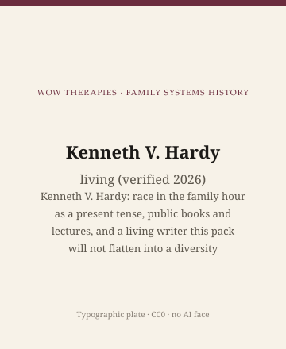

**Educational note.** This is history for a general reader. It is not a diagnosis, not a treatment plan, and not a substitute for care with a licensed clinician.

<!-- figure-id: kenneth-hardy.lead-plate -->
<figure class="wow-figure wow-figure--portrait wow-figure--portrait-typographic">
  
  <figcaption>
    <strong>Kenneth V. Hardy</strong> (living (verified 2026)) — Kenneth V. Hardy: race in the family hour as a present tense, public books and lectures, and a living writer this pack will not flatten into a diversity paragraph.
    <em>Typographic plate — no likeness embedded.</em>
    Original editorial plate (CC0). See <code>plates/kenneth-hardy/RIGHTS.md</code>.
  </figcaption>
</figure>

Kenneth V. Hardy has spent a public career asking white family therapists to stop treating their own race as the unmarked default of the hour. Papers with Tracey A. Laszloffy, later books in public catalogues, training at addresses that have included Drexel and the Eikenberg Institute — the titles a live page will link should come from a library catalogue, not from a memory of a workshop. He was alive at last verification in 2026. Living writers get extra care: public books, public lectures, no gossip, no health speculation, no scraped photographs.

## After the glass, in the present tense

The after-the-mirror essay in this pack is the climate. Hardy is one of the names that climate has. Boyd-Franklin 1989 put Black families at the center of a clinical book. Hardy has been, in public, the person who would not let the white clinician off as a "contextual" afterthought. Race, in his talks, is not a cultural note. It is in the room when the clinician opens the door.

This page will not teach you a race dialogue. It will not print a list of questions. Lists are protocols. Public lectures are public. They are not this pack's worksheet.

Narrative therapy's cheaper version externalizes oppression as a cartoon character a person can outwit in four sessions. Hardy's public argument is one reason this pack told that version to sit down. A thin story about racism is still a thin story.

## Neighbors

Hines and Hare-Mustin 1978 (ethics). Boyd-Franklin 1989. Falicov 1998. Aponte 1994. McGoldrick 1982. The Women's Project 1977 — four white women, a fact this calendar already stated. Hardy is not a sequel to any of them. He is the later public insistence that the field's unmarked person was a person.

A later editor should fix institutional titles and book years against an authority file. This draft will not invent a clean C.V. to look finished. Unfinished citations are honest. Fake completeness is a scar this repository already named in another century of work.

## Inheritance

A small-city clinician can steal one habit. When you hear yourself thinking of a family as "they" and of yourself as none, notice. Then stop. Noticing is not a certificate.

Type only. Living. No scrape. No stock handshake-across-difference photograph.

If a household is in trouble, this page is not the appointment.

The usable inheritance is a present tense. Family therapy's heroic decades can be told as a story that ended when the manuals arrived. Race did not end. A heritage series that stops at 1978 Milan has chosen a comfort. This pack's last figure is living on purpose. The calendar should not imply the argument is archival.

WOW Therapies is a Southeast Arkansas clinic. Heritage education here is not a claim of expertise in anyone's community. Service pages are a different file. A history post that uses Hardy's name as a booking keyword fails the claims guide.

The general psychotherapy pack's liberation essay (Fanon, Martín-Baró) is a neighbor and a different lane. Do not reprint Fanon here. Hardy is a family-therapy-hour writer, not a substitution for a decolonial syllabus. Complementary packs should not steal each other's dead.

Public books and lectures only. If a later editor cannot match a title to a catalogue, mark `[VERIFY]` and keep the sentence that does not depend on it: he made race a present-tense subject in a field that preferred a 1956 origin myth.

## Public lectures, a present tense, no fake C.V.

Drexel, the Eikenberg Institute, papers with Tracey Laszloffy, later books in catalogues — confirm each title and year before a live page grows a finished-looking list. This draft will not invent completeness. Living 2026. No scrape. No handshake stock.

The unmarked clinician is the habit. "They" for the family and none for the self is the tell. Noticing is not a certificate. A race dialogue list is a protocol this series will not print.

Fanon and Martín-Baró stay in the general psychotherapy pack. Hardy stays in the family hour. Complementary packs should not steal each other's dead. This calendar ends on a living writer on purpose. The argument is not archival. A heritage series that stops at 1978 Milan has chosen a comfort. Forty-four was the count. The last chair is not a diversity paragraph. It is a present tense.

## Portrait

Type only. Living.

## Confirm the catalogue, keep the present tense

Laszloffy papers, later books, Drexel, Eikenberg — confirm each before a live list. Do not invent completeness. Living 2026. No scrape. No handshake. No race-question protocol.

The unmarked self is the tell. Fanon stays in the other pack. Hardy stays in the hour. This calendar ends living on purpose. Forty-four was the count. The last chair is not a closing paragraph titled diversity. It is a refusal to let 1956 be the end of the argument.

Confirm Drexel, Eikenberg, Laszloffy, later titles. Living 2026. Present tense. Unmarked self. No protocol list. Fanon stays in the other pack. This pack ends here on purpose. 1956 is a date. It is not a finish line. Type only.

## 2005 *Teens Who Hurt*; 2016 supervision book

*Teens Who Hurt: Clinical Interventions to Break the Cycle of Adolescent Violence*, with Tracey A. Laszloffy (Guilford, 2005), is a dated clinical book a library can hold. It is not a protocol this series will reprint. *Culturally Sensitive Supervision and Training: Diverse Perspectives and Practical Applications*, with Toby Bobes (Routledge, 2016), is the supervision wing: race talk in the room behind the glass. A history article can say Hardy made race a supervision subject. It should not script a supervision hour.

Chapters in McGoldrick's *Revisioning Family Therapy* (Guilford, 1998 and later) are the other stable citations. Confirm chapter titles against the edition on the desk. Drexel University's couple and family therapy program and the Eikenberg Academy for Social Justice are later public addresses; URLs move. Prefer a dated book.

Living 2026. No fee scrape. No handshake stock. Fanon stays in the general psychotherapy pack. This calendar ends on a living family-hour writer on purpose. 1956 is a date. It is not a finish line.

## Sources

Hardy and Laszloffy papers; later public books as catalogue records; the after-the-mirror essay. Exact titles and years: confirm before live print. On neighbors, Boyd-Franklin, Falicov, Aponte, McGoldrick — different addresses.

*WOW Therapies educational series. Family-systems heritage lane. Complementary to the general psychotherapy history pack and the SLPWOW speech-pathology pack; this folder is family therapy only.*
