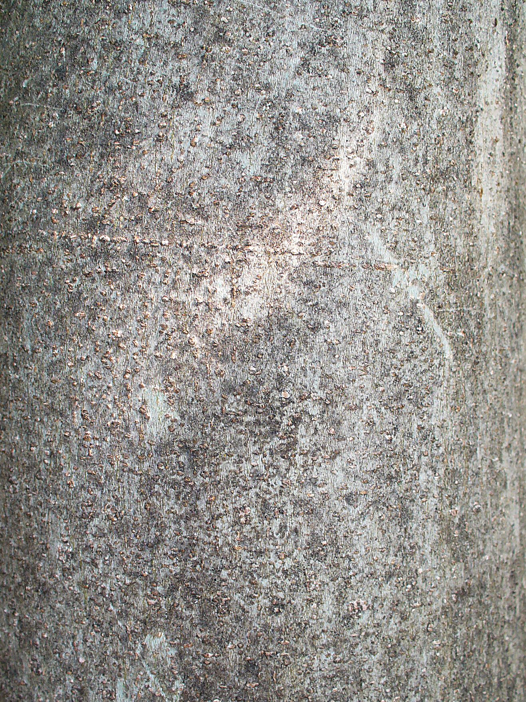

<figure>

<figcaption>Figure 1. Wet cold and dry cold are not the same winter. Staged stand-in (zone8a.d06.ficus-carica-bark); Photo: Kenraiz, Wikimedia Commons, CC BY-SA 3.0. Prefer publish photo from D:\FIGS\More Fig Pictures — wet bark after a cold rain — no sealed plastic. See RIGHTS.md.</figcaption>
</figure>

I have had 14°F in a dry wind that left the fig sulking but intact, and 18°F
in a week of sopping cold that marked wood I thought was safe. The
thermometer was not the whole story. Water was.

A lot of Zone 8a in the eastern half of the country is a wet cold. The air
comes in off the Gulf or sits in a low and rains, then the temperature slides
through freezing while the wood is still wet. Bark that is saturated goes into
the night with less margin. A wrap that would have been a decent coat in a
dry cold becomes a wet sock. Straw that was dry in November is a compost pile
in January. The failure mode is not a clean freeze-dry. The failure mode is
mold, bark slip, and a cane that looks alive until you squeeze it and it
gives.

Dry cold — the kind some 8a and 7 pockets get when a plains wind arrives
without the rain — is ruder to buds and to pots, kinder to wraps. Desiccation
is the tax. Wind pulls moisture out of canes. A pot on a porch can freeze
hard and stay hard. But a breathable wrap is actually wrapping in that
weather. You are not building a terrarium.

This is why I do not copy a Colorado or Utah fig method onto a Lower
Mississippi 8a yard without changing it. Those people can get away with
tighter coats. I cannot. I want a drip edge. I want the bottom of any tarp
open so the thing can breathe. I want the filler (leaves, straw) dry when it
goes in, and I will not stuff a cage with the wet oak leaves I raked this
morning. If the only leaves I have are wet, I wait. A late wrap with dry
material beats an on-time wrap with a sponge.

Zone 9 in the humid South has the wet problem without the cold excuse. A
"just in case" wrap there is how you donate a healthy fig to fungus. Zone 7
in a wet year has both problems at once, which is why the people who do it
well talk as much about ventilation as they do about R-value.

Practical split I use:

- Dry forecast, falling toward the mid-teens: I will wrap an 8a in-ground fig
  that I care about, especially a young one, and I will move pots.
- Wet week, temperatures bouncing 28 to 40: I will not seal anything. I will
  mulch the crown, check that water is not pooling, and wait for the actual
  Arctic shot.
- Ice storm on wet wood: I care more about breakage and about not trapping
  ice inside a plastic sleeve than I do about a pretty wrap photo.

If you only remember one sentence from this piece, make it this: in a wet 8a,
breathability is part of hardiness. A plant can survive the degree number and
still lose the winter to the wrap you built to save it.
