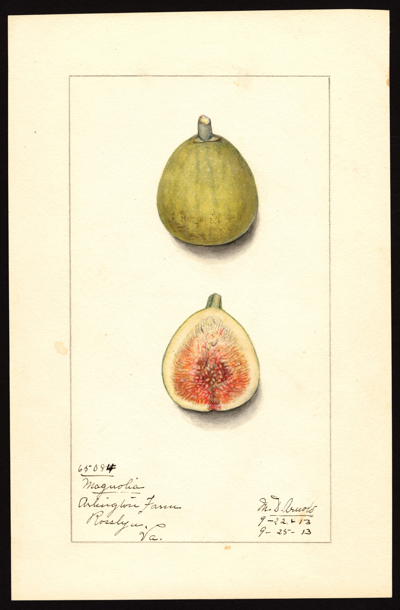

<figure>

<figcaption>Figure 1. Brown Turkey is a crowd of plants. Staged stand-in (zone8a.d12.usda-pom-magnolia-1913); USDA NAL POM00001043 (Magnolia), Mary Daisy Arnold, PD. Prefer publish photo from D:\FIGS\Fig Labels — Brown Turkey look-alike wood in winter. See RIGHTS.md.</figcaption>
</figure>

If I had a dollar for every Brown Turkey that was not the Brown Turkey the
seller meant, I could buy a decent roll of burlap. The name is a filing
cabinet. Eastern Brown Turkey, Texas Everbearing (often filed here),
various bronze figs from box stores, and whatever a nursery had extra of
in May — they all get the sticker. Some are honestly cold-useful in 7–9.
Some are ordinary figs with a famous name.

Virginia Tech treats Brown Turkey as a common Southeast plant, bronze
skin, amber-to-pink pulp, medium eye, zones 6–9 in their telling, more
prone to split and sour than a tight-eyed fig. That matches the ones I
trust. The medium eye is the summer tax. The cold story is usually decent
if the clone is a real Turkey and the plant is in the ground.

I will take a Brown Turkey from a neighbor's yard in March over a
mail-order "heirloom Brown Turkey" with a lifestyle photo. The neighbor
plant has already voted in my weather. The mail-order plant has voted in
someone else's warehouse.

In 8a, a good Turkey is a workhorse: bigger fruit than Celeste, fine for
preserves, a plant that will take a hit and come back. It is not the fig
I wrap first. It is the fig I expect to look rough after a nasty winter
and still feed us in August. In Zone 7 I want a known clone and a crown
mound, or I want it in a pot. In Zone 9 I want you to stop wrapping it
every year because your uncle in Tennessee wraps his.

The crowd problem shows up in arguments. Someone says Brown Turkey is
ironclad. Someone else says theirs died at 18°F. They are both looking at
plants that shared a name for a decade and never shared a parent. This is
why I do not run variety wars on the internet anymore. I run yard tours
in late winter. Show me the wood. Show me the last two lows. Then we can
talk.

If you already own a "Brown Turkey" and it fruits and lives, keep it. Do
not replace it with a more authentic Turkey. Authenticity does not taste
like anything. If you are buying your first fig and the only name on the
bench is Brown Turkey, buy it anyway if the plant looks like it has roots,
then take a Celeste cutting from a human as soon as you can. Diversity is
how you stop caring what the sticker believed.

The medium eye is the part people skip when they argue hardiness.
A Turkey that lives through 12°F and then splits in a warm rain
is a winter success and a July mess. I still keep one because
the preserves are honest and the plant forgives me. I do not
keep four of them under four different stickers and call it a
collection.

If you are trying to identify what you already have: fruit size,
eye, pulp color, and whether it makes a useful breba after a
mild winter. Write those down. Compare to a neighbor's named
plant. If they match, you have a working name. If they do not,
you have a fig. That is enough for winter. Winter does not
care what we printed on the tape.
