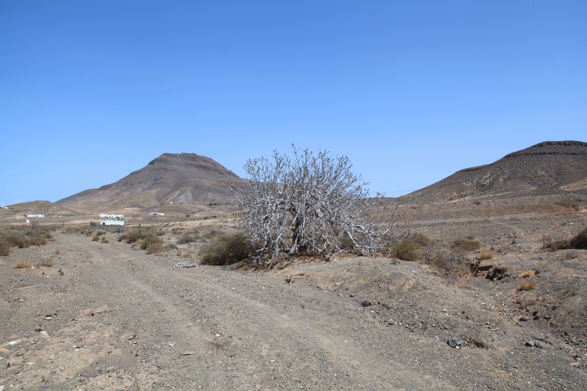

<figure>

<figcaption>Figure 1. In-ground, the earth is the blanket. Staged stand-in (zone8a.d15.fig-dormant-canopy-pajara-01); Photo: Frank Vincentz, Wikimedia Commons, CC BY-SA 3.0. Prefer publish photo from D:\FIGS\Figs — in-ground stool with crown mulch. See RIGHTS.md.</figcaption>
</figure>

The reason I put figs in the dirt, if I can, is not romance. It is
thermal mass. A couple of feet of soil does not care about your
overnight low the way a pot does. The roots sit in a battery that
charges all autumn. A mulch ring keeps the top of that battery from
flashing to the air temperature. In 8a, that is most of winter
protection for an established plant of a decent variety.

"In the ground" still has rules. Drainage first. A fig in a winter
puddle is a fig whose roots are sitting in ice water. I have lost
more plants to a low spot than to a headline low. If your 8a yard is
clay that perches water, plant on a broad mound, not in a hole you
dug like a grave and filled with potting mix. The grave fills with
the yard's water and becomes a bucket.

Depth: I set them about as deep as they sat in the nursery pot, maybe
a hair lower if the variety suckers and I want the crown in the
mulch, not a buried trunk that stays wet. I do not bury a fig like a
tomato. I do not perch it high like a rosemary in gravel unless
drainage is the whole problem.

The earth does not protect the canes. That is the trade. In-ground
figs keep roots and lose tops. Pot figs can keep tops (if you move
them) and lose roots (if you do not). I will take the first trade in
8a for any plant I intend to keep ten years. I will take the second
trade for a flavor I am not ready to commit to the yard, or for a
rental, or for a Zone 7 winter I do not want to wrap.

Bush form helps the earth do its job. Wood near the ground is wood
near the battery. A standard I have seen in the Southeast — and
Virginia Tech repeats it — is that bush is the cold form because
trunks get hurt and because harvest and bird netting are easier
anyway. I let suckers make a stool. I do not let them make a thicket
that I cannot wrap or walk through.

Zone 7 in-ground is still the right long-term move for hardy
varieties if you will mulch and accept dieback. Zone 9 in-ground is
the default; the earth is not even the point anymore — space and
water are. 8a in-ground is the plant I stop worrying about in
January, which is a kind of wealth. I save the worrying for the pots
and the first-year sticks.

I plant on a Saturday in spring when I can water for two
weeks without a trip. I do not plant in a hero weekend in
August and then leave. A fig that never builds roots does
not get to use the earth's blanket. It is a pot-shaped
root ball sitting in a hole, which is the worst of both
methods.

If your in-ground fig heaves after a freeze-thaw, press it
back and mulch. Do not assume heaving is death. If the
crown is sitting in a saucer of ice every January, raise
the plant in spring or cut a drain. The earth is only a
blanket when it is earth, not a bowl.

Zone 7 in-ground still beats a neglected pot. Zone 9
in-ground is how you get a tree. 8a in-ground is how you
get your weekends back in January, which is the reason I
dig at all.
