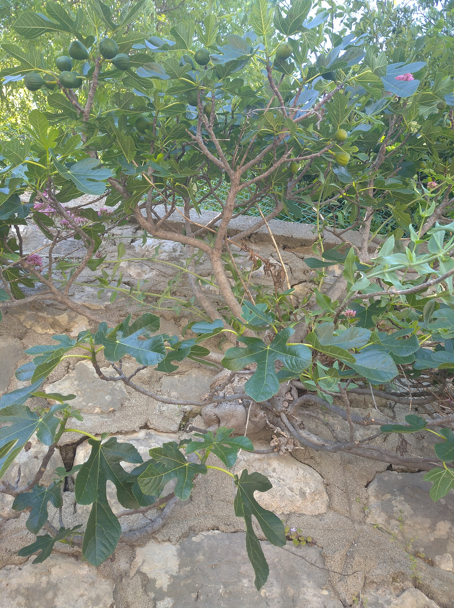

<!-- figure-id: d24.denoncin-figuier-plate -->
<figure>

<figcaption>Figure 1. Leaf-filled cages insulate without sealing — historic plates show the wood you are enclosing, not the leaves themselves. Credit: Denoncin, figuier plate (Commons: 11-Figuier-Ficus carica). License: Public domain (as tagged on Commons) — see RIGHTS.md.</figcaption>
</figure>

The cage is the only wrap I will still respect in a hurry.
Hardware cloth or a tall tomato cage, a cylinder around the
bundled fig, filled with leaves I dried under the porch, a
board or a cheap tarp on top, air at the bottom. It looks
like I am hiding a body. In Zone 7 it is how people keep
two or three feet of wood. In 8a it is how I put a first-
year plant to bed without inventing a new technology.

Why it works: leaves are dead air. Dead air is the
insulation. The wire keeps the leaves from becoming a wet
pile on the lawn. The hat keeps the rain from turning the
dead air into soup. The open bottom keeps the soup from
becoming a sealed jar.

Why it fails: wet leaves, no hat, no air, or a cage so
tight you have packed a tamale. Also mice. A leaf cage is
a hotel. I do not bait the fig. I do not leave bird seed
in the cylinder. If I have a mouse winter, I check for
girdling in February like I check for ice.

This is overkill for a mature 8a stool in a normal year.
I say that as someone who has built the cage anyway
because I needed to feel finished. The plant did not need
it. I needed it. That is allowed once. It is not a method.

Zone 7: build it so you can live with it until April. Make
the cylinder tall enough that you are protecting the wood
you want, not a six-inch stub. Zone 9: do not build it for
the season. If you want a cage for a two-night freak event,
fine — and take it down when the event ends. 8a: the cage
is a tool on the young plants and the sulkers. It is not
the brand of the yard.

Materials I will use again: 2×3 or 4×4 hardware cloth, zip
ties that become brittle and get replaced, oak leaves that
had a week to dry, a piece of plywood with a rock on it.
Materials I will not use again: hay that was already
heating, black plastic around the barrel, a cage I could
not open without destroying the plant.

If you have one fig and one Saturday, this is the wrap.
If you have twelve figs, this is how you learn which three
actually needed it.

How I fill it: bundle canes, set the cylinder,
pour leaves in by the armful, shake, do not
stomp. Leave an inch of slop at the top so the
hat is not sitting on a packed wad. If I can
push my hand in easily, it is loose enough. If
I cannot, I have made a tamale.

In spring the leaves become mulch. That is the
other reason I like this wrap. The waste is
not waste. I dump the dry-enough stuff on the
crown and I throw the slime in the compost,
not back on the bark.
