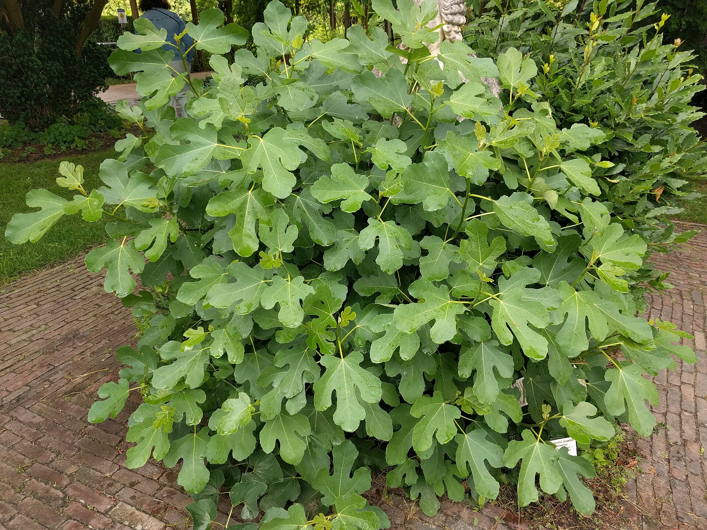

<!-- figure-id: d39.hortus-leiden-fig-2021 -->
<figure>

<figcaption>Figure 1. Concrete and porch boards radiate cold under pots — surface matters as much as USDA zone for patio figs. Credit: Rudolphous (Wikimedia Commons). License: CC BY-SA 4.0 — see RIGHTS.md.</figcaption>
</figure>

I can change a pot's winter by moving it six
feet and not changing anything else.

On a wooden porch table, the pot is in the
wind on five sides. The table is pride. The
roots are in the weather map.

On a concrete pad, the pot has a cold plate
under it. Concrete stores the day if the sun
hits it, and stores the night if it does not.
In a still sunny 8b afternoon, a dark pad
can be a gift. In a 12°F 8a night, it is a
heat sink bolted to the ball. I put a board
under pots I cannot get off the pad. I would
rather look messy than couple the roots to a
slab.

On dirt, even on the north side, the pot can
talk to the ground. That is the least-bad
outdoor place if the garage is full. Better:
dirt on the south side, clustered, mulched
around the walls.

Hanging pots I will not discuss as a winter
method. They are ornaments. I take them down
or I lose them.

Zone 7 outdoor pots should not be on a porch
table unless you have given up. Zone 9 pots
can live on a pad most winters if someone
will slide them to the wall on the one
night. 8a pots get the dirt or the garage,
and the porch is for October and April.

I walk the property in November and I ask,
for each pot: what is under you, what is
beside you, what hits you in the night
wind. Those three answers are the winter.
The variety name is a caption.

I did a rude experiment one mild
year: same variety, three pots,
porch table, concrete pad, dirt by
the wall. I did not wrap any of
them, which I do not recommend as
a lifestyle. After a 17°F night
with wind, the table pot was light
and late to leaf and never really
came back. The pad pot sulked and
lived. The dirt pot leafed like
nothing had happened. N=1. It was
enough for me to stop using the
table as a winter stage.

If you like the look of figs on a
porch, use the porch from May to
October. Winter is allowed to be
ugly. Ugly on dirt beats pretty
on a table that is trying to be
a display in a freeze.

I also look at what is *above* the pot. A porch roof
is a gift in ice and a thief of snow-blanket. An open
sky on dirt gives you both the cold and the snow.
Neither is automatically better. A covered porch on
the south side can be a decent 8a parking place if
the pot is on the floor, not a table, and you still
move it for a vortex. A covered porch that is a
wind tunnel between two houses is a beautiful
mistake.

Walk it at night. I keep saying that because I keep
skipping it and then being surprised.
