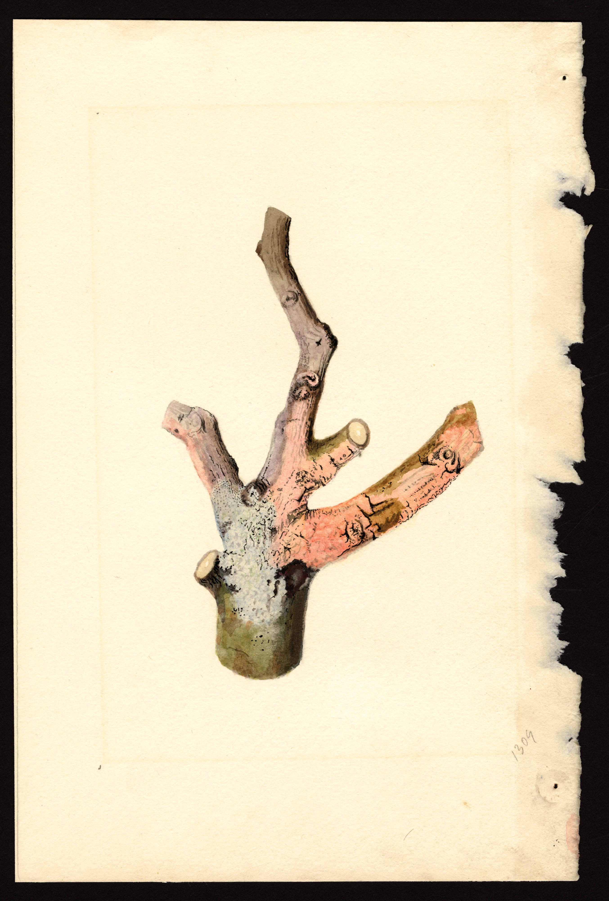

<figure>

<figcaption>Figure 1. Do not prune on panic in March. Staged stand-in (zone8a.d43.usda-pom-winter-cutting); USDA NAL Pomological Watercolor POM00001042, J. Marion Shull, PD. Prefer publish photo from D:\FIGS\Damaged Cuttings — do not panic-prune — mark live wood. See RIGHTS.md.</figcaption>
</figure>

March wood is a liar and a sleeper. I have
cut a fig to the dirt because I was tired
of looking at sticks, and then watched the
sticks I threw on the pile start to push
in the compost. I had pruned my crop into
the brush pile.

The rule I keep failing and then returning
to: scratch, wait, then cut. Thumbnail
into the bark from the tip down. Green and
damp — wait for buds. Tan and dry — keep
walking down the cane. When you hit live
wood, stop. Leave a little extra. Figs
will break below a cut. They will not
grow back the cane you dragged to the
street.

If nothing is green above the soil, wait
until the neighbors' figs are in full
leaf. Then look at the crown. Basal buds
are easy to miss if you want a tragedy.
If the crown is alive, you have a bush
year. Cut the dead off so it does not
shade the new shoots and so you stop
tripping over it. Do not fertilize the
grief. Let the plant make leaves, then
feed lightly if the soil is poor.

Fall panic is the other door. People
"clean up" in November and remove the
breba wood, or they cut a young plant
into a shape that cannot wrap. Winter
is not the time to become a sculptor.
Take the broken stuff. Leave the
argument for spring.

Zone 7 should be especially slow. Their
plants wake late. Zone 9 can prune
earlier because the wood tells the
truth sooner, but a late freeze after
an early cut is still a way to remove
your own fruit. 8a is where the false
spring makes you hold clippers like
they are a solution. They are not. They
are a commitment.

I put the clippers down and I walk the
canes once a week. The week the buds
swell, I know what I am allowed to
remove. Until then I am guessing, and
I am a bad guesser when I am embarrassed
by the yard.

If you already cut too hard, stop
cutting. Water when the soil
works. Wait for basal shoots.
You still have a fig if the
crown is alive. You have a
shorter year. I have gotten a
late main crop off a plant I
butchered in a mood. I have
also gotten nothing, when I
butchered a slow variety. The
mood does not know the cultivar.
That is why the mood does not
get the clippers.

Leave a few "maybe" canes if you
are unsure. Ugly is legal until
May. A clean March skeleton is
often a clean pile of mistakes.

I put the clippers in a different room
in March. That is not a joke. If I have
to walk to get them I have to pass the
thermometer notes and the card that
says wait. I have still cut too much
when the clippers were in my hand
"just to tidy." Tidy is a spring word
that has cost me fruit.
