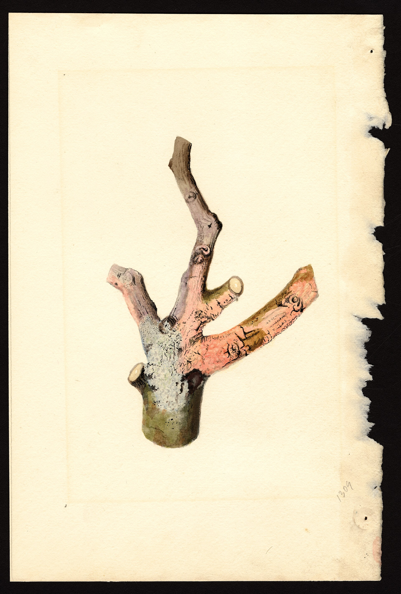

<!-- figure-id: d44.usda-pom-cutting -->
<figure>

<figcaption>Figure 1. Autopsy piles of grey sticks teach more than catalogs — scratch bark and check pith before declaring the roots dead. Credit: USDA NAL Pomological Watercolor Collection. License: Public domain (U.S. government work) — see RIGHTS.md.</figcaption>
</figure>

When a fig is sticks, I want a story that
makes me innocent. Variety. Polar vortex.
The neighbor's walnut. Sometimes the
story is true. Sometimes the plant is
telling me I left a pot on concrete, or
I wrapped it in a bag, or I planted it
in a hole that holds water like a
keepsake.

An autopsy I can actually run:

Where was the plant? Open wind, wall,
pot, bed, low spot. I write it down
before I rearrange the memory.

What did the thermometer do, for how
long? A single 14°F hour is not the
same as a 14°F weekend.

What does the wood say from the tip
down? What does the crown say? What
do the roots say if I can look —
white and firm, or brown and a smell?

Was there a wrap, and was it wet when
I opened it? Was there plastic? Did I
unwrap into a freeze?

Was the plant a first-year? Did I feed
it in September? Was the pot light in
December?

If the roots are dead and the site was
a pot on a pad, I do not need a new
cultivar. I need a garage. If the roots
are alive and the top is gone, I need
patience and a shorter-season fig if
this happens every year. If the bark
slipped in a wet bundle, I need to
stop building stills. If the plant is
in a puddle, I need a mound, not a
tougher name on a tag.

Zone 7 autopsies often end with "that
is winter" plus one fixable insult.
Zone 9 autopsies often end with
nematodes or water or a wrap that
should not have existed. 8a autopsies
are mixed, which is why people argue
in circles. Do the list. Pick the one
cause you can change. Plant again if
you want. Do not plant the same
mistake with a more expensive fig.

I keep the dead canes out of the new
mulch if they are mushy. I do not
perform a funeral. I perform a note
in the same place I wrote last
January's low.

I photograph the wrap in January
now, because memory edits the
plastic out. If the photo shows
a bag, the autopsy is over. If
the photo shows a pot on a pad,
the autopsy is over. If the photo
shows a decent cage and a living
crown, I call it winter and I
keep the variety.

Share the photo with the person
you are tempted to blame — the
seller, the map, the cousin in
9. Ask them what they see. A
second pair of eyes will find
the puddle you have walked past
since October.

If two plants died the same way, I stop
calling it a fluke. A fluke is one. A
method is two. I have needed that
sentence. I like to believe in flukes
because they let me keep the method.
Write the cause in one line. If you cannot, you are not done looking.
