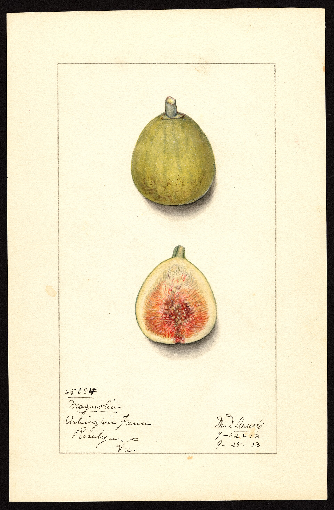

<!-- figure-id: d47.usda-pom-magnolia -->
<figure>

<figcaption>Figure 1. Box-store hardy labels in March describe marketing, not your December — verify cultivar against a voucher plate, then plan wraps. Credit: USDA NAL Pomological Watercolor Collection. License: Public domain (U.S. government work) — see RIGHTS.md.</figcaption>
</figure>

March is when the big stores roll out
figs with tags that say hardy like it
is a flavor. The plants have been in
a greenhouse. They are leafing. They
are in a pot that will freeze through
next January if you believe the tag
and set them on the porch. I still
buy them sometimes. I do not believe
them.

What I look at, if I am going to take
one home:

Roots, not the tag. Slide it out if
they will let you. Circling roots,
sour soil, water in the saucer — walk.
A name I recognize as a real cultivar,
not "fig tree" in a serif font. A
plant that is not already a six-foot
whip in a three-gallon can. That whip
is a summer of watering and a winter
of lies.

Then I decide its winter on the drive
home, not in November. If it is a
maybe, it stays a pot and it gets
the garage. If it is a Celeste-looking
thing I can stand to lose, it can go
in the ground in a decent spot after
the last frost, and it gets first-year
wrap rights. I do not plant a
greenhouse fig out in March in 8a
and then act shocked at a 22°F night
in April.

The word hardy on those tags is often
doing Chicago Hardy math for a plant
that is not Chicago Hardy. Or it is
doing Zone 8–10 math for a Mission
they shipped to an 8a endcap. I read
it as "this plant is alive in the
store." That is the only claim I can
verify.

Zone 7 should treat box-store figs as
pots for a year even if the name is
good. Zone 9 can plant them if the
roots are honest, and then the fight
is summer. 8a is where the tag and
the climate look close enough that
people skip the garage. They should
not.

If you want a fig that is actually
from this weather, take a cutting in
July from a yard that still has wood
in March. The store can be a start.
It should not be a religion.

I take the plant home and I
repot only if the soil is a
sour sponge. Otherwise I leave
it until after the last frost
so I am not adding transplant
shock to a greenhouse-to-yard
shock. March is already a lot
of weather for a plant that
woke up under glass.

Ask the store person where the
truck came from if you like
conversation. Then ignore the
answer for winter purposes.
The truck is not your garage.
You are.

Price is not a winter predictor. I have
had a twelve-dollar Celeste-looking fig
outlive a forty-dollar "collector" in
the same garage, because I actually
moved the cheap one and I treated the
expensive one like it was too good for
the dark. Money does not haul pots.
You do.
A greenhouse leaf in March is not proof of hardiness. It is proof of a heater.
