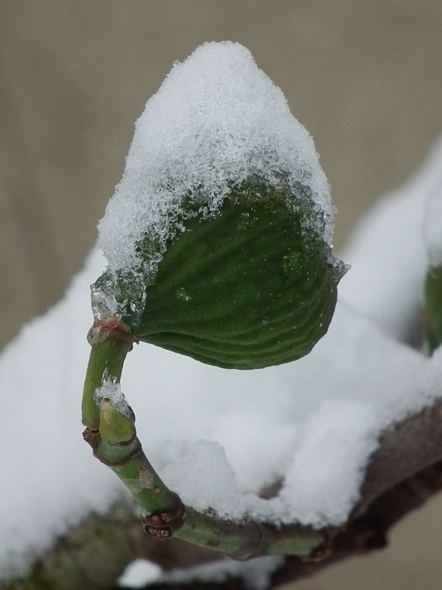

<figure>

<figcaption>Figure 1. How to tell if last year's wrap helped. Staged stand-in (zone8a.d50.fig-winter-snow-hood); Photo: 4028mdk09, Wikimedia Commons, CC BY-SA 3.0. Prefer publish photo from D:\FIGS\Figs — before/after wrap comparison two winters. See RIGHTS.md.</figcaption>
</figure>

I used to wrap, survive, and credit
the wrap. That is a story, not a
test. Figs survive 8a without me
all the time. If I want to know
whether the coat did work, I need
a comparison, not a feeling.

The honest versions:

Two plants, same variety, same age,
same week in the ground. One wrapped,
one not, same winter. In spring I
compare live wood height, breba,
and whether the unwrapped one is
even alive. That is a test. It is
ugly in the yard. It is the only
reason I still wrap some plants
and not others.

One plant, two winters, notes. If
I wrapped in the 11°F year and not
in the 18°F year, I have not
learned what I think I learned.
The winters were not the same
machine.

A plant that comes out of a wrap
with slipped bark and no mildew-
free wood is a wrap that failed
even if the crown lived. Survival
is not the metric if the method
ate the thing I was saving.

I write: variety, site, pot or
ground, wrapped or not, materials,
dates on and off, low, hours under
20, wind, spring wood. That list
fits on an index card. After three
years the card is smarter than a
forum.

What I have actually learned in
8a: established Celeste on a wall,
mulched, no wrap, keeps wood in a
normal mid-teens night. First-year
anything, wrap or cage, worth it.
Pots, garage, not negotiable.
Plastic, never again. Leaf cage on
a mature hardy stool in a 24°F
winter: I did it for me. The plant
did not notice.

Zone 7 tests will credit wraps more
often, because the untreated control
dies back more often. Zone 9 tests
will credit "doing nothing" more
often, because the wrap is the
risk. 8a is where a sloppy test
will tell you whatever you wanted
to hear.

If you will not leave one plant
unwrapped as a control, at least
leave last year's notes. A wrap
that you cannot evaluate will grow
into a ritual. Rituals are how we
steam figs in a mild January and
call it care.

I have a control plant on
purpose now: an old Chicago
Hardy I refuse to wrap. If
that plant keeps wood and the
wrapped fancy fig does not, I
do not wrap "harder" next
year. I change variety or
site. If the control dies
back and the wrapped plant
keeps two feet of wood, the
wrap stays in the kit.

Without a control I am just
collecting rituals. 8a is too
mild, some years, for rituals
to prove themselves. That is
why the easy years are
dangerous. They congratulate
every method, including the
bad ones.

I also ask what the wrap cost me: hours,
mold, a late unwrap, a fight with a
tarp. If the wood I saved is six inches
and the cost was a weekend and a slime
cage, I may choose dieback next time
and a main crop. Help is not only
live wood. Help is a winter I will
still do.
