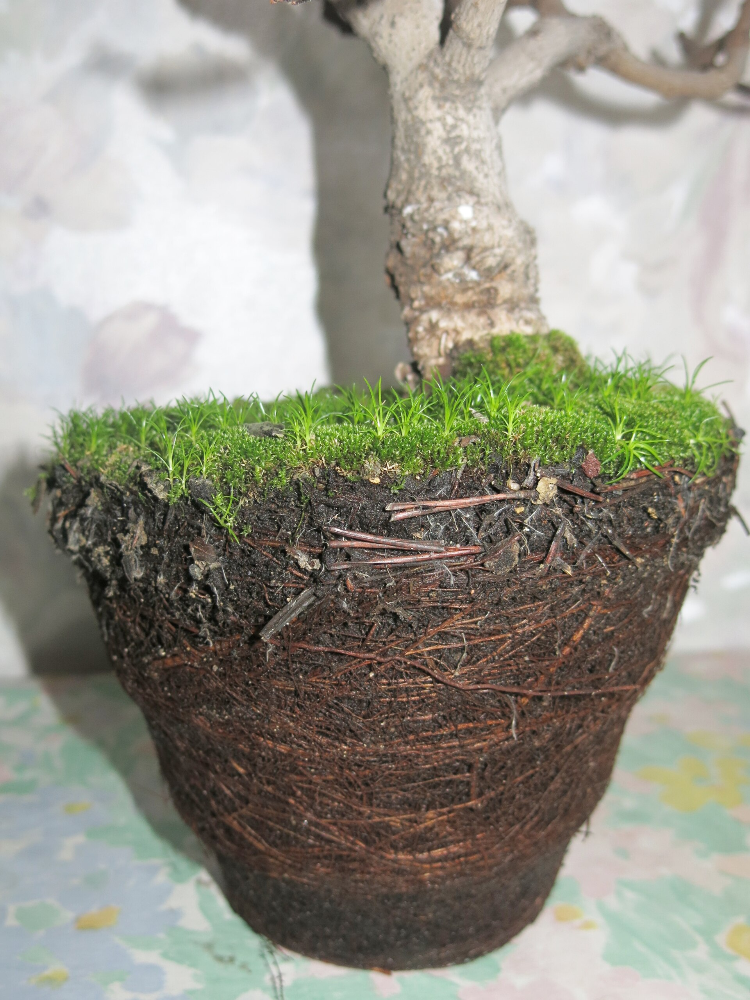

<!-- orchard_slot: D:\FIGS\Greenhouse photos — hero still before publish -->
<figure>

<figcaption>Figure 1. Potted common fig in a movable container — the pot as a climate tool in USDA Zones 7 through 9. PD/CC staging fill — swap for a Keith still from PHOTO_NOTES (`D:\FIGS` first) before publish. Credits: RIGHTS.md.</figcaption>
</figure>

# Why a pot beats the ground in Zone 7–9

People treat a pot as the consolation prize. You wanted an orchard tree; you
got a tub on the patio. That reading is wrong in this band of the country.
In Zones 7 through 9 the pot is the climate tool. The ground is the thing
that locks you into a winter you cannot edit.

Start with Zone 7. An in-ground fig can live. Chicago Hardy, Celeste, a
tough Brown Turkey — they come back. What they often do not do is keep last
year's wood. A night in the single digits kills the top. The plant resprouts
from the crown like a cut-back butterfly bush, and every fig that needed old
wood is gone. You wait on a main crop that starts late and finishes against
the first cold week of October. Some years you eat. Some years you get a
handful of half-soft green knobs and a story.

A pot changes the sentence. After leaf drop you roll the plant into an
unheated garage, a closed shed, a cold corner of a basement that stays
above hard freeze and below the temperature of a living room. The wood
lives. Breba is possible. The main crop starts from a plant that did not
spend April rebuilding a canopy. That is not a lifestyle flourish. That is
the difference between a crop and a hobby that looks like a crop.

Zone 8 is the awkward middle, and it is where people get cocky. Winters are
usually kind. Then a polar slide puts 12°F on a pot sitting in the open, and
the roots — which are not insulated by a cubic yard of earth — die while the
top still looks fine. In-ground figs in Zone 8 often shrug. Potted figs in
Zone 8 need a plan even when the plan is only "group them on the south wall
and wrap the cans." The pot is still the right vessel because you can give
them that plan. You cannot pick up the in-ground plant on the Tuesday the
forecast turns.

Zone 9 flips the problem. Winter is not the enemy most years. Heat is. A fig
in clay soil against a west wall will live, but the fruit can stall in
August and the roots sit in a baked crust. A pot lets you slide the plant
into morning sun and afternoon shade, or at least off the reflective
concrete that turns a 98°F day into a 115°F root zone. You can also pick
the soil. That matters on the Gulf and in the Piney Woods, where old beds
are full of root-knot nematodes that treat fig roots like a job. A clean
mix in a pot is a quarantine you can actually keep.

There is a second, quieter reason. Figs in the ground get huge. That is
lovely if you have a side yard and a ladder. It is a problem if you have a
townhouse pad, a rented house, or a deck with a weight limit. Pot culture
keeps the plant in the size class of a piece of furniture you are willing
to live with. Root restriction, used on purpose, is how a Violette de
Bordeaux stays a five-foot shrub instead of a garage-eater. You still have
to water. You do not have to prune with a pole saw.

People will tell you potted figs are more work. They are more *visible*
work. You see the wilt. You feel the weight of a dry 20-gallon when you tip
it. An in-ground fig hides drought until the fruit yellows and drops, and
it hides winter kill until April when nothing leafs. I would rather have
the work I can see.

None of this means every fig must live in a pot forever. If you are Zone 8b
on a slope, with drainage, and you have a variety that has already proved
itself in your county, the ground is fine. Plant it. Mulch it. Stop reading
container essays. This series is for the rest of the map: Zone 7 people who
want wood to survive, Zone 8 people who got burned by one bad January, Zone
9 people whose soil or heat or rental agreement makes a tub the honest
choice.

The rule I use: if the winter can take the wood, or the summer can cook the
roots, or the ground is a nematode hotel, the fig belongs in something you
can move. Everything after that — mix, gallons, varieties, frost night — is
just how you keep the promise the pot made.
