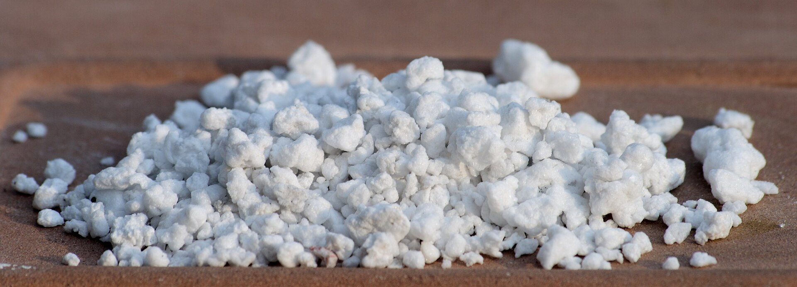

<!-- orchard_slot: D:\FIGS\Greenhouse photos — hero still before publish -->
<figure>

<figcaption>Figure 1. Perlite in potting media — plastic, fabric, clay, and wood pots each change drying speed on a patio. PD/CC staging fill — swap for a Keith still from PHOTO_NOTES (`D:\FIGS` first) before publish. Credits: RIGHTS.md.</figcaption>
</figure>

# Fabric, plastic, clay, wood, and the barrel

The plant does not care about the brand on the pot. It cares about
volume, drainage, heat, and whether you can move the thing when the
forecast turns. Materials are just how those four show up.

**Fabric bags** are the default I recommend to people who have not
picked a religion yet. They air-prune roots, so you get a fibrous ball
instead of a circling rope. They run cooler than black plastic in July.
They dry faster, which is a virtue in a wet Zone 8 summer and a chore in
a Zone 9 courtyard. Cheap bags slump and fade in one season. Spend
enough that the fabric has a coating and the handles do not tear when
the pot is wet. Set them on slats or a dolly, not in a puddle. Fabric in
a saucer is a diaper.

**Plastic nursery cans** are ugly and honest. They hold water longer
than fabric. They are light. They are also little ovens if they are
black and sitting on concrete in August. A 15-gallon black can in Zone 9
can put roots into the temperature range that stalls growth even when
you water. Slide it into a slightly larger decorative pot, or pick a
light color, or shade the can. Do not pretend color is decoration only.
I drill extra holes in the side wall an inch above the bottom on cheap
cans that only have a few slits. Side drainage beats a single punch-out
that clogs with roots.

**Terracotta** breathes. It also drinks your water and then shatters if
you leave it wet through a Zone 7 freeze. I like clay for a small dwarf
on a covered porch. I do not like it as the winter vessel north of Zone
8b. If you use it, accept that you will water more, and get the pot
indoors before the first hard freeze or accept shards in March.

**Wood** — cedar boxes, half barrels — looks like you meant it. Half
whiskey barrels are a classic fig home. Line them with fabric if you
want to lift the plant out later; otherwise you are marrying the barrel.
Check that the barrel has real drain holes, not a hopeful crack. Wood
rots at the soil line. That is not a moral failing. Budget years, not
decades, unless you built from cedar and kept the box off the dirt.

**Glazed ceramic** is a living-room object that escaped. Fine for a
show plant you water on a schedule. Terrible if the pot has no hole.
No hole is not a style. It is a vase. I will not argue about cachepots
if the grow pot inside can come out and drain.

**Self-watering reservoirs** get their own draft. Short version: they
help people who travel in June and they rot plants for people who leave
the reservoir full in November.

Color and wall thickness change the root climate more than people
admit. Thin black plastic on a south patio in Jackson or Austin is a
different machine than a thick beige fabric bag on a north-of-Richmond
deck. Same plant, same gallons, different summer.

Whatever you pick, the drain has to work when the pot is full of roots,
not when it is empty on the store floor. Lift it after a storm. If it
is still draining five minutes later, good. If it is a bucket, fix the
holes or retire the pot.

And buy the dolly when you buy the pot. I have watched too many people
choose a handsome 25-gallon and then discover in October that handsome
weighs 80 pounds wet and the garage is four steps down. Material is
also a moving problem. Fabric handles help. Barrels do not. Plan the
exit as part of the purchase.
