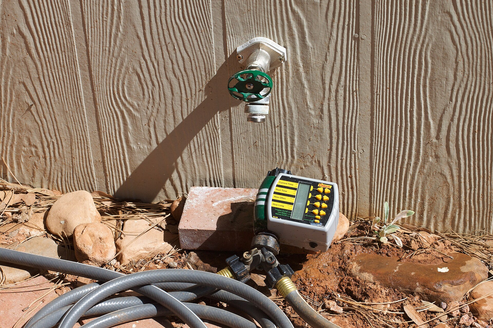

<!-- orchard_slot: D:\FIGS\Greenhouse photos — hero still before publish -->
<figure>

<figcaption>Figure 1. Garden hose at season close — dormant potted figs still need a quiet winter drink. PD/CC staging fill — swap for a Keith still from PHOTO_NOTES (`D:\FIGS` first) before publish. Credits: RIGHTS.md.</figcaption>
</figure>

# The quiet drink a dormant pot still needs

A fig that has dropped its leaves is not a stick in a vase. The roots
are alive. They are slow, and they will rot if you treat winter like
July, and they will desiccate if you treat winter like a closet you
never open.

Once the plant is dormant — leaves gone, no soft green tips — the mix
should be barely moist. Not bone dry. Not wet. Think of a sponge you
wrung out and left on the counter. In an unheated garage in Zone 7
that might mean a cup or two every three to four weeks for a
15-gallon, more if the space is drafty and the pot is fabric. There
is no calendar that replaces lifting the pot.

The failure I see most is the heated house. Someone brings the fig
into the living room "to be safe," the radiator ticks, the plant
breaks dormancy in December, puts out pale leaves, crawls with
spider mites, and then you have a houseplant with no summer and a
winter it no longer understands. Dormant figs want cold. Not
Minnesota cold. Garage cold. Thirty-five to forty-five is a sweet
range. They will take the low thirties. They will not take a
repeated hard freeze through the pot if you can help it.

If the plant is still outside in Zone 8 or 9, winter water is about
rain and wind, not a schedule. A pot on a covered porch can go dry
in a week of sun and wind even in January. A pot in the open can
sit soaked for ten days. Tilt saucers. Clear the drain. Do not add
"a little extra for winter" on top of a week of rain.

Frozen mix is a special case. Do not water a pot that is frozen
through. The water sits, then rots the crown when it thaws. Wait
for a thaw, check the weight, then decide. A pot that will freeze
solid for days should not have been left wet. That is why I dry
them down a bit before the first hard night, then keep them just
short of dry after that.

Yellow leaves in November are not a watering puzzle. They are the
plant leaving. Let them fall. Pick them out of the pot so they do
not mat and stay wet on the wood. I do not strip half-green leaves
to "hurry dormancy" unless a freeze is due tomorrow and I need the
plant clean for the garage. Even then I would rather let a frost
do it.

When the days lengthen and you see swelling buds, do not panic-water
back into summer. Increase slowly. The first warm week in Zone 7 is
a liar. The plant can start, then sit through a freeze. A sopping
pot in a late freeze is a colder pot. Keep the mix on the dry side
of moist until you are done moving the plant in and out.

If you only remember one number, remember this: dormant roots die
from wet faster than they die from a missed drink, and they still
die from a missed drink if you forget them from Thanksgiving to
March. Put a note on the garage door. Check them when you check
the breaker in a cold snap. That is the whole winter irrigation
program.
