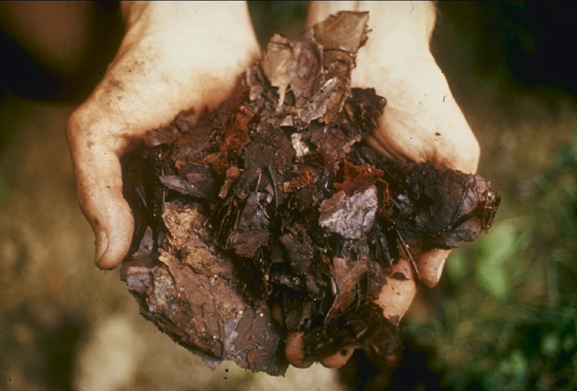

<!-- orchard_slot: D:\FIGS\Figs — hero still before publish -->
<figure>

<figcaption>Figure 1. Finished compost — feed potted figs for fruit, not a nitrogen hedge on the patio. PD/CC staging fill — swap for a Keith still from PHOTO_NOTES (`D:\FIGS` first) before publish. Credits: RIGHTS.md.</figcaption>
</figure>

# Feeding without growing a leaf factory

A fig in the ground can live on neglect and a spring handful of
compost. A fig in a pot is eating from a box you filled. That box
runs out. The mistake is not forgetting to feed. The mistake is
feeding as if more green were the goal.

I want short internodes, dark leaves, and fruit. I do not want a
six-foot fountain of pale leaves and two figs hiding underneath.
High nitrogen gets you the fountain. It is satisfying in May and
useless in August.

In this band I start food when the plant is actually growing — not
when the calendar says March and the buds are still tight. A
balanced or gently nitrogen-leaning feed in spring is fine. As
soon as I see fruit set, I shift toward something with more
potassium and less of the leaf-push. Tomato food is a crude
version of that idea and it works if you do not overdose. Fish
emulsion makes a plant look lush and makes a porch smell like a
dock. Use it early, outdoors, and then stop being romantic about
it.

Rates: half of what the bottle says for houseplants, and less
often. Pots concentrate salts. Figs will show a burned leaf edge
before they write you a letter. If you use a slow-release
prill, one spring application in a 20-gallon is often enough
through early summer. I still give a weak liquid every few weeks
in the heat because a plant that is watered daily is also leaking
nutrition out the drain. That is the pot bargain.

Stop dates matter more than brand. In Zone 7 I am done feeding
by early to mid-August. I want the wood to harden. Soft growth
in September is what a October frost kills first, and then you
have a plant that looks fine until January when the dieback
keeps going. Zone 8 can run a little later. Zone 9 can feed
into early fall if the plant is still working a main crop, but
even there I would not push nitrogen after the worst heat
breaks if the plant is already large.

Organic vs synthetic is a personality test. Both can grow a
fig. Both can burn one. Compost tea is not a plan. A measured
product you can repeat is a plan. I like knowing the NPK
because I want to change it midseason. If you only want one
bag, get a modest slow-release and a separate potassium source
and keep your hands off the lawn fertilizer.

Yellowing between veins on new leaves is often iron or the pH
of your tap, not a call for more 10-10-10. Adding more
balanced food on top of a lockout makes a salt problem. See
the yellow-leaf draft and the salt draft before you double the
dose.

A plant in its first year in a new pot needs less food than
you think. The mix has a charge. The plant is building roots.
A light feed after it takes off is plenty. The grocery-store
crop is year two or three. Feeding a baby like a production
tree is how you get the leaf factory on a stick.

If the plant is dark, compact, and loading fruit, do not
"help." Help is how the factory starts.
