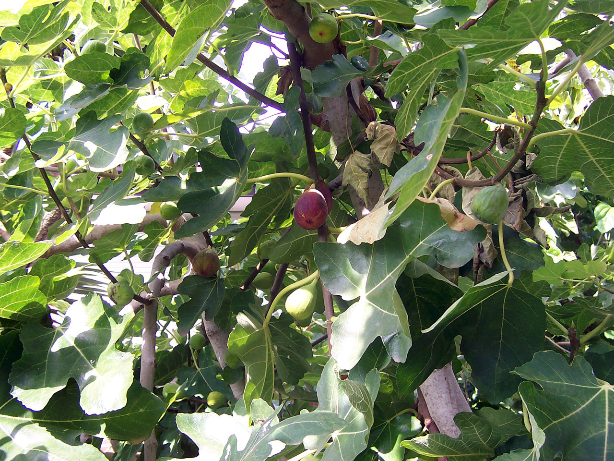

<!-- orchard_slot: D:\FIGS\Figs — hero still before publish -->
<figure>

<figcaption>Figure 1. Fig tree in the landscape — Zone 8 winters that are usually mild until they are not. PD/CC staging fill — swap for a Keith still from PHOTO_NOTES (`D:\FIGS` first) before publish. Credits: RIGHTS.md.</figcaption>
</figure>

# Zone 8, the awkward middle

Zone 8 is where fig people get sloppy, and I say that as
someone who has been sloppy here. Most winters you can
leave a potted Chicago Hardy or Celeste outside and tell
a story about how figs are easy. Then a January arrives
that belongs to Zone 6 for four nights, and the pots —
not the in-ground trees down the street — are the ones
that die.

The roots are the weak part. In the ground, even a
ugly clay bed holds heat and buffers the swing. In a
15-gallon can, the whole root ball can go below 20°F
while the air is 18°F. Bark on the top may still be
green. You find out in April.

So the Zone 8 plan is a sliding scale, not a religion.

In a normal winter, I group pots against a south or
east wall, off the open lawn, out of the wind alley
beside the house. I lift them onto bricks so they do
not sit in a melt puddle. I wrap the cans with
something dull — burlap, an old mover's blanket, foam
if I have it — and I leave the tops alone until a
hard night is actually on the forecast. Covering a
plant in leaf for a 28°F night is useful. Wrapping a
dormant top like a mummy for a 22°F night is optional.
Wrapping the pot is not optional if the night is
going into the teens.

I keep a backup space. Garage, shed, unused
greenhouse, even a spare bathroom that stays cool.
The backup is for the forecast that makes the
neighbors talk. You do not need it five years in a
row. You need it the year you do not have it.

Varieties still matter. LSU Purple, Celeste, Brown
Turkey, Chicago Hardy, Olympian — these are Zone 8
pot plants I will leave out with protection. A
thin-wood, late, heat-loving fig I will treat more
like a Zone 7 plant and give it the garage for
January. The tag that says "Zone 8" was written for
in-ground, not for a black pot on a deck.

Rain and rot are the other Zone 8 winter. This is
not the desert. A pot can stay soaked from December
to February under an open sky. Clear the saucers.
Check the holes. A little extra bark in the mix
pays you back here. I have lost more Zone 8 pot
figs to a wet, mild winter than to a dry cold one.

Spring is early and dishonest. A February warm spell
will push buds. Then March will take them. I do not
drag pots into full sun in the first warm week to
"get a jump." I let them sit on the east side and
I keep a sheet handy. The breba on old wood is
exactly what a late freeze loves to burn. If you
saved the wood through January, do not donate it
in March.

Zone 8 pot culture is not Zone 7 with less work. It
is Zone 7's winter plus Zone 9's humidity, in
random order, in the same year. Have a wall, a
wrap, and a door you can open on the ugly night.
That is a plan. "It usually doesn't get that cold"
is a eulogy.
