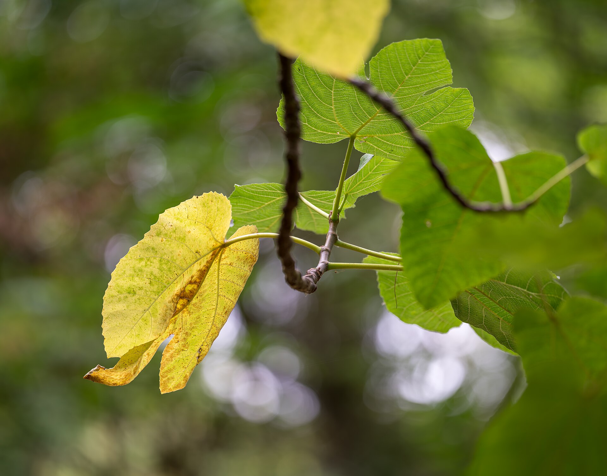

<!-- orchard_slot: D:\FIGS\Figs-summer-23 — hero still before publish -->
<figure>

<figcaption>Figure 1. Fig foliage in summer heat — cooked roots and stalled fruit on pots in Zone 9. PD/CC staging fill — swap for a Keith still from PHOTO_NOTES (`D:\FIGS` first) before publish. Credits: RIGHTS.md.</figcaption>
</figure>

# Zone 9 heat, cooked roots, stalled fruit

In Zone 9 the fig is not a tender experiment. It is a
Mediterranean plant in a place that can be more brutal
than the Mediterranean. Winter is a week you watch.
Summer is the season that decides the crop.

Pots make summer harder and more solvable. Harder
because roots in a can see temperatures the ground
never shows them. Solvable because you can move the
can.

Black plastic on a west-facing slab in July is the
failure case. The slab reflects. The wall radiates.
The pot wall becomes a skillet. Roots in the outer
inch cook. The plant wilts with wet mix because the
roots that could drink are damaged. People add water.
The middle goes sour. That is not a thirsty fig. That
is a scalded one.

Fix the site before you fix the hose. Morning sun,
afternoon shade is the luxury setting — east or
northeast of a building, under high shade after
1 p.m., not under a dense tree that drips and
blocks half the day. If you only have a west
patio, lift the pots onto a board, shade the
cans with a second pot or a wrap of light
fabric, and use a light-colored or fabric
container. A cheap piece of shade cloth on a
tomato cage over the pot wall — not over the
whole plant all day — is inelegant and it
works.

Water volume goes up. A 20-gallon in Zone 9 sun
can take a full soak in the morning and a
partial in the late afternoon during a heat
dome. If you cannot do that, you need more
gallons or less sun, not a tougher variety.
Varieties help, though. Texas Everbearing, LSU
figs, Black Mission, Peter's Honey — plants
that know heat — still need water. They just
keep better rhythm when the nights stay
warm.

Fruit stall is the Zone 9 surprise. Figs that
were moving along in June sit green through
the worst of August, then finish in September
when the heat breaks. You did not fail. The
plant paused. Keep water even. Do not strip
the green fruit. Do not nitrogen-bomb it to
"wake it up." A little afternoon shade can
shorten the stall. So can a pot that is not
cooking.

Gulf Zone 9 adds humidity and rust and fruit
souring. Dry Zone 9 adds salt and wind and a
mix that goes hydrophobic. Same zone number,
different plants. If you are Houston-humid,
read the Celeste draft and the rust draft
before you buy an open-eye fig because it
looked purple on a website. If you are
interior, read the salt draft and buy the
volume.

Winter in Zone 9 is a cold-snap problem, not
a season problem. Have a sheet and a place
to cluster pots against the house for the
one night it hits the mid-20s. Then put
them back. Do not build a garage ritual
you will resent. Save the ritual for Zone 7.

I judge a Zone 9 pot fig by August. If it is
still pushing decent leaves, the mix is
moist without a smell, and the fruit is
holding, you are doing it. If it is a wilted
umbrella over a hot can, you are growing a
pot, not a fig. Move the pot.
