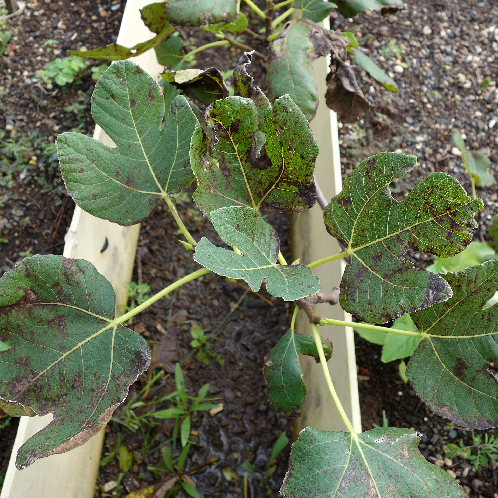

<!-- orchard_slot: D:\FIGS\Figs-summer-23 — hero still before publish -->
<figure>

<figcaption>Figure 1. Fig rust on foliage caused by Cerotelium fici — wet summer on container figs. PD/CC staging fill — swap for a Keith still from PHOTO_NOTES (`D:\FIGS` first) before publish. Credits: RIGHTS.md.</figcaption>
</figure>

# Fig rust in a wet summer

Fig rust shows as yellow-orange specks
on the leaves, then a dusty rust on
the underside, then a plant that
defoliates in August while the fruit
is still thinking about it. In a dry
year you barely meet it. In a humid
Zone 8, it is a roommate.

Pots do not make rust. They can make
it worse if you crowd six plants into
a corner, water the leaves at dusk,
and never thin the middle. They can
make it better if you can move a
plant into morning sun and air, which
an in-ground fig cannot do.

I start with sanitation because it is
free. Pick up the leaves. Do not
leave a wet mat in the pot. Do not
compost a rust year next to the pots
if you are trying to break a cycle.
Thin the bush so air moves. Water the
soil, not the canopy, in the morning.

Resistant varieties help. Some LSU
figs and some old Southern plants
hold leaves better. Some fancy
imports rust like they came to
suffer. I will not publish a false
ranking. I will say: if a variety
rusts to the sticks every year in
your yard, it is not your personality.
Replace it.

People reach for sprays. A copper or
a labeled fungicide used early, as a
program, can slow rust. A spray in
August on a plant that is already
half-naked is theater. If you spray,
read the label for fruit, and do not
mix a kitchen chemistry set. I have
had years I sprayed and years I
did not. The years I thinned, spaced,
and watered at the roots were the
years I regretted less.

A plant that lost its leaves in
August is not dead. Keep watering the
pot. The wood is still working. Fruit
already near ripe can finish. Tiny
fruit may stall. In Zone 7 a rust
defoliation plus an early fall is a
lost main crop. In Zone 9 the plant
may push new leaves and try again.
Do not fertilize a rusted plant into
a flush of soft leaves in September
in Zone 7. You will feed the next
frost.

Winter: those leaves are inoculum.
Clean the pot when you put it away.
Look at the remaining foliage if any
and get it off. Rust is patient.

Spacing: if the leaves of two pots
touch all afternoon, you built a
canopy. Pull them apart. The rust
does not need your help meeting
itself.

I do not throw away a good variety
after one rust year. I throw it
away after it tells me, every year,
that my air is wrong for its
leaves. The pot lets me try a
different corner first. Use that
before you use the trash. A new
corner is cheaper than a new
personality.
