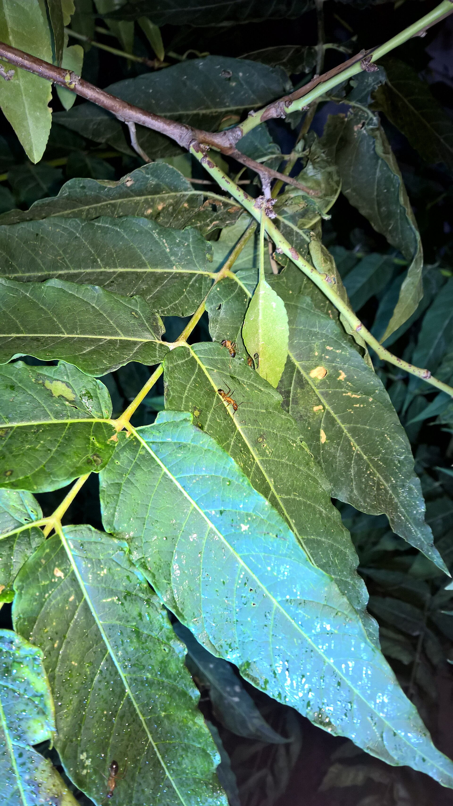

<!-- orchard_slot: D:\FIGS\Figs-summer-23 — hero still before publish -->
<figure>

<figcaption>Figure 1. Ants tending honeydew on a plant — scale and mealybug context on figs overwintered indoors. PD/CC staging fill — swap for a Keith still from PHOTO_NOTES (`D:\FIGS` first) before publish. Credits: RIGHTS.md.</figcaption>
</figure>

# Scale, mealybug, and the indoor winter

Outdoors, a healthy pot fig in sun
does not carry a lot of insect plot.
The plot starts when you bring the
plant into a garage that is a little
too warm, or a sunroom, or — stop —
the living room.

Scale looks like tan or brown lentils
stuck to the wood and the leaf ribs.
You scratch one and it is wet
underneath, or it flicks off and
leaves a pale scar. Mealybug looks
like bits of cotton in the crotches.
Both suck. Both drip honeydew. Both
explode in still, indoor air.

I inspect when the leaves drop. That
is the honest moment. Wood is visible.
A cheap alcohol swab takes a light
population off a dormant plant. A
heavy population on a leafy indoor
fig is a project: soap, oil, repeat,
and you will miss the ones behind the
leaf. This is why I do not winter
figs in leaf in the house.

If you must have a leafy plant
inside — you are Zone 7 and you
panicked before dormancy — isolate
it. Do not park it next to the
citrus and the houseplants. Check
weekly. Wipe. A systemic indoor
product is a choice people make. I
would rather finish dormancy in the
cold and skip the chemistry.

Outdoors, ants farming honeydew are
a clue. So is a sooty film on the
pot rim. Look before you treat the
"fungus." The fungus is eating the
sugar the scale paid out.

Predators exist in a real yard.
Indoors they do not ship themselves
to your spare room. That is the
whole indoor problem.

On a dormant plant I will use a
dormant oil if the infestation is
real and the plant is fully asleep
and the label agrees. On a plant I
am about to eat from, I am slower
with oils in summer. Soap and a
cloth and persistence are underrated
because they are not a product
identity.

Do not confuse fig rust specks with
scale. Do not confuse the natural
bumps on old fig wood with scale.
Scratch. If you are unsure, wait a
week and see if the bumps multiply
and shine with honeydew. Scale
multiplies. Wood does not.

If you find a heavy population in
April on wood you thought was clean,
treat before the leaves hide
everything. A dormant miss becomes
a June project. I would rather wipe
wood in February for twenty minutes
than wash leaves in a heat wave.

The best pest program in this series
is still: dormant and cold in winter,
sun and air in summer, and a look
at the wood when the leaves leave.
The pot makes that look easy. Use
the pot. A flashlight and a thumbnail
are still the first tools.
