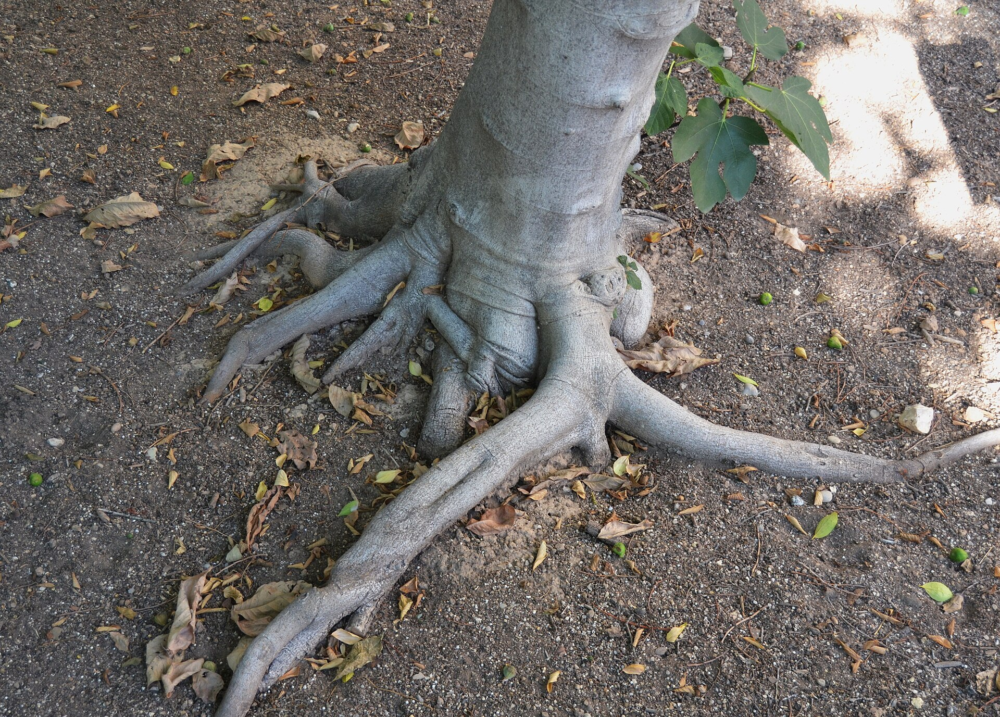

<!-- orchard_slot: D:\FIGS\Greenhouse photos — hero still before publish -->
<figure>

<figcaption>Figure 1. Shallow fig roots — root-bound pots, root-prune, or step up in gallon size. PD/CC staging fill — swap for a Keith still from PHOTO_NOTES (`D:\FIGS` first) before publish. Credits: RIGHTS.md.</figcaption>
</figure>

# Root-bound, root-prune, or step up

Figs tolerate a tight pot better than
tomatoes do. A little restriction
keeps the plant from becoming a
leaf hose and can push it to fruit.
A lot of restriction is a plant
that wilts at 10 a.m. and has no
mix left to hold a drink.

I slide a plant out in late winter
or just as it wakes. If I see a
white net and some mix, I leave
it. If I see a solid coil and the
shape of the pot in roots, I
decide: bigger can, or the same
can and a haircut.

Stepping up is the kind choice.
One size. 15 to 20, 20 to 25. Not
15 to a barrel unless you like
wet soil and a year of sulk.
Tease the bottom coil. Add fresh
mix. Water. Do not feed for a
couple of weeks.

Root-pruning back into the same
pot is the apartment choice. Saw
an inch off the bottom. Slice
three or four verticals up the
sides. Shake out what you can.
Replace with fresh mix. The plant
will act insulted and then it
will grow. Do this while it is
still mostly asleep. Midsummer
root surgery on a loaded plant
is how you pick a fight.

How often: every two or three
years for a plant you are
keeping at a size. Every year
for a dwarf in a small bag that
dries too fast. Never, if you
are the person who likes a
crisis every July. The crisis
is the schedule telling you.

Old mix in the middle of a
long-term pot can go greasy and
sour even if the roots are not
a coil. If the drain is slow
and the smell is a ditch, dump
and reset. That is not
repotting for size. That is
repotting because the box went
bad.

A plant that is root-bound and
happy — compact, fruiting, you
can keep up with water — can
wait. Do not repot a fruiting
plant in June because a video
said spring energy. Wait until
the crop is done, or live with
the tight pot until next
winter.

Zone 7: do the work before the
plant goes into the garage, or
as it comes out, not in a warm
spell in January on the driveway
in a wind. Zone 9: you have more
calendar. Still avoid the heat
dome.

A plant that bleeds a lot of
water straight through and then
wilts is telling you there is
no mix left, only roots. That
is not a fertilizer moment.
That is a winter appointment
on the calendar. Write it in
August when you are annoyed,
because in January you will
feel merciful and skip it.

I mark the year on the underside
of the pot with a pencil. It is
the least clever system I have
and it is the one I still use.
When I cannot remember the year,
the roots remember.
