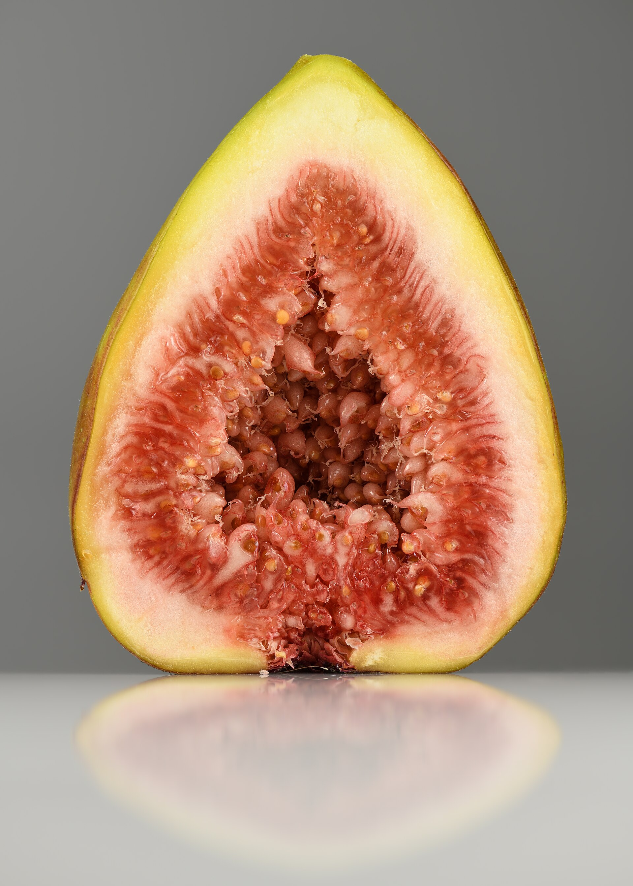

<!-- orchard_slot: D:\FIGS\Fig Fruit — hero still before publish -->
<figure>

<figcaption>Figure 1. Halved ripe common fig — knowing ripe from almost on patio-harvested fruit. PD/CC staging fill — swap for a Keith still from PHOTO_NOTES (`D:\FIGS` first) before publish. Credits: RIGHTS.md.</figcaption>
</figure>

# Knowing ripe from almost

An unripe fig is a waste of a
summer. It tastes like a damp
sponge with a hint of promise.
People pick there because the
color arrived and they were
afraid of the birds. Color is
a rumor. Softness is the
news.

I wait for the neck to
slacken. The fruit hangs. The
skin may show cracks like a
fine glaze. On a dark fig the
color goes dull, not shiny.
On a yellow fig the green
leaves and a warm tone
arrives. Then I touch. A ripe
fig gives. It does not
collapse into soup unless you
waited a day too long in
July.

The eye can show a drop of
nectar. That is a good sign
and also a fly sign. Pick
that one.

Figs do not ripen like
bananas in a bowl if you
picked them stone hard. A
fig that had started — a
little give — will finish
on the counter. A fig you
picked because you were
angry at a squirrel will
not become a good fig. It
will become a lesser fig
you eat anyway.

Morning harvest is cooler
and the fruit holds. I pick
into a shallow bowl, not a
sack. They bruise. They do
not store like apples. Two
days in the fridge is a
lot. Eat, dry, or cook.

A pot helps you learn
ripeness because you walk
past the plant. In-ground
figs at the back fence get
picked too early because
the trip was a production.
Put the pot where you fill
the kettle. That is a
ripeness strategy.

Different varieties lie
differently. Brown types
color early. Celeste can
look modest when it is
ready. Violette looks
ready when it is almost
ready — wait for the
hang. Learn each plant.
The third year you will
know from six feet.

If you cut one open and
the inside is still pale
and dryish, you were
early. If it is amber or
berry and jammy, you were
on time. If it fizzes,
you were late or the
rain won. That tasting
is the calibration. Do
it once per variety per
season and then trust
your fingers.

A pot on the path to the
trash cans gets checked.
A pot behind the grill
gets forgotten until it
is a bird feeder. Site
is a ripeness tool.

I do not measure brix. I
do not own a chart. I
own a habit of waiting
one more day when I am
unsure, unless the birds
have started. When the
birds start, the
definition of ripe moves
up a day. That is
politics, not botany.
Politics still feeds you
if you pick.
