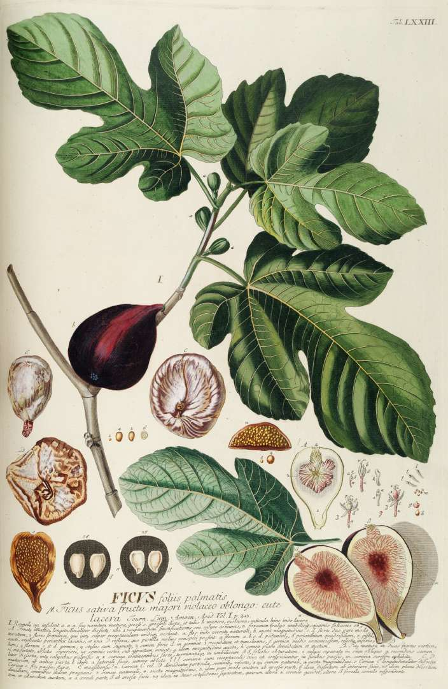

<!-- orchard_slot: D:\FIGS\Fig Fruit — hero still before publish -->
<figure>

<figcaption>Figure 1. Historical botanical plate of Ficus carica — short variety list for pots, not a catalog. PD/CC staging fill — swap for a Keith still from PHOTO_NOTES (`D:\FIGS` first) before publish. Credits: RIGHTS.md.</figcaption>
</figure>

# A short list, not a catalog

Fig lists on the internet
are a way to not plant.
Here is a short one for
pots in this band. If
you want twenty names,
you want a forum. If
you want fruit, pick
three.

**Zone 7, three pots.**
Chicago Hardy — lives,
forgiving, good enough.
Olympian — ripens when
the summer was ordinary.
Celeste — sugar, closed
eye, humid weeks. That
is a winter, a calendar,
and a rain plan.

**Zone 8, three pots.**
Celeste or an LSU —
humidity. A Brown
Turkey type — volume.
Violette de Bordeaux —
flavor. Overwinter the
Violette like you mean
it. The others can take
the wall most years.

**Zone 9, three pots.**
An LSU if you are Gulf.
Texas Everbearing if
you want a long brown
crop. Violette or a
honey fig if you have
heat and want a reason.
Black Mission if you
have sun and gallons
and you accept a larger
plant.

**One dwarf.** Little
Miss Figgy or
Fignomenal for a
balcony or a person
who said no trees.
Not instead of the
three if you have
ground-level sun.
In addition, or
instead if weight
is the law.

**I am not listing**
every LSU release,
every Ukrainian hardy,
every striped fig
with a story. I have
grown some and not
others. The ones
above I will stand
behind as pot plants
in this climate
band without a
disclaimer novel.

**How to add a
fourth.** Add it
when the first
three have fruited
for you. A fourth
before a first crop
is collecting. I
collect too. I am
not pretending it
is agriculture.

**How to drop one.**
If a plant rusts to
sticks every year,
or never ripens, or
you hate the fruit,
take a cutting for
a friend who has a
different summer
and free the pot.
The pot is the
scarce thing. The
name is not. A
name you do not
eat is clutter
with a Latin
footnote.

Do not start with
Panache or a thin
famous fig because
a photo was
striped. Start with
food. Striped can
be year four if
year one through
three already
fed you.

If a neighbor
offers you a
cutting from a
plant that already
feeds their street,
that cutting beats
a famous name in
the mail. Local
ripe is a variety.
Use it. Write the
neighbor's name on
the tag. That is
provenance that
matters.
