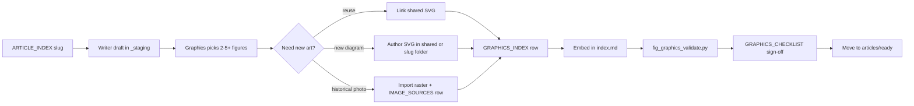

# Graphics pipeline

End-to-end flow from blank slug to publish-ready article with figures.



## Roles

| Step | Owner | Output |
|------|-------|--------|
| 1. Slug activation | Editor | Row in `ARTICLE_INDEX.md` → `draft` |
| 2. Figure plan | Graphics | 2–5+ figure IDs listed in article front matter (`figures:`) |
| 3. Asset creation | Graphics | SVG or cleared raster on disk |
| 4. Registration | Graphics | `GRAPHICS_INDEX.md` + `IMAGE_SOURCES.md` if raster |
| 5. Embed | Writer or Graphics | `<!-- figure-id: ... -->` blocks per `templates/figure-block.md` |
| 6. Validate | Any | `python3 tools/fig_graphics_validate.py content/fig-history-ancient-to-today` |
| 7. Review | Editor | `GRAPHICS_CHECKLIST.md` all boxes |

## Figure plan (front matter)

```yaml
---
title: "Roman fig orchards and maritime trade"
slug: roman-fig-orchards-and-trade
era: classical
figures:
  - roman-orchards.timeline
  - roman-orchards.med-belt
  - roman-orchards.orchard
  - roman-orchards.maritime
status: staging
---
```

## Shared vs slug-local assets

- Prefer **shared** SVG for maps, timelines, and plates used in multiple articles.
- Put **slug-local** rasters only under `assets/images/<slug>/`.
- Do not fork shared SVG into slug folders unless the diagram is truly unique (then register new ID).

## Quality bar

- Magazine archival: consistent `STYLE_GUIDE.md` palette and footer labels on schematics.
- Captions stand alone; alt text matches first sentence.
- Historical images: never synthesized; use `shared.frame-historical-credit` layout or matching caption bar in markdown.
