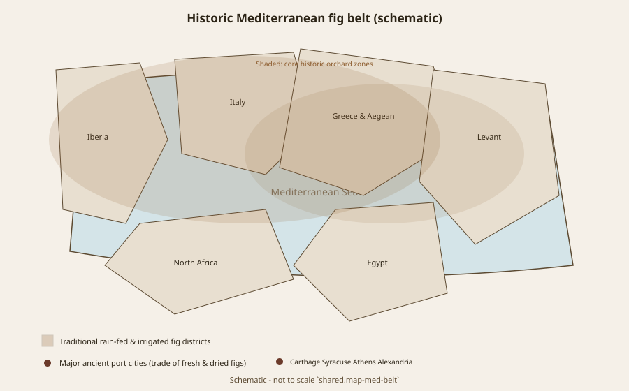
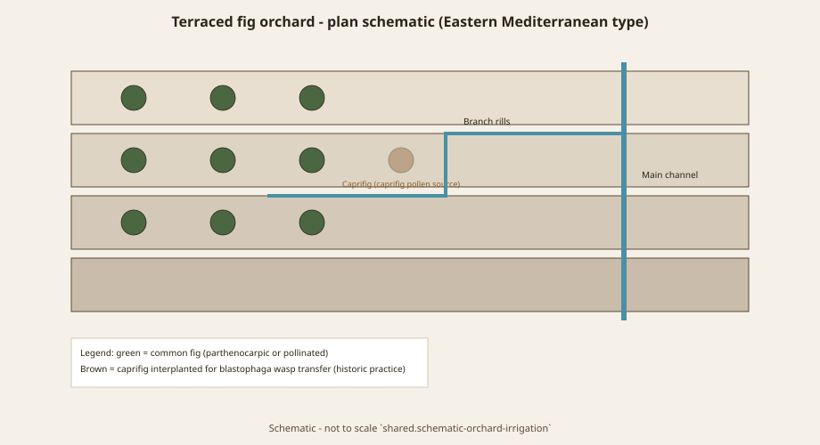
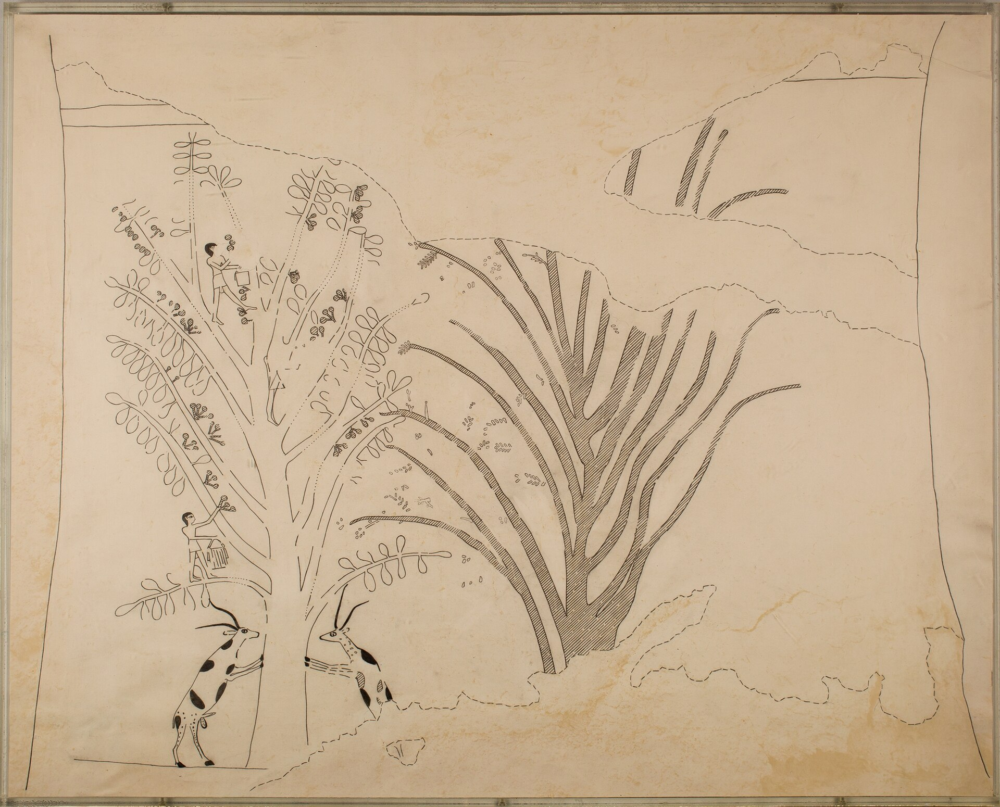
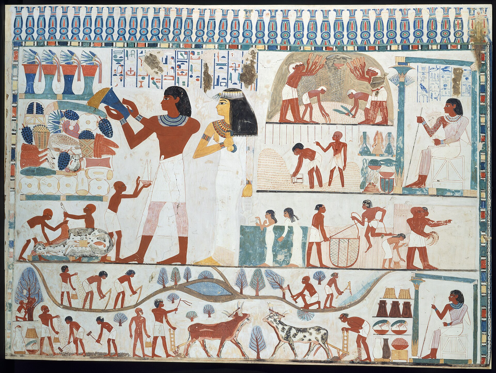
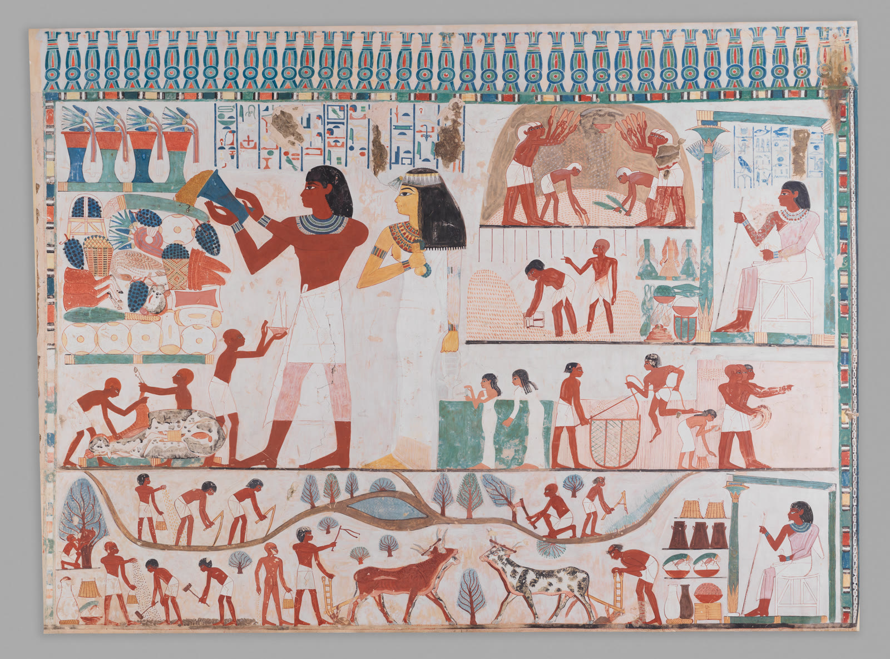

# Egypt Grew Two Figs

Walk a Theban tomb with a modern fruit in your head and you will misread the wall. Egypt had *Ficus carica*, the common fig of the Levant and the later Mediterranean, and *Ficus sycomorus*, the sycomore-fig — a different species, a different wasp, a different job in the garden. Brewer, Redford, and Redford noted that Egyptian art separates the two from the Old Kingdom, around 2500 BCE. The distinction is not a scholar’s nicety. One tree is a sweet imported crop that shows up in offering lists and baskets. The other is timber, shade, a body for Nut and Hathor, a fruit people gashed so it would ripen after the right wasp was gone.

If this series were only a love letter to *carica*, Egypt would still belong in it — but only if we keep the two names on the table.

## Carica on the tray

A 2020 paper in the *International Journal of Heritage, Tourism and Hospitality* walks *F. carica* through tombs until the New Kingdom. The common fig is treated as an eastern introduction; the sycomore as a southern one. Texts talk about quantity. Walls show the fruit. At Idu’s mastaba in Giza (G 7102), figs sit in a large vessel among other offerings in front of the tomb owner. In the Middle Kingdom tomb of Djehutihotep at El-Bersheh, offering-bearers work the same theme. In the New Kingdom, TT 40 (Huy) has trays of fruit including figs; TT 112 (Menkheperraseneb) shows a servant with a fig basket under lotus. These are not “fruit, generic.” The authors argue *carica* is frequent enough in lists from the Old Kingdom on that it was a known orchard tree, sweeter, with a thicker trunk in the paintings, fruit larger than the sycomore’s.

Archaeobotany is less chatty than paint. Fourth-millennium finds in the Nile Delta are read as cultivated *carica* moving in from the east (2019 arboriculture synthesis). That is a dispersal, not an Egyptian invention of the species. The Nile did not domesticate the common fig. It accepted it.

<!-- figure-id: ancient-egypt.timeline -->

*Figure 1. Long arc of fig culture with Egyptian bronze-age orchard phase marked. Schematic timeline.*

## Sycomore: the tree that is also a goddess

*F. sycomorus* is the tree Egyptian religion could not leave alone. Azzazy and Ezzat, working texts, images, and palynology from Tell el-Dabʿa, put it at pools and offering tables, as a form of Nut, Isis, Hathor — a nourisher of the dead. Wood went into coffins. Fruit went into tombs and survived the dry air so well that modern botanists can still see the work done on them.

Jacob Galil described that work. Ancient fruit from tombs, and fruit in paintings, often show a circular cut. Egyptian farmers in the twentieth century still gashed sycomore figs sold around Cairo. The physiology is ethylene: wound the fruit, it ripens. The technique is old enough to be a habit, not a recipe card. It exists because the pollinator, *Ceratosolen arabicus*, disappeared from Egypt. Sexual reproduction of the sycomore there is broken. People kept the tree anyway, as shade and as a fruit that can be forced.

Amos, dressing sycomore-figs in the Hebrew Bible (Amos 7:14), is in this world, not in a *carica* orchard. The English word “sycamore” later wandered off to maples and planes. The prophet was not talking about those.

<!-- figure-id: ancient-egypt.med-map -->

*Figure 2. Egypt within the wider Mediterranean fig belt. Schematic — not to scale.*

## Gardens, not still lifes

Egyptian fig pictures are rarely the Roman trick of two fruits and a loaf on a sill. They are production and offering: men in trees, baskets, tables, a garden painted as a pool with trees arranged the way a wealthy dead man wanted eternity to look. The Nebamun garden fragments in the British Museum (EA37983) are the kind of image this article wants. The Museum’s image licence is not Wikimedia PD-Art. Use the Museum’s service, credit the Trustees, obey NC if that is the tag. This pack does not scrape a postcard and call it open access.

<!-- figure-id: ancient-egypt.orchard-plan -->

*Figure 3. Terraced orchard with channel irrigation and caprifig interplant (historic practice). Schematic plan — not a Theban tomb reconstruction.*

The point of the garden image is ecological as much as pretty. Egypt’s fig story is irrigation, estate, and tomb economy. *Carica* is one more Mediterranean fruit on a tray. *Sycomorus* is furniture of the cosmos. A history that uses “the Egyptian fig” as a single object has already left the wall.

<!-- BM-001 Nebamun garden: British Museum EA37983 through their image service. Not embedded pending licence. -->
<!-- orchard_slot: ORCH-08 leaf only — palmate carica against a sycomore leaf if photographed -->

## What a cleared wall can show

Rights PR #275 cleared three Met facsimiles. None of them is Nebamun. None of them is a photograph of a living Theban orchard.

The Tomb of Djari harvest drawing is **sycamore-fig** — *Ficus sycomorus* — men in a tree, gazelles at the trunk, fruit on the branches. The Commons file misspells the species as “Sicamore.” Caption the species anyway. This is the gashing tree, the timber tree, the goddess-body tree. It is not a Calimyrna basket and not Idu’s offering vessel. It fills the old pending ID `ancient-egypt.tomb-harvest` without scraping the British Museum.

<!-- figure-id: ancient-egypt.tomb-harvest -->

*Figure 4. Harvesting sycamore-figs, Tomb of Djari. Metropolitan Museum of Art facsimile (INST.1979.2.5). CC0. **Ficus sycomorus**, not *F. carica*. A drawing of a wall, not a photograph of a tree.*

Nakht’s agricultural register (TT52; Davies, Met Graphic Expedition) is estate work: plough, herd, offering. It is **not** a fig-picking close-up. The east-wall facsimile of Nakht’s offering chapel (Met object 548438, CC0) is the same warning in another register — a wealthy dead man’s eternity, water already assumed. Use both as landscape. Do not relabel either as *carica* ID.

<!-- figure-id: ancient-egypt.nakht-ag -->

*Figure 5. Agricultural scenes, Tomb of Nakht (TT52). Norman de Garis Davies; Met Graphic Expedition. CC0. Estate context — not a fig harvest.*

<!-- figure-id: ancient-egypt.nakht-east-wall -->

*Figure 6. East wall, south side of Nakht’s offering chapel. Norman de Garis Davies, 1908–1910; original painting ca. 1410–1370 BCE. Met object 548438. CC0.*

## What we will not say

We will not say the fig was “sacred to the Egyptians” as if that were a species-free fact. We will not put a Calimyrna on a mastaba. We will not date *carica* in the Nile Valley to a Predynastic romance without a find. The Predynastic “tree of life” language that attaches to sycomore in some catalogues is about *sycomorus*. Leave it there.

The common fig’s Egyptian life is real: lists, baskets, a coastal crop that still makes sense on the Mediterranean fringe. It is a chapter, not the origin. The origin argument stays in the Jordan and in the genetics. Egypt is where two *Ficus* economies learned to share a river.

## Two economies, one river

The sycomore is infrastructure. The common fig is a tray. Garden-pool
palynology (Tell el-Dabʿa in Azzazy and Ezzat’s sycomore paper) and offering
paintings do related work: they put fruit in a landscape that already had
water. A magazine that photographs only split *carica* pulp has left the
tree that held up the sky in a coffin text.

Keep Hathor’s sycomore out of a California variety caption. Keep Huy’s
offering figs out of a “first farm” sentence. Egypt is a chapter about
hospitality and about a second species this series will not let English
swallow.

## Sources for this piece

- Gad et al., *IJHTH* (2020), doi:10.21608/ijhth.2020.153621 — Idu G 7102, El-Bersheh, TT 40, TT 112.
- Brewer, Redford, and Redford (1994).
- Azzazy and Ezzat on the sycomore (texts, Nut/Hathor, Tell el-Dabʿa).
- Galil, gashing technique (Purdue Hort 306 reprint).
- 2019 *Vegetation History and Archaeobotany* synthesis.
- Met facsimiles: Djari harvest INST.1979.2.5 (CC0); Nakht agricultural DT306954 (CC0); Nakht east wall object 548438 (CC0). Nebamun EA37983 stays reserved.

See `BIBLIOGRAPHY.md`.
