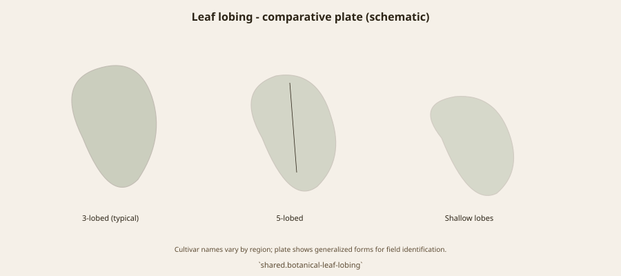

# Two Skins, Two Jobs

Retail language loves a pair: black and white, Mission and Genoa. Biology loves types: common, Smyrna, San Pedro, caprifig. Mission is a black common fig with a California mission story. White Genoa (and Black Genoa, which is another name-pile) are European-facing common figs that nurseries used when they wanted a pale or a dark fruit that did not need a wasp. NSW DPI treats Black Genoa as the leading fresh fig in that state. Prince Albert, South Africa, still dries White Genoa in local accounts. The names traveled farther than any shared clone-identity paper.

Condit tried to pin Genoa names. He did not finish the argument for every backyard. A white fig that a California grocer calls Genoa may not be the Genoa a Ligurian grocer means. Say so.

## What the skin is for

Dark skins sell as “Mission” even when the tree is not. Pale skins sell as mild, canning, or dried-white depending on the district. Kadota ate some of the pale commercial job in California. White Adriatic ate some of the drying job and lost the tasting against Sarılop.

<!-- figure-id: shared.chart-variety-regions -->

*Figure 1. Mission vs Genoa as market skins, not as a Linnaean split. Qualitative.*

<!-- figure-id: shared.botanical-syconium -->

*Figure 2. Common-type parthenocarpy under both skins. Pack plate.*

<!-- figure-id: shared.botanical-leaf-lobing -->

*Figure 3. Do not ID these clones by a sinus. Pack plate.*

The honest pair is not black/white. It is wasp/no wasp. Everything else is paint.

## Skins are not types

Both names, at their honest core, are common-type trees. The pair is retail. The bill is wasp/no wasp. Black Genoa’s Australian fresh job and White Genoa’s Prince Albert drying job are local uses of European-facing names. Condit tried to pin them. The backyard did not wait.

## Retail pairs, biological singles

A grocer loves black/white. A biologist loves common/Smyrna/San Pedro/caprifig. Mission is a black common fig with a California corridor story. White Genoa and Black Genoa are European-facing common-type names that traveled to NSW DPI’s leading-fresh slot and to Prince Albert’s drying racks. Condit tried to pin Genoa. Liguria and a California crate may still not mean the same wood.

Kadota ate some of the pale commercial job in California canning. White Adriatic ate some of the drying job and lost the tasting against Sarılop. The honest pair under the paint is wasp/no wasp. Skins are how nurseries sell the pair to people who do not want a lecture.

## Two skins that do not pay the same tax

Retail loves a pair. Biology loves a bill. Mission — black, common type, a California corridor story — sets without a wasp and dries dark. White Genoa and Black Genoa are European-facing common-type names that nurseries used when they wanted pale or dark fruit that would not wait on an insectary. NSW DPI treats Black Genoa as the leading fresh fig in that state because it travels. Prince Albert, in local South African accounts, still dries White Genoa. The names moved farther than any shared identity paper.

Condit tried to pin Genoa. He did not finish the argument for every backyard. A Ligurian grocer and a California crate may not be holding the same wood. Kadota ate some of the pale commercial job in American canning. White Adriatic ate some of the drying job and lost the tasting against seeded Sarılop. Brown Turkey, always, is a pile sitting at the edge of this pair, waiting to steal a caption.

The honest opposition is not black/white. It is wasp/no wasp. Both Mission and the honest Genoas, at their core, are common-type rooms that close themselves. That is why a mission garden could fruit and a Smyrna row could not. Skins are how a nursery sells the pair to someone who does not want Condit’s four boxes before breakfast.

Photograph the fruit, not only the leaf. Write the type. If a lab later says two tags are one clone — the NCGR scandal is the model — print the paper. Until then, sell skin as skin and do not preach a Linnaean split that is not there.

## Names that outran the wood

A Ligurian grocer, a California crate, and an Australian Agfact can say
Genoa and not mean the same stick. Condit tried to pin it. Backyards did
not wait. NSW DPI’s Black Genoa is a travel skin. Prince Albert’s White
Genoa is a drying habit. Kadota ate some of the American pale commercial
job. White Adriatic ate some of the drying job and lost to seeded Sarılop.
Mission — black, common-type, corridor tree — dries dark and never paid
the wasp tax.

The pair is retail. The bill is wasp/no wasp. Both honest cores are Common
types that close themselves. That is why a mission garden fruited and a
Smyrna row did not. Brown Turkey waits at the edge to steal a caption.
Photograph fruit, write the type, print a paper if a lab later collapses
two tags. Until then, skin is skin.

## Two jobs, one tax difference

Dark dry without a wasp. Pale or dark fresh that travels without a
wasp. That is the pair’s honest core. Liguria, California, NSW, Prince
Albert can say Genoa and not share wood. Kadota and Adriatic ate pieces
of the pale job. Brown Turkey waits to steal the caption. Write the
type. Photograph August. Let a lab collapse tags if it can.

## Common-type is the shared room

Both skins, at their honest core, close without a guest. That is the
sentence a Smyrna grower had to learn the hard way. Retail still sells
a pair. Biology still sells a bill. Ligurian and Californian Genoa may
diverge in a lab tomorrow. Until they do, write type, photograph fruit,
keep Brown Turkey off the caption.

<!-- figure-id: black-mission.celeste -->

*Figure 4. Mary Daisy Arnold, Celeste, Cape Charles, Virginia, 1911. USDA NAL POM00007441. Public domain. The same file as the [market clones](../mission-kadota-brown-turkey/) essay. An Eastern Common pale fig. Not White Genoa, not a California five, not a Linnaean opposite of Mission.*

Celeste is useful here because it refuses the retail pair. It is pale, Common-type, Atlantic, and still not the Genoa a Ligurian grocer means. Skin is paint. The bill is wasp or no wasp. NSW DPI’s Black Genoa remains a travel skin. Prince Albert’s White Genoa remains a local drying habit. Mission remains a black corridor tree that never paid Algeria. Write the type. Do not preach a split that is not there.

## Sources for this piece

- Condit 1955, Mission / Genoa / Adriatic entries.
- NSW DPI, Black Genoa as leading fresh type.
- South African local notes on White Genoa drying (Prince Albert) — industry descriptive.

See `BIBLIOGRAPHY.md`.
